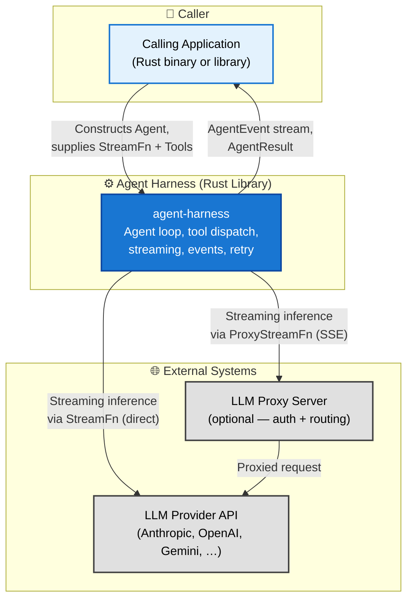
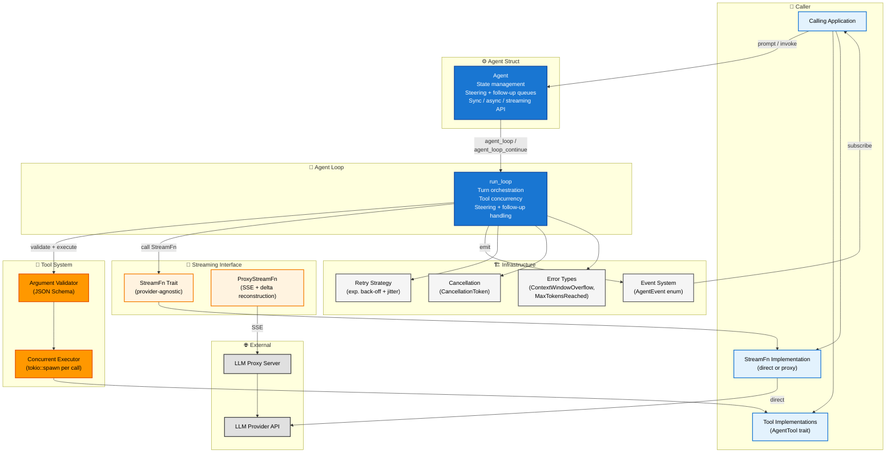
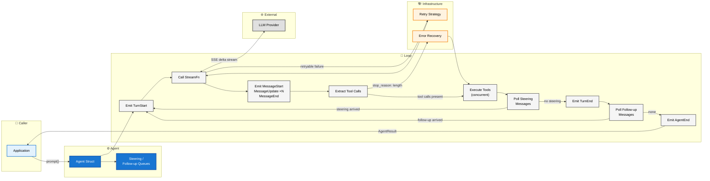
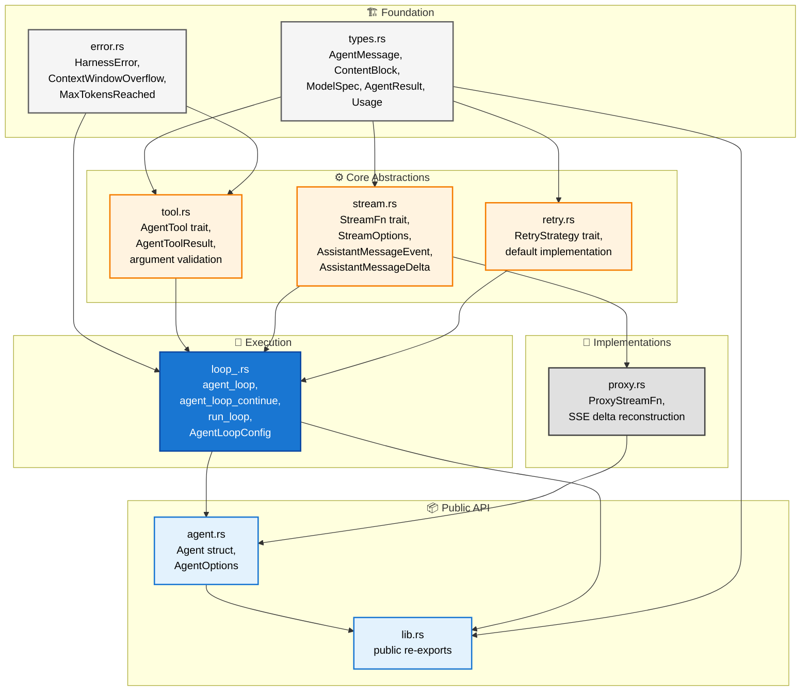

# Agent Harness — High Level Design

**Related Documents:**
- Product Requirements: [PRD.md](../planning/PRD.md)

---

## System Overview

The Agent Harness is a pure-Rust library crate that provides the core scaffolding for building LLM-powered agentic applications. It is consumed as a dependency by calling applications; it has no runtime process of its own. The harness manages the agent loop, message context, tool dispatch, streaming, and lifecycle events. All LLM provider access is delegated to a caller-supplied `StreamFn` implementation, keeping the harness fully provider-agnostic.

---

## C4 Level 1 — System Context

This diagram shows the agent harness as a single system and the external actors and systems it interacts with.

**Key relationships**

| Relationship | Direction | Description |
|---|---|---|
| App → Harness | Inbound | Caller constructs an `Agent`, registers tools, supplies a `StreamFn`, and invokes prompts |
| Harness → App | Outbound | Harness emits `AgentEvent` values and returns `AgentResult` on completion |
| Harness → LLM Provider | Outbound | Direct streaming inference via caller-supplied `StreamFn` |
| Harness → Proxy Server | Outbound | Optional: built-in `ProxyStreamFn` forwards requests to a proxy over SSE |
| Proxy Server → LLM Provider | Outbound | Proxy handles auth and routes to the actual provider |

---

## Internal Component Architecture

This diagram shows the major internal modules and how they relate within the harness.

---

## Single Turn Data Flow

This diagram traces the path of a single prompt through the harness from invocation to completion.

---

## Crate Module Dependencies

This diagram shows how the source modules depend on each other, reflecting the build order.

---

## Design Decisions

**Library, not a service.** The harness is a crate, not a daemon. There are no HTTP ports, no config files, no CLI. Callers link it as a dependency and own the runtime.

**StreamFn is the only provider boundary.** All LLM communication flows through a single trait. Direct providers, proxies, mock implementations for testing, and future transports all satisfy the same interface. The harness never holds an API key or SDK client.

**Events are outward-only.** The event system is a push channel from the harness to the caller. Hooks that mutate execution (cancel a tool, retry a call) are expressed as callbacks in `AgentLoopConfig`, not as event responses. This avoids re-entrant state.

**Errors stay in the message log.** LLM and tool errors produce assistant messages rather than unwinding the call stack. The caller always gets a complete, inspectable message history regardless of outcome.

**Concurrency is scoped to tool execution.** Tool calls within a single turn run concurrently via `tokio::spawn`. Everything else — turns, steering polls, follow-up polls — is sequential. This makes the loop easy to reason about without sacrificing the main performance win of parallel tool execution.
