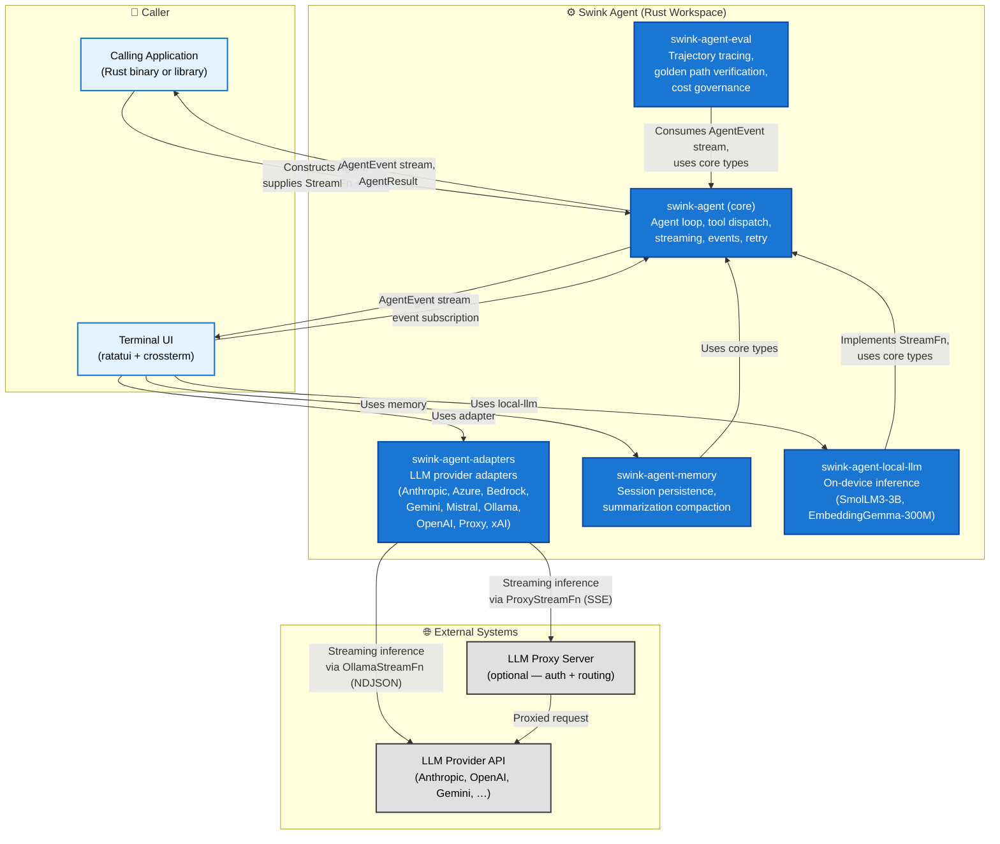
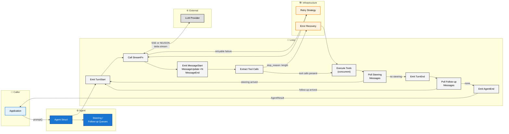
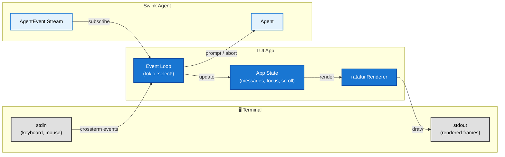

# Swink Agent — High Level Design

**Related Documents:**
- Product Requirements: [PRD.md](../planning/PRD.md)

---

## System Overview

The Swink Agent is a Rust workspace composed of seven crates that provide the core scaffolding for building LLM-powered agentic applications. The **core library** (`swink-agent`) manages the agent loop, message context, tool dispatch, streaming, lifecycle events, model catalogs, agent registries, loop policies, middleware, and inter-agent messaging. The **adapters crate** (`swink-agent-adapters`) provides ready-made `StreamFn` implementations for nine LLM providers: Anthropic, Azure, AWS Bedrock, Google Gemini, Mistral, Ollama, OpenAI (multi-provider compatible), Proxy, and xAI. The **memory crate** (`swink-agent-memory`) provides session persistence and summarization-aware context compaction. The **local-llm crate** (`swink-agent-local-llm`) provides on-device inference via mistral.rs with SmolLM3-3B for text/tool generation and EmbeddingGemma-300M for embeddings. The **eval crate** (`swink-agent-eval`) provides trajectory tracing, golden path verification, response matching, and cost/latency governance for agent evaluation. The **TUI crate** (`swink-agent-tui`) is a binary that provides an interactive terminal interface. All LLM provider access is delegated to a `StreamFn` implementation, keeping the core harness fully provider-agnostic.

---

## C4 Level 1 — System Context

This diagram shows the swink agent as a single system and the external actors and systems it interacts with.



**Key relationships**

| Relationship | Direction | Description |
|---|---|---|
| App → Harness | Inbound | Caller constructs an `Agent`, registers tools, supplies a `StreamFn`, and invokes prompts |
| Harness → App | Outbound | Harness emits `AgentEvent` values and returns `AgentResult` on completion |
| Adapters → LLM Provider / Proxy | Outbound | Nine adapters stream inference to their respective providers: `AnthropicStreamFn` (SSE), `AzureStreamFn` (SSE), `BedrockStreamFn` (SSE), `GeminiStreamFn` (SSE), `MistralStreamFn` (SSE), `OllamaStreamFn` (NDJSON), `OpenAiStreamFn` (SSE, multi-provider), `ProxyStreamFn` (SSE, forwards to proxy), `XAiStreamFn` (SSE) |
| Proxy Server → LLM Provider | Outbound | Proxy handles auth and routes to the actual provider |
| LocalLLM → Harness | Internal | Implements `StreamFn` via `LocalStreamFn` for on-device inference (SmolLM3-3B); provides `EmbeddingModel` for text vectorization |
| Eval → Harness | Internal | Eval consumes `AgentEvent` stream via `TrajectoryCollector`, uses core types (`Usage`, `Cost`, `AssistantMessage`) for invocation traces |
| TUI → Adapters | Internal | TUI selects provider via catalog presets and environment variables; supports all nine remote adapters plus local-llm fallback |

---

## Internal Component Architecture

This diagram shows the major internal modules and how they relate within the harness.

```mermaid
flowchart TB
    subgraph CallerLayer["👤 Caller"]
        App["Calling Application"]
        Tools["Tool Implementations<br/>(AgentTool trait)"]
        StreamImpl["StreamFn Implementation<br/>(direct or proxy)"]
    end

    subgraph AgentLayer["⚙️ Agent Struct"]
        Agent["Agent<br/>State management<br/>Steering + follow-up queues<br/>Sync / async / streaming API"]
    end

    subgraph LoopLayer["🔄 Agent Loop"]
        Loop["run_loop<br/>Turn orchestration<br/>Tool concurrency<br/>Steering + follow-up handling"]
    end

    subgraph ToolLayer["🔧 Tool System"]
        Validator["Argument Validator<br/>(JSON Schema)"]
        Executor["Concurrent Executor<br/>(tokio::spawn per call)"]
        ToolMW["ToolMiddleware<br/>(intercept execute)"]
        SubAgentTool["SubAgent<br/>(multi-agent composition)"]
    end

    subgraph StreamLayer["📡 Streaming Interface"]
        StreamFn["StreamFn Trait<br/>(provider-agnostic)"]
    end

    subgraph AdapterLayer["🔌 Adapters Crate"]
        AnthropicFn["AnthropicStreamFn<br/>(SSE + thinking blocks)"]
        AzureFn["AzureStreamFn<br/>(SSE)"]
        BedrockFn["BedrockStreamFn<br/>(SSE + AWS SigV4)"]
        GeminiFn["GeminiStreamFn<br/>(SSE)"]
        MistralFn["MistralStreamFn<br/>(SSE)"]
        OllamaFn["OllamaStreamFn<br/>(NDJSON streaming)"]
        OpenAiFn["OpenAiStreamFn<br/>(SSE, multi-provider)"]
        XAiFn["XAiStreamFn<br/>(SSE)"]
        ProxyFn["ProxyStreamFn<br/>(SSE + delta reconstruction)"]
        RemotePresets["RemotePresets<br/>(catalog-driven connections)"]
        Classify["HttpErrorClassifier<br/>(status code mapping)"]
    end

    subgraph LocalLLMLayer["🧠 Local LLM Crate"]
        LocalStream["LocalStreamFn<br/>(on-device inference)"]
        LocalModel["LocalModel<br/>(SmolLM3-3B, GGUF Q4_K_M)"]
        EmbeddingModel["EmbeddingModel<br/>(EmbeddingGemma-300M)"]
    end

    subgraph InfraLayer["🏗️ Infrastructure"]
        Events["Event System<br/>(AgentEvent enum)"]
        Retry["Retry Strategy<br/>(exp. back-off + jitter)"]
        Cancel["Cancellation<br/>(CancellationToken)"]
        Errors["Error Types<br/>(ContextWindowOverflow,<br/>ModelThrottled, StreamError)"]
        Catalog["ModelCatalog<br/>(TOML-driven provider/<br/>preset registry)"]
        Registry["AgentRegistry<br/>(named agent lookup)"]
        Mailbox["AgentMailbox<br/>(inter-agent messaging)"]
        Policy["PolicySlots<br/>(PreTurn, PreDispatch,<br/>PostTurn, PostLoop)"]
        StreamMW["StreamMiddleware<br/>(intercept output stream)"]
        Emission["Emission<br/>(structured event payloads)"]
        Orchestrator["AgentOrchestrator<br/>(multi-agent supervision)"]
        Checkpoint["Checkpoint<br/>(loop state snapshots)"]
        BuiltinPolicies["Built-in Policies<br/>(Budget, Checkpoint,<br/>DenyList, LoopDetection,<br/>MaxTurns, Sandbox)"]
        Fallback["ModelFallback<br/>(automatic model failover)"]
        CtxTransformer["ContextTransformer<br/>(sync context rewriting)"]
        CtxVersion["ContextVersion<br/>(versioned context history)"]
        ToolExecPolicy["ToolExecutionPolicy<br/>(Concurrent/Sequential/Priority)"]
        Metrics["MetricsCollector<br/>(turn + tool execution metrics)"]
    end

    subgraph EvalLayer["📊 Evaluation"]
        EvalRunner["EvalRunner<br/>Orchestration pipeline"]
        TrajectoryCollector["TrajectoryCollector<br/>AgentEvent → Invocation"]
        EvalRegistry["EvaluatorRegistry<br/>TrajectoryMatcher,<br/>BudgetEvaluator,<br/>ResponseMatcher,<br/>EfficiencyEvaluator"]
        AuditTrail["AuditedInvocation<br/>SHA-256 hash chain"]
        EvalStore["EvalStore<br/>FsEvalStore (JSON)"]
    end

    subgraph MemoryLayer["🧠 Memory"]
        SessionStore["SessionStore trait<br/>JsonlSessionStore"]
        Compactor["SummarizingCompactor<br/>Summary injection,<br/>sliding window wrapper"]
    end

    subgraph TUILayer["🖥️ Terminal UI"]
        TUIApp["TUI App<br/>Event loop, layout,<br/>focus management"]
        ConvView["Conversation View<br/>Message rendering,<br/>markdown, syntax highlighting"]
        InputEditor["Input Editor<br/>Multi-line text input"]
        ToolPanel["Tool Panel<br/>Active executions, results"]
        HelpPanel["Help Panel<br/>F1-toggled side panel"]
        DiffView["Diff View<br/>Inline unified diffs"]
        StatusBar["Status Bar<br/>Model, usage, state"]
    end

    subgraph ExternalLayer["🌐 External"]
        LLMProvider["LLM Provider API"]
        ProxyServer["LLM Proxy Server"]
    end

    App -->|"prompt / invoke"| Agent
    App --> Tools
    App --> StreamImpl
    Agent -->|"agent_loop /<br/>agent_loop_continue"| Loop
    Loop -->|"validate + execute"| Validator
    Validator --> Executor
    Executor --> Tools
    Loop -->|"call StreamFn"| StreamFn
    StreamFn --> StreamImpl
    AnthropicFn -->|"implements"| StreamFn
    AzureFn -->|"implements"| StreamFn
    BedrockFn -->|"implements"| StreamFn
    GeminiFn -->|"implements"| StreamFn
    MistralFn -->|"implements"| StreamFn
    OllamaFn -->|"implements"| StreamFn
    OpenAiFn -->|"implements"| StreamFn
    XAiFn -->|"implements"| StreamFn
    LocalStream -->|"implements"| StreamFn
    StreamImpl -->|direct| LLMProvider
    AnthropicFn -->|"SSE"| LLMProvider
    AzureFn -->|"SSE"| LLMProvider
    BedrockFn -->|"SSE"| LLMProvider
    GeminiFn -->|"SSE"| LLMProvider
    MistralFn -->|"SSE"| LLMProvider
    OllamaFn -->|"NDJSON"| LLMProvider
    OpenAiFn -->|"SSE"| LLMProvider
    XAiFn -->|"SSE"| LLMProvider
    LocalStream -->|"local inference"| LocalModel
    ProxyFn -->|SSE| ProxyServer
    ProxyServer --> LLMProvider
    Loop -->|"emit"| Events
    Events -->|"subscribe"| App
    Loop --> Retry
    Loop --> Cancel
    Loop --> Errors
    EvalRunner -->|"create_agent"| Agent
    Events -->|"subscribe"| TrajectoryCollector
    TrajectoryCollector -->|"Invocation"| EvalRegistry
    EvalRegistry -->|"EvalSetResult"| EvalStore
    Compactor -->|"wraps"| StreamFn
    SessionStore -->|"persists"| Events
    TUIApp -->|"save / load"| SessionStore
    TUIApp -->|"prompt / abort"| Agent
    Events -->|"subscribe"| TUIApp
    TUIApp --> ConvView
    TUIApp --> InputEditor
    TUIApp --> ToolPanel
    TUIApp --> StatusBar

    classDef callerStyle fill:#e3f2fd,stroke:#1976d2,stroke-width:2px,color:#000
    classDef agentStyle fill:#1976d2,stroke:#0d47a1,stroke-width:2px,color:#fff
    classDef loopStyle fill:#1976d2,stroke:#0d47a1,stroke-width:2px,color:#fff
    classDef toolStyle fill:#ff9800,stroke:#e65100,stroke-width:2px,color:#000
    classDef streamStyle fill:#fff3e0,stroke:#f57c00,stroke-width:2px,color:#000
    classDef adapterStyle fill:#c8e6c9,stroke:#388e3c,stroke-width:2px,color:#000
    classDef infraStyle fill:#f5f5f5,stroke:#616161,stroke-width:2px,color:#000
    classDef externalStyle fill:#e0e0e0,stroke:#424242,stroke-width:2px,color:#000
    classDef tuiStyle fill:#1976d2,stroke:#0d47a1,stroke-width:2px,color:#fff
    classDef memoryStyle fill:#ce93d8,stroke:#7b1fa2,stroke-width:2px,color:#000
    classDef evalStyle fill:#a5d6a7,stroke:#2e7d32,stroke-width:2px,color:#000
    classDef localStyle fill:#ffcc80,stroke:#e65100,stroke-width:2px,color:#000

    class App,Tools,StreamImpl callerStyle
    class Agent agentStyle
    class Loop loopStyle
    class Validator,Executor,ToolMW,SubAgentTool toolStyle
    class StreamFn streamStyle
    class AnthropicFn,AzureFn,BedrockFn,GeminiFn,MistralFn,OllamaFn,OpenAiFn,XAiFn,ProxyFn,RemotePresets,Classify adapterStyle
    class LocalStream,LocalModel,EmbeddingModel localStyle
    class Events,Retry,Cancel,Errors,Catalog,Registry,Mailbox,Policy,StreamMW,Emission,Orchestrator,Checkpoint,BuiltinPolicies,Fallback,CtxTransformer,CtxVersion,ToolExecPolicy,Metrics infraStyle
    class SessionStore,Compactor memoryStyle
    class EvalRunner,TrajectoryCollector,EvalRegistry,AuditTrail,EvalStore evalStyle
    class TUIApp,ConvView,InputEditor,ToolPanel,HelpPanel,DiffView,StatusBar tuiStyle
    class LLMProvider,ProxyServer externalStyle
```



---

## Single Turn Data Flow

This diagram traces the path of a single prompt through the harness from invocation to completion.



---

## Workspace Crate Dependencies

This diagram shows how the seven workspace crates and their internal modules depend on each other.

```mermaid
flowchart TB
    subgraph CoreCrate["📦 swink-agent (core)"]
        subgraph FoundationLayer["🏗️ Foundation"]
            types["types.rs<br/>AgentMessage, ContentBlock,<br/>ModelSpec, AgentResult, Usage"]
            error["error.rs<br/>AgentError,<br/>ContextWindowOverflow,<br/>ModelThrottled, StreamError"]
        end

        subgraph CoreLayer["⚙️ Core Abstractions"]
            tool["tool.rs<br/>AgentTool trait,<br/>AgentToolResult,<br/>argument validation"]
            stream["stream.rs<br/>StreamFn trait,<br/>StreamOptions,<br/>AssistantMessageEvent,<br/>AssistantMessageDelta"]
            retry["retry.rs<br/>RetryStrategy trait,<br/>default implementation"]
        end

        subgraph ImplLayer["🔧 Implementations"]
            context["context.rs<br/>sliding_window,<br/>overflow-aware pruning"]
            builtintools["tools/<br/>BashTool, ReadFileTool,<br/>WriteFileTool<br/>(feature-gated)"]
            tool_mw["tool_middleware.rs<br/>ToolMiddleware"]
            stream_mw["stream_middleware.rs<br/>StreamMiddleware"]
            sub_agent["sub_agent.rs<br/>SubAgent (multi-agent tool)"]
        end

        subgraph CatalogLayer["📋 Catalogs & Registries"]
            catalog["model_catalog.rs<br/>ModelCatalog, PresetCatalog,<br/>ProviderCatalog (TOML-driven)"]
            presets["model_presets.rs<br/>ModelConnection,<br/>ModelConnections"]
            registry_mod["registry.rs<br/>AgentRegistry,<br/>AgentId, AgentRef"]
            messaging_mod["messaging.rs<br/>AgentMailbox, send_to"]
            policy["policy.rs + policies/<br/>PolicySlots (PreTurn, PreDispatch,<br/>PostTurn, PostLoop),<br/>6 built-in policies"]
        end

        subgraph ExecutionLayer["🔄 Execution"]
            loop_["loop_/ (module)<br/>mod.rs · stream.rs<br/>tool_dispatch.rs · turn.rs"]
        end

        subgraph APILayer["📦 Public API"]
            agent["agent.rs<br/>Agent struct,<br/>AgentOptions"]
            display_mod["display.rs<br/>CoreDisplayMessage,<br/>IntoDisplayMessages"]
            msg_provider["message_provider.rs<br/>MessageProvider trait,<br/>ChannelMessageProvider"]
            event_fwd["event_forwarder.rs<br/>EventForwarderFn"]
            lib["lib.rs<br/>public re-exports"]
        end
    end

    subgraph AdaptersCrate["🔌 swink-agent-adapters"]
        adapters_lib["lib.rs<br/>re-exports"]
        anthropic["anthropic.rs<br/>AnthropicStreamFn,<br/>SSE + thinking blocks"]
        azure["azure.rs<br/>AzureStreamFn,<br/>SSE"]
        bedrock["bedrock.rs<br/>BedrockStreamFn,<br/>SSE + AWS SigV4"]
        google["google.rs<br/>GeminiStreamFn,<br/>SSE"]
        mistral["mistral.rs<br/>MistralStreamFn,<br/>SSE"]
        ollama["ollama.rs<br/>OllamaStreamFn,<br/>NDJSON streaming"]
        openai["openai.rs<br/>OpenAiStreamFn,<br/>SSE, multi-provider"]
        xai["xai.rs<br/>XAiStreamFn,<br/>SSE"]
        proxy["proxy.rs<br/>ProxyStreamFn,<br/>SSE delta reconstruction"]
        convert["convert.rs<br/>MessageConverter trait"]
        classify_mod["classify.rs<br/>HttpErrorClassifier"]
        remote_presets_mod["remote_presets.rs<br/>Catalog-driven connections"]
    end

    subgraph LocalLLMCrate["🧠 swink-agent-local-llm"]
        local_lib["lib.rs<br/>re-exports"]
        local_model["model.rs<br/>LocalModel,<br/>SmolLM3-3B (GGUF Q4_K_M)"]
        local_stream["stream.rs<br/>LocalStreamFn"]
        local_embedding["embedding.rs<br/>EmbeddingModel,<br/>EmbeddingGemma-300M"]
        local_preset["preset.rs<br/>default_local_connection"]
        local_convert["convert.rs<br/>message conversion"]
        local_progress["progress.rs<br/>ProgressCallbackFn"]
    end

    subgraph MemoryCrate["🧠 swink-agent-memory"]
        mem_lib["lib.rs<br/>re-exports"]
        mem_store["store.rs<br/>SessionStore trait"]
        mem_jsonl["jsonl.rs<br/>JsonlSessionStore,<br/>JSONL persistence"]
        mem_meta["meta.rs<br/>SessionMeta"]
        mem_compact["compaction.rs<br/>SummarizingCompactor,<br/>summary injection"]
    end

    subgraph EvalCrate["📊 swink-agent-eval"]
        eval_lib["lib.rs<br/>re-exports"]
        eval_trajectory["trajectory.rs<br/>TrajectoryCollector,<br/>AgentEvent → Invocation"]
        eval_evaluator["evaluator.rs<br/>Evaluator trait,<br/>EvaluatorRegistry"]
        eval_runner["runner.rs<br/>EvalRunner,<br/>AgentFactory trait"]
        eval_builtins["match_.rs, budget.rs,<br/>response.rs, efficiency.rs<br/>Built-in evaluators (5)"]
        eval_gate["gate.rs<br/>GateConfig, check_gate,<br/>CI/CD gating"]
        eval_audit["audit.rs<br/>AuditedInvocation,<br/>SHA-256 hash chain"]
        eval_store["store.rs<br/>EvalStore trait,<br/>FsEvalStore"]
    end

    subgraph TUICrate["🖥️ swink-agent-tui"]
        tui_main["main.rs<br/>env var config,<br/>provider selection"]
        tui_app["app.rs<br/>event loop, layout"]
        tui_creds["credentials.rs<br/>keychain integration"]
        tui_session["session.rs<br/>re-exports from memory"]
        tui_wizard["wizard.rs<br/>first-run setup"]
    end

    types --> tool
    types --> stream
    types --> retry
    error --> tool
    error --> loop_
    tool --> loop_
    stream --> loop_
    retry --> loop_
    loop_ --> agent
    agent --> lib
    loop_ --> lib
    types --> lib

    stream -->|"StreamFn trait"| anthropic
    stream -->|"StreamFn trait"| azure
    stream -->|"StreamFn trait"| bedrock
    stream -->|"StreamFn trait"| google
    stream -->|"StreamFn trait"| mistral
    stream -->|"StreamFn trait"| ollama
    stream -->|"StreamFn trait"| openai
    stream -->|"StreamFn trait"| xai
    stream -->|"StreamFn trait"| proxy
    stream -->|"StreamFn trait"| local_stream
    anthropic --> adapters_lib
    azure --> adapters_lib
    bedrock --> adapters_lib
    google --> adapters_lib
    mistral --> adapters_lib
    ollama --> adapters_lib
    openai --> adapters_lib
    xai --> adapters_lib
    proxy --> adapters_lib
    classify_mod --> adapters_lib
    remote_presets_mod --> adapters_lib
    convert --> ollama
    convert --> openai

    local_stream --> local_lib
    local_model --> local_lib
    local_embedding --> local_lib
    local_preset --> local_lib
    local_convert --> local_stream

    types -->|"core types"| mem_store
    types -->|"core types"| mem_compact
    context -->|"sliding_window"| mem_compact
    mem_store --> mem_jsonl
    mem_meta --> mem_jsonl
    mem_jsonl --> mem_lib
    mem_compact --> mem_lib

    lib -->|"swink-agent dep"| eval_trajectory
    lib -->|"swink-agent dep"| eval_runner
    eval_trajectory --> eval_evaluator
    eval_evaluator --> eval_builtins
    eval_runner --> eval_trajectory
    eval_runner --> eval_evaluator
    eval_builtins --> eval_lib
    eval_evaluator --> eval_lib
    eval_runner --> eval_lib
    eval_store --> eval_lib

    lib -->|"swink-agent dep"| tui_main
    adapters_lib -->|"adapters dep"| tui_main
    local_lib -->|"local-llm dep"| tui_main
    mem_lib -->|"memory dep"| tui_session
    tui_main --> tui_app

    classDef foundationStyle fill:#f5f5f5,stroke:#616161,stroke-width:2px,color:#000
    classDef coreStyle fill:#fff3e0,stroke:#f57c00,stroke-width:2px,color:#000
    classDef implStyle fill:#e0e0e0,stroke:#424242,stroke-width:2px,color:#000
    classDef execStyle fill:#1976d2,stroke:#0d47a1,stroke-width:2px,color:#fff
    classDef apiStyle fill:#e3f2fd,stroke:#1976d2,stroke-width:2px,color:#000
    classDef adapterStyle fill:#c8e6c9,stroke:#388e3c,stroke-width:2px,color:#000
    classDef localStyle fill:#ffcc80,stroke:#e65100,stroke-width:2px,color:#000
    classDef memoryStyle fill:#ce93d8,stroke:#7b1fa2,stroke-width:2px,color:#000
    classDef evalStyle fill:#a5d6a7,stroke:#2e7d32,stroke-width:2px,color:#000
    classDef tuiStyle fill:#1976d2,stroke:#0d47a1,stroke-width:2px,color:#fff
    classDef catalogStyle fill:#fff9c4,stroke:#f9a825,stroke-width:2px,color:#000

    class types,error foundationStyle
    class tool,stream,retry coreStyle
    class context,builtintools,tool_mw,stream_mw,sub_agent implStyle
    class catalog,presets,registry_mod,messaging_mod,policy catalogStyle
    class loop_ execStyle
    class agent,display_mod,msg_provider,event_fwd,lib apiStyle
    class adapters_lib,anthropic,azure,bedrock,google,mistral,ollama,openai,xai,proxy,convert,classify_mod,remote_presets_mod adapterStyle
    class local_lib,local_model,local_stream,local_embedding,local_preset,local_convert,local_progress localStyle
    class mem_lib,mem_store,mem_jsonl,mem_meta,mem_compact memoryStyle
    class eval_lib,eval_trajectory,eval_evaluator,eval_runner,eval_builtins,eval_gate,eval_audit,eval_store evalStyle
    class tui_main,tui_app,tui_creds,tui_session,tui_wizard tuiStyle
```



---

## Design Decisions

**Library, not a service.** The harness is a crate, not a daemon. There are no HTTP ports, no config files, no CLI. Callers link it as a dependency and own the runtime.

**StreamFn is the only provider boundary.** All LLM communication flows through a single trait. Direct providers, proxies, mock implementations for testing, local on-device models, and future transports all satisfy the same interface. The harness never holds an API key or SDK client. Nine built-in remote implementations ship in the adapters crate: `AnthropicStreamFn`, `AzureStreamFn`, `BedrockStreamFn`, `GeminiStreamFn`, `MistralStreamFn`, `OllamaStreamFn`, `OpenAiStreamFn`, `ProxyStreamFn`, and `XAiStreamFn`. A tenth implementation, `LocalStreamFn`, ships in the local-llm crate for on-device inference.

**Adapters are a separate crate.** Provider-specific `StreamFn` implementations live in `swink-agent-adapters`, keeping the core harness free of any provider SDK or protocol detail. Adding a new provider means adding a module to the adapters crate — no changes to the core.

**Local-llm is a separate crate.** On-device inference via mistral.rs lives in `swink-agent-local-llm`, keeping the heavy native dependencies (GGUF runtime, HuggingFace model downloads) out of the core and adapters crates. It provides `LocalStreamFn` (text generation with SmolLM3-3B) and `EmbeddingModel` (text vectorization with EmbeddingGemma-300M). Models are lazily downloaded and cached. This crate serves as the default fallback when no cloud API credentials are configured.

**Catalogs and registries are core concerns.** `ModelCatalog` loads provider and preset metadata from an embedded TOML file, enabling catalog-driven provider selection without hardcoding model details. `AgentRegistry` provides thread-safe named agent lookup for multi-agent systems. `AgentMailbox` enables asynchronous inter-agent messaging. These subsystems live in the core crate because they define coordination primitives that any agent-based application may need.

**Policies control loop behavior.** Four configurable policy slots (`PreTurn`, `PreDispatch`, `PostTurn`, `PostLoop`) replace the previous scattered hooks (`LoopPolicy`, `BudgetGuard`, `PostTurnHook`, `ToolValidator`, `ToolCallTransformer`). Each slot accepts a `Vec` of policy implementations evaluated in order. Six built-in policies ship with the library: `BudgetPolicy`, `CheckpointPolicy`, `DenyListPolicy`, `LoopDetectionPolicy`, `MaxTurnsPolicy`, and `SandboxPolicy`. Empty policy vecs mean anything goes — zero overhead when unused.

**Middleware wraps both tools and streams.** `ToolMiddleware` intercepts `execute()` on any `AgentTool`, and `StreamMiddleware` intercepts the output stream from any `StreamFn`. Both follow the decorator pattern — callers compose them without touching inner implementations. This enables cross-cutting concerns like logging, metrics, and access control.

**Events are outward-only.** The event system is a push channel from the harness to the caller. Hooks that mutate execution (cancel a tool, retry a call) are expressed as callbacks in `AgentLoopConfig`, not as event responses. This avoids re-entrant state.

**Errors stay in the message log.** LLM and tool errors produce assistant messages rather than unwinding the call stack. The caller always gets a complete, inspectable message history regardless of outcome.

**Concurrency is scoped to tool execution.** Tool calls within a single turn run concurrently via `tokio::spawn`. Everything else — turns, steering polls, follow-up polls — is sequential. This makes the loop easy to reason about without sacrificing the main performance win of parallel tool execution.

**Memory is a separate crate.** Session persistence and context compaction strategies live in `swink-agent-memory`, keeping storage dependencies (filesystem, future vector stores) out of the core. The memory crate consumes core's extension hooks (`TransformContextFn`, `ConvertToLlmFn`) without modifying core internals. See `memory/docs/architecture/` for the compaction architecture. Advanced memory research (RAG, explicit memory tools) lives in a separate repository.

**Evaluation is a separate crate.** The evaluation framework lives in `swink-agent-eval`, keeping test/benchmark dependencies out of the core. It consumes the `AgentEvent` stream via `TrajectoryCollector` — the same subscription mechanism available to any caller. The eval crate depends only on `swink-agent` core, not on adapters or memory. The `Evaluator` trait and `EvaluatorRegistry` pattern enables custom scoring metrics without modifying the framework. Full `Invocation` traces are stored per result to support future comparative analysis across models and configurations.

**TUI is a separate crate.** The terminal interface is a binary crate that depends on the core library, adapters crate, and memory crate, not a feature-gated module. This keeps the core harness free of terminal dependencies and allows the TUI to evolve independently. The TUI consumes the same public API that any other application would use.

**xtask is a workspace member.** The `xtask` crate provides developer workflow commands (e.g., `cargo xtask verify-catalog`) without adding dev-only dependencies to the core crates.

## TUI Architecture

The TUI is a separate binary crate (`swink-agent-tui`) that depends on `swink-agent` (core), `swink-agent-adapters`, `swink-agent-local-llm`, and `swink-agent-memory`. It provides an interactive terminal interface for conversing with an LLM agent. The TUI supports all nine remote adapters (via catalog-driven preset selection) plus local-llm as a fallback when no cloud credentials are configured. It includes a first-run setup wizard for API key configuration, session persistence (via the memory crate's `SessionStore` trait), and credential management via the system keychain.

### Provider Configuration

The TUI selects its LLM provider via environment variables in priority order: Proxy > OpenAI > Anthropic > Ollama. API keys can also be stored in the system keychain via the `#key` command or the first-run setup wizard.

| Variable | Default | Description |
|---|---|---|
| `LLM_BASE_URL` | _(unset)_ | SSE proxy endpoint — highest priority if set |
| `LLM_API_KEY` | _(empty)_ | Bearer token for the proxy |
| `LLM_MODEL` | `claude-sonnet-4-20250514` | Model identifier for the proxy |
| `OPENAI_API_KEY` | _(unset)_ | OpenAI API key (or keychain) |
| `OPENAI_BASE_URL` | `https://api.openai.com` | OpenAI-compatible endpoint |
| `OPENAI_MODEL` | `gpt-4o` | OpenAI model name |
| `ANTHROPIC_API_KEY` | _(unset)_ | Anthropic API key (or keychain) |
| `ANTHROPIC_BASE_URL` | `https://api.anthropic.com` | Anthropic endpoint |
| `ANTHROPIC_MODEL` | `claude-sonnet-4-20250514` | Anthropic model name |
| `OLLAMA_HOST` | `http://localhost:11434` | Ollama server URL (default fallback) |
| `OLLAMA_MODEL` | `llama3.2` | Ollama model name |
| `LLM_SYSTEM_PROMPT` | `You are a helpful assistant.` | System prompt (shared across all providers) |

### Component Model

The TUI uses a component-based architecture where each UI element is a stateful widget rendered via `ratatui`. The component tree is:

```
App
├── Conversation View (scrollable message history)
│   ├── User Message Block
│   ├── Assistant Message Block (with streaming)
│   │   ├── Text Content (markdown rendered)
│   │   ├── Thinking Block (dimmed)
│   │   └── Tool Call Block
│   └── Tool Result Block
├── Input Editor (multi-line text composition)
├── Tool Panel (active tool executions)
└── Status Bar (model, usage, state)
```

### Event Loop

The TUI runs a dual event loop:

1. **Terminal events** — `crossterm` delivers keyboard, mouse, and resize events. These are dispatched to the focused component for input handling.
2. **Agent events** — The TUI subscribes to `AgentEvent` from the harness via `Agent::subscribe`. Events arrive on a channel and trigger UI state updates.

Both event sources are multiplexed via `tokio::select!` in the main render loop.

### Data Flow


