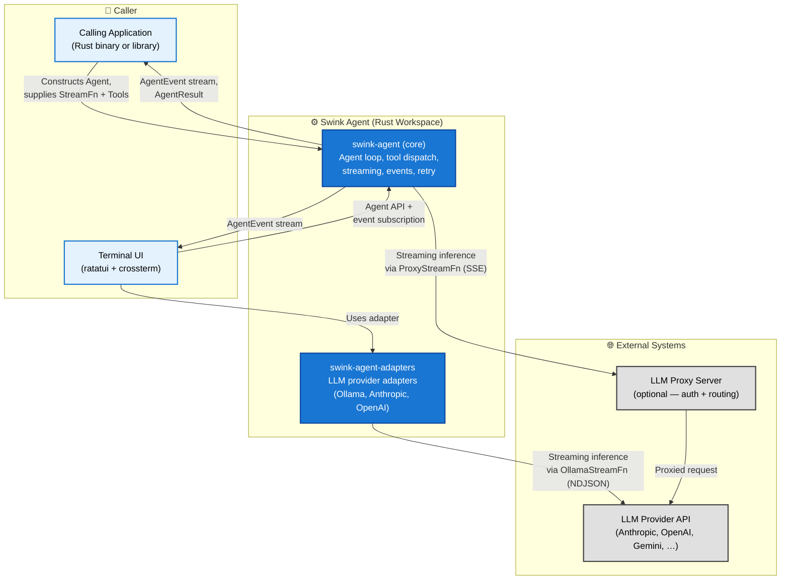
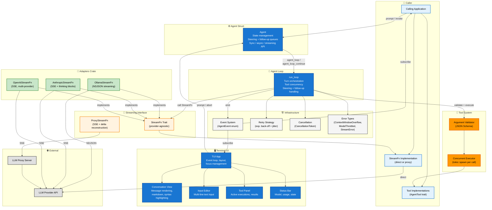
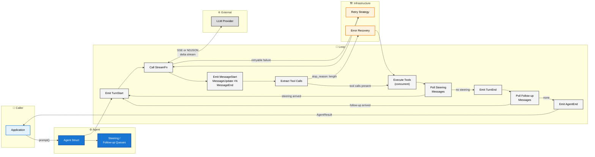
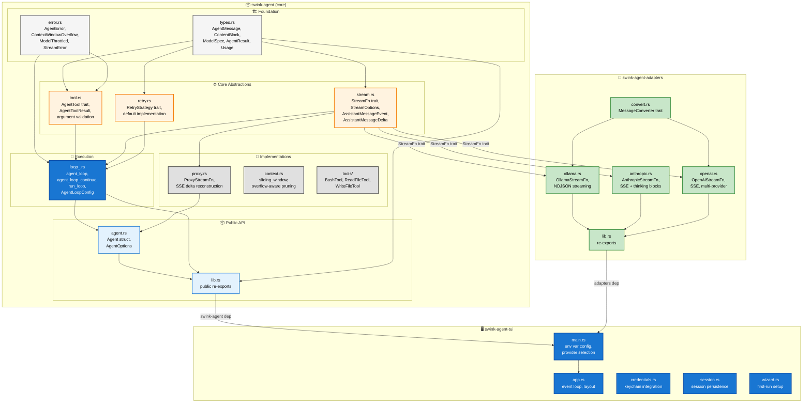
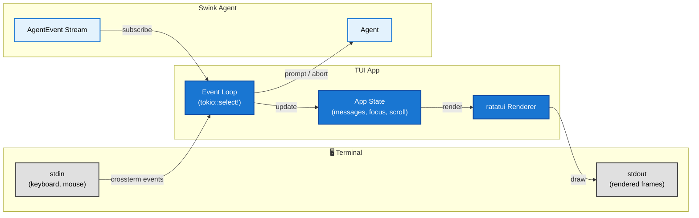

# Swink Agent — High Level Design

**Related Documents:**
- Product Requirements: [PRD.md](../planning/PRD.md)

---

## System Overview

The Swink Agent is a Rust workspace composed of three crates that provide the core scaffolding for building LLM-powered agentic applications. The **core library** (`swink-agent`) manages the agent loop, message context, tool dispatch, streaming, and lifecycle events. The **adapters crate** (`swink-agent-adapters`) provides ready-made `StreamFn` implementations for specific LLM providers. The **TUI crate** (`swink-agent-tui`) is a binary that provides an interactive terminal interface. All LLM provider access is delegated to a `StreamFn` implementation, keeping the core harness fully provider-agnostic.

---

## C4 Level 1 — System Context

This diagram shows the swink agent as a single system and the external actors and systems it interacts with.



**Key relationships**

| Relationship | Direction | Description |
|---|---|---|
| App → Harness | Inbound | Caller constructs an `Agent`, registers tools, supplies a `StreamFn`, and invokes prompts |
| Harness → App | Outbound | Harness emits `AgentEvent` values and returns `AgentResult` on completion |
| Adapters → LLM Provider | Outbound | `OllamaStreamFn` streams inference via Ollama's `/api/chat` endpoint (NDJSON) |
| Harness → Proxy Server | Outbound | Optional: built-in `ProxyStreamFn` forwards requests to a proxy over SSE |
| Proxy Server → LLM Provider | Outbound | Proxy handles auth and routes to the actual provider |
| TUI → Adapters | Internal | TUI selects provider by priority: Proxy (LLM_BASE_URL), OpenAI (OPENAI_API_KEY), Anthropic (ANTHROPIC_API_KEY), Ollama (default) |

---

## Internal Component Architecture

This diagram shows the major internal modules and how they relate within the harness.



---

## Single Turn Data Flow

This diagram traces the path of a single prompt through the harness from invocation to completion.



---

## Workspace Crate Dependencies

This diagram shows how the three workspace crates and their internal modules depend on each other.



---

## Design Decisions

**Library, not a service.** The harness is a crate, not a daemon. There are no HTTP ports, no config files, no CLI. Callers link it as a dependency and own the runtime.

**StreamFn is the only provider boundary.** All LLM communication flows through a single trait. Direct providers, proxies, mock implementations for testing, and future transports all satisfy the same interface. The harness never holds an API key or SDK client. Four built-in implementations ship with the project: `ProxyStreamFn` (SSE, in core), `OllamaStreamFn` (NDJSON), `AnthropicStreamFn` (SSE with thinking blocks), and `OpenAiStreamFn` (SSE, multi-provider compatible) — the latter three in the adapters crate.

**Adapters are a separate crate.** Provider-specific `StreamFn` implementations live in `swink-agent-adapters`, keeping the core harness free of any provider SDK or protocol detail. Adding a new provider means adding a module to the adapters crate — no changes to the core.

**Events are outward-only.** The event system is a push channel from the harness to the caller. Hooks that mutate execution (cancel a tool, retry a call) are expressed as callbacks in `AgentLoopConfig`, not as event responses. This avoids re-entrant state.

**Errors stay in the message log.** LLM and tool errors produce assistant messages rather than unwinding the call stack. The caller always gets a complete, inspectable message history regardless of outcome.

**Concurrency is scoped to tool execution.** Tool calls within a single turn run concurrently via `tokio::spawn`. Everything else — turns, steering polls, follow-up polls — is sequential. This makes the loop easy to reason about without sacrificing the main performance win of parallel tool execution.

**TUI is a separate crate.** The terminal interface is a binary crate that depends on both the core library and the adapters crate, not a feature-gated module. This keeps the core harness free of terminal dependencies and allows the TUI to evolve independently. The TUI consumes the same public API that any other application would use.

## TUI Architecture

The TUI is a separate binary crate (`swink-agent-tui`) that depends on both `swink-agent` (core) and `swink-agent-adapters`. It provides an interactive terminal interface for conversing with an LLM agent. The TUI supports four providers (Proxy, OpenAI, Anthropic, Ollama) selected by environment variable priority. It includes a first-run setup wizard for API key configuration, session persistence, and credential management via the system keychain.

### Provider Configuration

The TUI selects its LLM provider via environment variables in priority order: Proxy > OpenAI > Anthropic > Ollama. API keys can also be stored in the system keychain via the `#key` command or the first-run setup wizard.

| Variable | Default | Description |
|---|---|---|
| `LLM_BASE_URL` | _(unset)_ | SSE proxy endpoint — highest priority if set |
| `LLM_API_KEY` | _(empty)_ | Bearer token for the proxy |
| `LLM_MODEL` | `claude-sonnet-4-20250514` | Model identifier for the proxy |
| `OPENAI_API_KEY` | _(unset)_ | OpenAI API key (or keychain) |
| `OPENAI_BASE_URL` | `https://api.openai.com` | OpenAI-compatible endpoint |
| `OPENAI_MODEL` | `gpt-4o` | OpenAI model name |
| `ANTHROPIC_API_KEY` | _(unset)_ | Anthropic API key (or keychain) |
| `ANTHROPIC_BASE_URL` | `https://api.anthropic.com` | Anthropic endpoint |
| `ANTHROPIC_MODEL` | `claude-sonnet-4-20250514` | Anthropic model name |
| `OLLAMA_HOST` | `http://localhost:11434` | Ollama server URL (default fallback) |
| `OLLAMA_MODEL` | `llama3.2` | Ollama model name |
| `LLM_SYSTEM_PROMPT` | `You are a helpful assistant.` | System prompt (shared across all providers) |

### Component Model

The TUI uses a component-based architecture where each UI element is a stateful widget rendered via `ratatui`. The component tree is:

```
App
├── Conversation View (scrollable message history)
│   ├── User Message Block
│   ├── Assistant Message Block (with streaming)
│   │   ├── Text Content (markdown rendered)
│   │   ├── Thinking Block (dimmed)
│   │   └── Tool Call Block
│   └── Tool Result Block
├── Input Editor (multi-line text composition)
├── Tool Panel (active tool executions)
└── Status Bar (model, usage, state)
```

### Event Loop

The TUI runs a dual event loop:

1. **Terminal events** — `crossterm` delivers keyboard, mouse, and resize events. These are dispatched to the focused component for input handling.
2. **Agent events** — The TUI subscribes to `AgentEvent` from the harness via `Agent::subscribe`. Events arrive on a channel and trigger UI state updates.

Both event sources are multiplexed via `tokio::select!` in the main render loop.

### Data Flow


