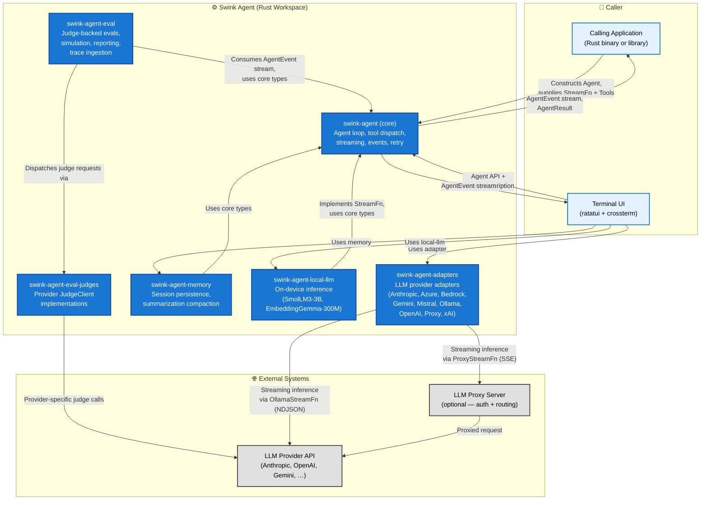
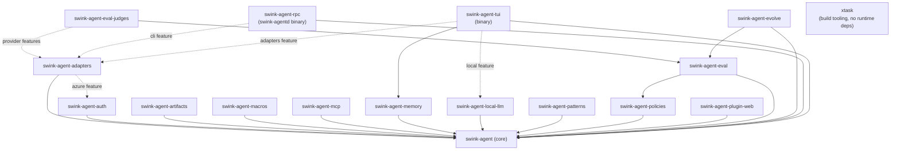

# Swink Agent — High Level Design

**Related Documents:**
- Product Requirements: [PRD.md](../planning/PRD.md)

---

## System Overview

The Swink Agent is a Rust workspace composed of sixteen library/binary/plugin crates plus an `xtask` build-tooling crate that provide the core scaffolding for building LLM-powered agentic applications. The **core library** (`swink-agent`) manages the agent loop, message context, tool dispatch, streaming, lifecycle events, model catalogs, agent registries, loop policies, middleware, and inter-agent messaging. The **adapters crate** (`swink-agent-adapters`) provides ready-made `StreamFn` implementations for nine LLM providers: Anthropic, Azure, AWS Bedrock, Google Gemini, Mistral, Ollama, OpenAI (multi-provider compatible), Proxy, and xAI. The **policies crate** (`swink-agent-policies`) provides the shared reusable policy implementations built against the core policy trait API, each feature-gated independently, while plugin crates can also define crate-local policies. The **memory crate** (`swink-agent-memory`) provides session persistence and summarization-aware context compaction. The **local-llm crate** (`swink-agent-local-llm`) provides on-device inference via llama.cpp (Rust bindings: `llama-cpp-2`) with SmolLM3-3B for text/tool generation and EmbeddingGemma-300M for embeddings. All models use GGUF format. The **eval crate** (`swink-agent-eval`) provides trajectory tracing, golden path verification, response matching, cost/latency governance, plus (spec 043) a versioned prompt-template registry, 24 judge-backed/deterministic evaluators across seven families, multi-turn simulation (`ActorSimulator` / `ToolSimulator`), auto-generation (`ExperimentGenerator`), OTel / Langfuse / OpenSearch / CloudWatch trace ingestion, Console/JSON/Markdown/HTML reporters, a LangSmith exporter, and a `swink-eval` CLI binary. The **eval-judges crate** (`swink-agent-eval-judges`, new in spec 043) hosts per-provider `JudgeClient` implementations (Anthropic, OpenAI, Bedrock, Gemini, Mistral, Azure, xAI, Ollama, Proxy) behind feature flags, plus synchronous `Blocking<Provider>JudgeClient` wrappers. The **evolve crate** (`swink-agent-evolve`) provides an eval-driven self-improvement loop over prompts and tool schemas: baseline evaluation → diagnosis → mutation → re-evaluation → acceptance gating → versioned persistence. The **rpc crate** (`swink-agent-rpc`) exposes an `Agent` over a Unix-domain socket as newline-delimited JSON-RPC 2.0 and ships the `swink-agentd` daemon binary (behind its `cli` feature). The **artifacts crate** (`swink-agent-artifacts`) provides versioned artifact storage with filesystem and in-memory backends. The **auth crate** (`swink-agent-auth`) provides OAuth2 credential management and refresh for *tool authentication* (in-memory `CredentialStore`, see spec 035) — distinct from the TUI's keychain-backed *LLM provider API key* storage described below. The **macros crate** (`swink-agent-macros`) provides derive macros for the agent framework. The **MCP crate** (`swink-agent-mcp`) provides Model Context Protocol integration (stdio/SSE). The **patterns crate** (`swink-agent-patterns`) provides multi-agent orchestration patterns (pipeline, parallel, loop). The **web plugin** (`swink-agent-plugin-web`) provides web browsing and search tools as a plugin. The **TUI crate** (`swink-agent-tui`) is a binary that provides an interactive terminal interface. All LLM provider access is delegated to a `StreamFn` implementation, keeping the core harness fully provider-agnostic.

---

## C4 Level 1 — System Context

This diagram shows the swink agent as a single system and the external actors and systems it interacts with.

**Key relationships**

| Relationship | Direction | Description |
|---|---|---|
| App → Harness | Inbound | Caller constructs an `Agent`, registers tools, supplies a `StreamFn`, and invokes prompts |
| Harness → App | Outbound | Harness emits `AgentEvent` values and returns `AgentResult` on completion |
| Adapters → LLM Provider / Proxy | Outbound | Nine adapters stream inference to their respective providers: `AnthropicStreamFn` (SSE), `AzureStreamFn` (SSE), `BedrockStreamFn` (SSE), `GeminiStreamFn` (SSE), `MistralStreamFn` (SSE), `OllamaStreamFn` (NDJSON), `OpenAiStreamFn` (SSE, multi-provider), `ProxyStreamFn` (SSE, forwards to proxy), `XAiStreamFn` (SSE) |
| Proxy Server → LLM Provider | Outbound | Proxy handles auth and routes to the actual provider |
| LocalLLM → Harness | Internal | Implements `StreamFn` via `LocalStreamFn` for on-device inference (SmolLM3-3B); provides `EmbeddingModel` for text vectorization |
| Eval → Harness | Internal | Eval consumes `AgentEvent` stream via `TrajectoryCollector`, uses core types for invocations, and layers judge-backed evaluators, simulation, generation, reporting, telemetry, and trace ingestion on top |
| Eval → EvalJudges | Internal | Judge-backed evaluators delegate provider-specific dispatch, retry, and batching to `swink-agent-eval-judges` |
| EvalJudges → LLM Provider | Outbound | Feature-gated `JudgeClient` implementations call Anthropic, OpenAI, Bedrock, Gemini, Mistral, Azure, xAI, Ollama, or Proxy endpoints |
| TUI → Adapters | Internal | The default TUI build selects among the compiled remote adapters via environment variables; optional `local`/`full` features add on-device local-llm support |

---

## Internal Component Architecture

The C4-L1 diagram above shows the six most load-bearing crates; the full sixteen-crate dependency graph is in [Workspace Crate Dependencies](#workspace-crate-dependencies) below. Within the **core crate**, the major subsystems are (each links to its detailed architecture doc where one exists):

- **Agent struct** (`src/agent.rs` + `src/agent/`) — the stateful public API: sync/async/streaming invocation, steering and follow-up queues, event subscriptions, structured output, pause/resume checkpointing. See [agent/](agent/README.md).
- **Agent loop** (`src/loop_/`) — turn orchestration, concurrent tool dispatch, steering/follow-up injection, transfer handling, retry, cancellation. See [agent-loop/](agent-loop/README.md).
- **Data model** (`src/types/`, `src/state.rs`) — messages, content blocks, usage/cost, stop reasons, `SessionState`/`StateDelta`. See [data-model/](data-model/README.md).
- **Context pipeline** (`src/context.rs`, `src/context_transformer.rs`, `src/async_context_transformer.rs`) — per-turn context snapshots, sliding-window compaction, the sync `ContextTransformer` and async `AsyncContextTransformer` hooks. See [agent-context/](agent-context/README.md).
- **Tool system** (`src/tool.rs`, `src/tools/`, `src/tool_middleware.rs`, `src/sub_agent.rs`) — `AgentTool` trait, JSON-Schema argument validation, feature-gated built-in tools, decorator middleware, multi-agent composition via `SubAgent`.
- **Streaming interface** (`src/stream.rs`, `src/stream_middleware.rs`, `src/retry.rs`) — the provider-agnostic `StreamFn` trait, stream middleware, and pluggable retry strategy.
- **Infrastructure** — `AgentEvent` system, error taxonomy (`ContextWindowOverflow`, `ModelThrottled`, `StreamError`), `ModelCatalog` (TOML-driven), `AgentRegistry`, `AgentMailbox`, policy slots, `ModelFallback`, checkpoints, `MetricsCollector`, `ToolExecutionPolicy`.

---

## Single Turn Data Flow

The turn-by-turn data flow (streaming, tool extraction/execution, steering and follow-up polling, event emission) is documented in [agent-loop/README.md](agent-loop/README.md).

---

## Workspace Crate Dependencies

Crate-level dependency graph for all sixteen crates plus `xtask` (dashed = optional / feature-gated). Module-level detail lives in the per-subsystem docs linked above.

---

## Design Decisions

**Library, not a service.** The core harness is a crate, not a daemon — no HTTP ports, no config files, no CLI. Callers link it as a dependency and own the runtime. For out-of-process callers, the optional `swink-agent-rpc` crate layers a Unix-socket JSON-RPC 2.0 service (and the `swink-agentd` binary) on top without changing the core.

**StreamFn is the only provider boundary.** All LLM communication flows through a single trait. Direct providers, proxies, mock implementations for testing, local on-device models, and future transports all satisfy the same interface. The harness never holds an API key or SDK client. Nine built-in remote implementations ship in the adapters crate: `AnthropicStreamFn`, `AzureStreamFn`, `BedrockStreamFn`, `GeminiStreamFn`, `MistralStreamFn`, `OllamaStreamFn`, `OpenAiStreamFn`, `ProxyStreamFn`, and `XAiStreamFn`. A tenth implementation, `LocalStreamFn`, ships in the local-llm crate for on-device inference.

**Adapters are a separate crate.** Provider-specific `StreamFn` implementations live in `swink-agent-adapters`, keeping the core harness free of any provider SDK or protocol detail. Adding a new provider means adding a module to the adapters crate — no changes to the core.

**Local-llm is a separate crate.** On-device inference via llama.cpp lives in `swink-agent-local-llm`, keeping the heavy native dependencies (GGUF runtime, HuggingFace model downloads) out of the core and adapters crates. It provides `LocalStreamFn` (text generation with SmolLM3-3B) and `EmbeddingModel` (text vectorization with EmbeddingGemma-300M). Models are lazily downloaded and cached. TUI builds can opt into this crate via the `local` feature instead of pulling it into every default build.

**Catalogs and registries are core concerns.** `ModelCatalog` loads provider and preset metadata from an embedded TOML file, enabling catalog-driven provider selection without hardcoding model details. `AgentRegistry` provides thread-safe named agent lookup for multi-agent systems. `AgentMailbox` enables asynchronous inter-agent messaging. These subsystems live in the core crate because they define coordination primitives that any agent-based application may need.

**Policies control loop behavior.** Four configurable policy slots (`PreTurn`, `PreDispatch`, `PostTurn`, `PostLoop`) replace the previous scattered hooks (`LoopPolicy`, `BudgetGuard`, `PostTurnHook`, `ToolValidator`, `ToolCallTransformer`). Each slot accepts a `Vec` of policy implementations evaluated in order. Empty policy vecs mean anything goes — zero overhead when unused.

**Policies are a separate crate.** Shared reusable policy implementations live in `swink-agent-policies`, keeping them optional and independently feature-gated. The crate depends only on `swink-agent` public API — no internal imports. Six core policies (`BudgetPolicy`, `CheckpointPolicy`, `ToolDenyListPolicy`, `LoopDetectionPolicy`, `MaxTurnsPolicy`, `SandboxPolicy`) handle loop governance; four application policies (`PromptInjectionGuard`, `PiiRedactor`, `ContentFilter`, `AuditLogger`) address content safety and audit. Plugin crates can also define crate-local policies against the same trait surface. Each policy in `swink-agent-policies` is behind its own feature flag (`budget`, `max-turns`, `deny-list`, `sandbox`, `loop-detection`, `checkpoint`, `prompt-guard`, `pii`, `content-filter`, `audit`), with `default = ["all"]`.

**Middleware wraps both tools and streams.** `ToolMiddleware` intercepts `execute()` on any `AgentTool`, and `StreamMiddleware` intercepts the output stream from any `StreamFn`. Both follow the decorator pattern — callers compose them without touching inner implementations. This enables cross-cutting concerns like logging, metrics, and access control.

**Events are outward-only.** The event system is a push channel from the harness to the caller. Hooks that mutate execution (cancel a tool, retry a call) are expressed as callbacks in `AgentLoopConfig`, not as event responses. This avoids re-entrant state.

**Errors stay in the message log.** LLM and tool errors produce assistant messages rather than unwinding the call stack. The caller always gets a complete, inspectable message history regardless of outcome.

**Concurrency is scoped to tool execution.** Tool calls within a single turn run concurrently via `tokio::spawn`. Everything else — turns, steering polls, follow-up polls — is sequential. This makes the loop easy to reason about without sacrificing the main performance win of parallel tool execution.

**Memory is a separate crate.** Session persistence and context compaction strategies live in `swink-agent-memory`, keeping storage dependencies (filesystem, future vector stores) out of the core. The memory crate consumes core's extension hooks (`ContextTransformer`, `AsyncContextTransformer`, `ConvertToLlmFn`) without modifying core internals. `ContextTransformer` (`src/context_transformer.rs`) is the synchronous trait — configured as `Option<Arc<dyn ContextTransformer>>` on `AgentLoopConfig`, with a blanket impl so bare `Fn(&mut Vec<AgentMessage>, bool)` closures still satisfy it; `AsyncContextTransformer` is the async counterpart that enables async context rewriting, useful when compaction requires LLM calls (e.g., summarization). See `memory/docs/architecture/` for the compaction architecture. Advanced memory research (RAG, explicit memory tools) lives in a separate repository.

**Evaluation is a separate subsystem.** The evaluation framework lives primarily in `swink-agent-eval`, with provider-specific judge clients split into `swink-agent-eval-judges` so the default eval crate can stay provider-agnostic and feature-gated. `swink-agent-eval` consumes the `AgentEvent` stream via `TrajectoryCollector`, then layers versioned prompt templates, judge-backed/deterministic evaluators, simulation/generation, trace ingestion, reporting, telemetry, and the `swink-eval` CLI on top of the same public core types. Full `Invocation` traces and persisted `EvalSetResult` artifacts support rerendering, gating, and comparative analysis across models, prompts, and configurations.

**TUI is a separate crate.** The terminal interface is a library crate with an associated binary that depends on the core library and memory crate, with adapter and local-LLM support enabled through its own feature flags rather than the root crate. This keeps the core harness free of terminal dependencies and allows the TUI to evolve independently. The TUI consumes the same public API that any other application would use.

**Self-improvement is a separate crate.** `swink-agent-evolve` runs a closed-loop optimization cycle over prompts and tool schemas — baseline evaluation → diagnosis → mutation → re-evaluation → acceptance gating → versioned persistence — building on `swink-agent-eval` without adding optimization machinery to the eval crate itself.

**The daemon is optional.** `swink-agent-rpc` exposes an `Agent` over a Unix-domain socket via newline-delimited JSON-RPC 2.0. The protocol is bidirectional: the server streams `AgentEvent` notifications and sends `tool.approve` requests while the client drives turns via `prompt` requests. The `swink-agentd` binary ships behind the crate's `cli` feature.

**xtask is a workspace member.** The `xtask` crate provides developer workflow commands (e.g., `cargo xtask verify-catalog`) without adding dev-only dependencies to the core crates.

## TUI Architecture

The TUI is a separate binary crate (`swink-agent-tui`) that always depends on `swink-agent` (core) and `swink-agent-memory`, enables the remote adapters through its `cli`/`adapters` features, and enables local inference through its optional `local` feature. The default TUI feature set wires in Anthropic, OpenAI, Ollama, and proxy adapters; `full` adds local-llm support. It includes a first-run setup wizard for API key configuration, session persistence (via the memory crate's `SessionStore` trait), and credential management via the system keychain (`tui/src/credentials.rs`) — this is LLM provider API key storage, unrelated to the `swink-agent-auth` crate's in-memory tool-credential system described above.

### Provider Configuration

The TUI selects its LLM provider via environment variables in priority order: Proxy > OpenAI > Anthropic > Ollama. API keys can also be stored in the system keychain via the `#key` command or the first-run setup wizard. The full environment-variable reference lives in [`tui/README.md`](../../tui/README.md).

### Event Loop and Components

The TUI runs a dual event loop multiplexed via `tokio::select!`: `crossterm` terminal events (keyboard, mouse, resize) are dispatched to the focused component, while `AgentEvent` values from `Agent::subscribe` arrive on a channel and trigger UI state updates. Each UI element (conversation view, input editor, tool panel, status bar, help panel, diff view) is a stateful widget rendered via `ratatui`; the component inventory is documented in [`tui/README.md`](../../tui/README.md).
