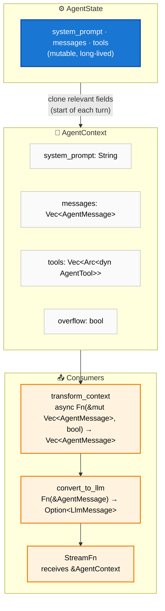
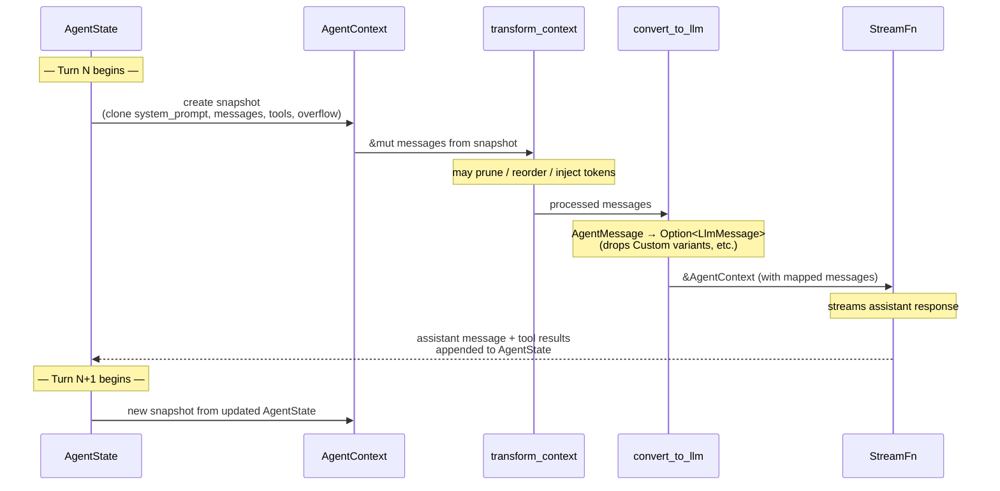

# Agent Context

**Source file:** `src/types.rs`
**Related:** [PRD §5](../../planning/PRD.md#5-agent-context)

The agent context is the immutable snapshot passed into each loop turn. It contains the system prompt, the current message history, and the list of available tools. The loop never mutates a context in place — each turn produces a new snapshot.

---

## L2 — Structure



---

### L3 — Immutability Strategy

- `AgentContext` is constructed at the start of each turn by cloning relevant fields from `AgentState`.
- The context is passed by shared reference (`&AgentContext`) to `StreamFn` and hooks.
- Messages produced during the turn (assistant message, tool results) are appended to `AgentState`, not to the context snapshot.
- This ensures the `StreamFn` and hooks always see a consistent view, even during concurrent tool execution.

---

### L3 — Per-Turn Snapshot Lifecycle



---

### L3 — Overflow Signal

When a `ContextWindowOverflow` error occurs, the harness records this state and uses the next snapshot to communicate the condition to downstream hooks.

- When a `ContextWindowOverflow` error occurs, the harness records this state on `AgentState`.
- On retry via `continue_loop()`, the new `AgentContext` snapshot carries an `overflow` flag set to `true`.
- `transform_context` receives this flag and can apply more aggressive pruning (e.g., dropping older tool results, summarising earlier turns).
- After successful recovery (the next turn completes without overflow), the flag is cleared on `AgentState`, and subsequent snapshots revert to `overflow: false`.

```mermaid
sequenceDiagram
    participant Loop as run_loop
    participant State as AgentState
    participant Ctx as AgentContext
    participant Transform as transform_context

    Note over Loop: Turn fails with ContextWindowOverflow
    Loop->>State: set overflow = true

    Note over Loop: continue_loop() called
    State->>Ctx: create snapshot (overflow: true)
    Ctx->>Transform: &mut messages, overflow = true
    Note over Transform: aggressive pruning applied

    Transform->>Loop: pruned messages
    Note over Loop: turn succeeds

    Loop->>State: set overflow = false
    Note over State: next snapshot will have overflow: false
```
