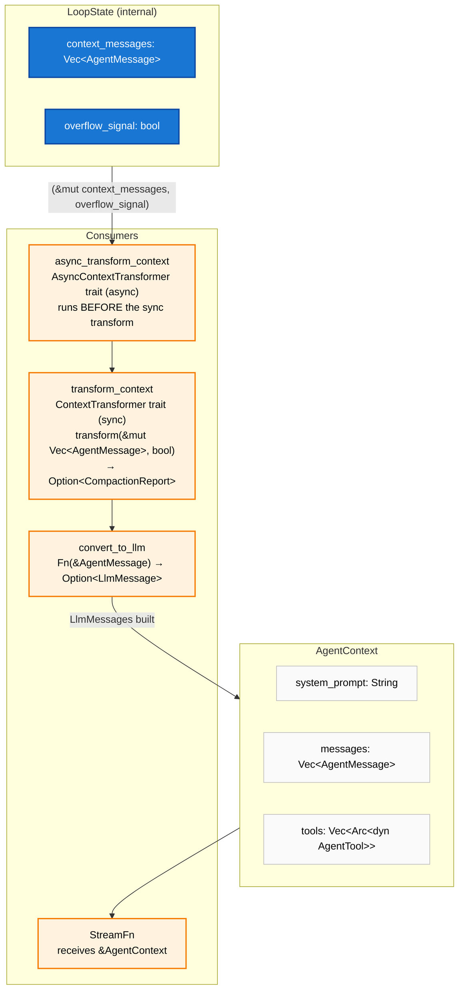
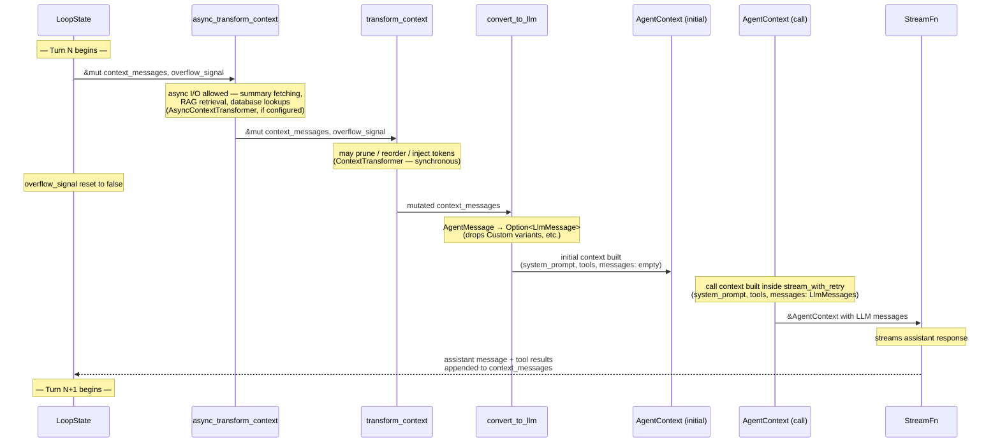

# Agent Context

**Source files:** `src/context.rs` (sliding window compaction), `src/types/`, `src/context_transformer.rs`, `src/async_context_transformer.rs`
**Related:** [PRD §5](../../planning/PRD.md#5-agent-context)

The agent context is the immutable snapshot passed into each loop turn. It contains the system prompt, the current message history, and the list of available tools. The loop never mutates a context in place — each turn produces a new snapshot.

---

## L2 — Structure

---

### L3 — Two-Context Design

The implementation creates two distinct `AgentContext` instances per turn:

1. **Initial context** — Built in `run_turn` with an empty `messages` vec. Carries `system_prompt` and `tools` so they are available to `stream_with_retry`.
2. **Call context** — Built inside `stream_with_retry` (and rebuilt on each retry attempt). Populates `messages` with the LLM-filtered messages (`Vec<AgentMessage>` wrapping the `LlmMessage` values produced by `convert_to_llm`). This is the context actually passed to `StreamFn`.

Message transformation and LLM conversion happen *before* either context is constructed — they operate directly on `LoopState.context_messages`.

---

### L3 — Per-Turn Snapshot Lifecycle

---

### L3 — Overflow Signal

The overflow signal is managed internally in `LoopState` — it is **not** a field on `AgentContext`. It is passed as a plain `bool` parameter to both transformer traits.

- When a `ContextWindowOverflow` error is detected, the loop sets `LoopState.overflow_signal = true` and continues to the next inner-loop iteration.
- At the start of the next turn, the transformers are called with `overflow = true`, so they can apply more aggressive pruning (e.g., dropping older tool results, summarising earlier turns).
- Immediately after, `overflow_signal` is reset to `false` — the signal is consumed in a single turn.
- The signal never flows through `AgentContext`; it exists only in `LoopState` and is passed directly to the transformers.

How the overflow interacts with the surrounding turn/retry machinery is shown in the [agent-loop README](../agent-loop/README.md).

---

## Related: Memory Crate

The `swink-agent-memory` crate builds on the `ContextTransformer` / `AsyncContextTransformer` hooks to provide higher-level compaction strategies. `SummarizingCompactor` wraps `sliding_window` and injects pre-computed summaries of dropped messages after the anchor. See [`memory/docs/architecture/`](../../../memory/docs/architecture/README.md) for the multi-layer memory vision.
