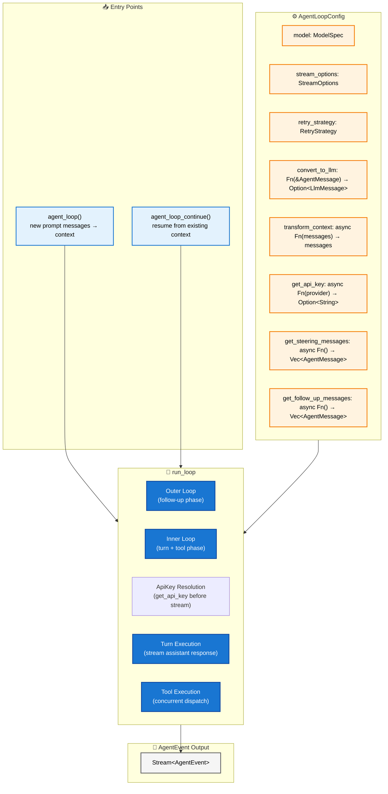
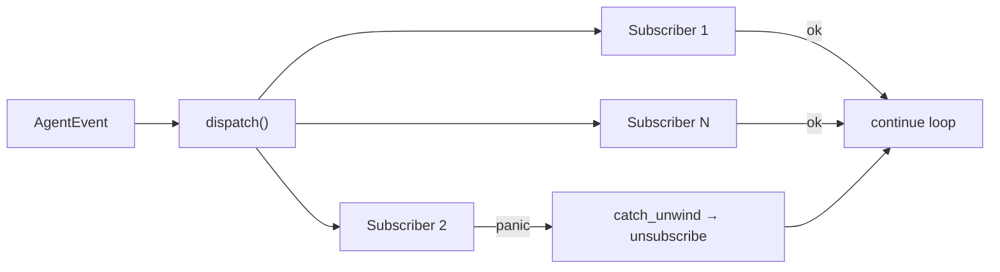

# Agent Loop

**Source files:** `src/loop_.rs`
**Related:** [PRD §12](../../planning/PRD.md#12-agent-loop), [PRD §8](../../planning/PRD.md#8-event-system)

The agent loop is the core execution engine of the harness. It drives turns, dispatches tool calls, manages steering and follow-up message injection, emits all lifecycle events, and handles error and abort conditions. The `Agent` struct is a stateful wrapper over it; the loop itself is stateless and pure.

---

## L2 — Loop Structure



---

## L3 — Nested Loop Phases

The loop is structured as two nested phases. The inner loop handles turns and tool execution. The outer loop handles follow-up messages that arrive after the agent would otherwise stop.

```mermaid
flowchart TB
    AgentStart(["AgentStart"])

    subgraph OuterLoop["🔁 Outer Loop — follow-up phase"]
        OStart(["enter"])
        OPoll["poll get_follow_up_messages()"]
        OHasMsg{"messages?"}

        subgraph InnerLoop["🔁 Inner Loop — turn + tool phase"]
            IStart(["enter turn"])
            InjectPending["inject pending messages<br/>into context"]
            TransformCtx["transform_context()"]
            ConvertLlm["convert_to_llm()"]
            ResolveKey["get_api_key()"]
            StreamTurn["call StreamFn<br/>(with retry)"]
            EmitMsgEvents["emit MessageStart<br/>MessageUpdate ×N<br/>MessageEnd"]
            CheckStop{"stop_reason?"}
            ExtractTools["extract tool calls"]
            HasTools{"has tool calls?"}
            CheckLength{"stop_reason: length?"}
            MTRecovery["max tokens recovery<br/>(replace incomplete tool calls)"]
            ExecTools["execute tools concurrently<br/>(emit ToolExecution* events)"]
            PollSteer["poll get_steering_messages()"]
            HasSteer{"steering?"}
            EmitTurnEnd["emit TurnEnd"]
            EmitTurnEndErr["emit TurnEnd"]
            IPoll["poll get_steering_messages()"]
            IHasSteer{"steering?"}
        end

        AgentStart --> OStart
        OStart --> IStart
        IStart --> InjectPending
        InjectPending --> TransformCtx
        TransformCtx --> ConvertLlm
        ConvertLlm --> ResolveKey
        ResolveKey --> StreamTurn
        StreamTurn --> EmitMsgEvents
        EmitMsgEvents --> CheckStop
        CheckStop -->|"error / aborted"| EmitTurnEndErr
        EmitTurnEndErr -->|"emit AgentEnd — exit"| AgentEnd
        CheckStop -->|"stop / tool_use / length"| ExtractTools
        ExtractTools --> HasTools
        HasTools -->|"no"| EmitTurnEnd
        HasTools -->|"yes"| CheckLength
        CheckLength -->|"yes"| MTRecovery
        MTRecovery --> ExecTools
        CheckLength -->|"no"| ExecTools
        ExecTools --> PollSteer
        PollSteer --> HasSteer
        HasSteer -->|"yes — skip remaining tools"| EmitTurnEnd
        HasSteer -->|"no"| EmitTurnEnd
        EmitTurnEnd --> IPoll
        IPoll --> IHasSteer
        IHasSteer -->|"yes — new turn"| IStart
        IHasSteer -->|"no — exit inner"| OPoll

        OPoll --> OHasMsg
        OHasMsg -->|"yes — new turn"| IStart
        OHasMsg -->|"no"| AgentEnd
    end

    AgentEnd(["AgentEnd"])

    classDef phaseStyle fill:#1976d2,stroke:#0d47a1,stroke-width:2px,color:#fff
    classDef decisionStyle fill:#fff3e0,stroke:#f57c00,stroke-width:2px,color:#000
    classDef termStyle fill:#e0e0e0,stroke:#424242,stroke-width:2px,color:#000
    classDef stepStyle fill:#f5f5f5,stroke:#616161,stroke-width:2px,color:#000

    class IStart,OStart,AgentStart phaseStyle
    class CheckStop,CheckLength,HasTools,HasSteer,IHasSteer,OHasMsg decisionStyle
    class AgentEnd termStyle
    class InjectPending,TransformCtx,ConvertLlm,ResolveKey,StreamTurn,EmitMsgEvents,ExtractTools,MTRecovery,ExecTools,PollSteer,EmitTurnEnd,EmitTurnEndErr,IPoll,OPoll stepStyle
```



---

## L3 — Event Emission Sequence

Every event emitted during a normal two-turn run with one tool call per turn.

```mermaid
sequenceDiagram
    participant Loop as run_loop
    participant Sub as Subscriber

    Loop->>Sub: AgentStart

    Note over Loop: — Turn 1 —
    Loop->>Sub: TurnStart
    Loop->>Sub: MessageStart (user)
    Loop->>Sub: MessageEnd (user)
    Loop->>Sub: MessageStart (assistant, streaming)
    loop streaming
        Loop->>Sub: MessageUpdate (delta)
    end
    Loop->>Sub: MessageEnd (assistant)
    Loop->>Sub: ToolExecutionStart (tool_call_id, name, args)
    Loop->>Sub: ToolExecutionUpdate (partial result) [optional]
    Loop->>Sub: ToolExecutionEnd (result, is_error)
    Loop->>Sub: TurnEnd (assistant message + tool results)

    Note over Loop: — Turn 2 —
    Loop->>Sub: TurnStart
    Loop->>Sub: MessageStart (assistant, streaming)
    loop streaming
        Loop->>Sub: MessageUpdate (delta)
    end
    Loop->>Sub: MessageEnd (assistant)
    Loop->>Sub: TurnEnd (assistant message, no tool results)

    Loop->>Sub: AgentEnd (all new messages)
```

---

## L4 — Steering Interrupt Flow

Steering messages cause the loop to abandon remaining tools in the current batch and inject the steering message before the next assistant turn.

```mermaid
sequenceDiagram
    participant App as Application
    participant Agent as Agent Struct
    participant Loop as run_loop
    participant Tools as Tool Executor

    Note over Loop: executing tool batch [A, B, C]...
    Loop->>Tools: execute tool A
    Tools-->>Loop: result A
    Loop->>Agent: poll get_steering_messages()
    Note over App: App calls agent.steer(msg)
    Agent-->>Loop: [steering message]

    Note over Loop: cancel tools B and C via CancellationToken
    Loop->>Loop: emit ToolExecutionEnd(error: "tool call cancelled: user requested steering interrupt") for B, C
    Loop->>Loop: emit TurnEnd
    Loop->>Loop: push steering message to pending
    Loop->>Loop: new TurnStart
    Loop->>Loop: inject steering message into context
    Note over Loop: continues with next assistant turn
```

---

## L3 — Event Dispatch System

The agent loop uses a synchronous fan-out dispatch system to deliver `AgentEvent` instances to all registered subscribers.

### Subscriber Registration

- **Subscribe:** `subscribe(callback) → SubscriptionId` — registers a callback that receives events.
- **Unsubscribe:** `unsubscribe(id)` — removes a previously registered subscriber.

### Internal Storage

```text
HashMap<SubscriptionId, Box<dyn Fn(&AgentEvent) + Send + Sync>>
```

### Dispatch Semantics

- **Synchronous fan-out:** each event is delivered to every registered subscriber before the loop proceeds.
- **Thread safety:** all callbacks must be `Send + Sync`.
- **Panic isolation:** if a subscriber panics, the panic is caught and does not crash the loop. The panicking subscriber is automatically unsubscribed.



---

## L4 — Subscriber Lifecycle

Subscribers can be registered and unregistered at any point relative to the agent loop's execution.

- **Registration timing:** subscribers may be added before a run starts or while a run is in progress.
- **Unsubscription timing:** subscribers may be removed at any time, including from within a callback (takes effect after the current dispatch completes).
- **Mid-run registration:** a subscriber added during a run receives events only from the point of registration onward; it does not receive retroactive events.
- **Panic auto-unsubscription:** a subscriber whose callback panics is automatically unsubscribed. The panic is caught, the subscriber is removed, and dispatch continues to remaining subscribers.
