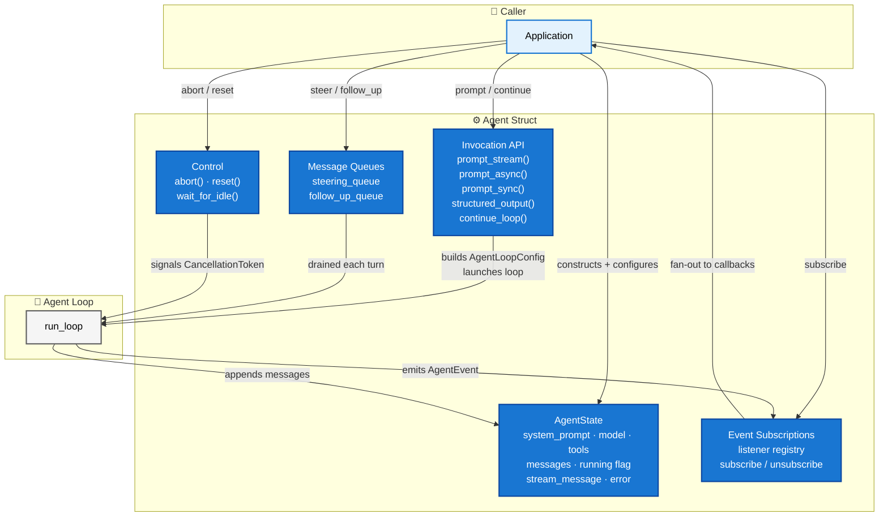
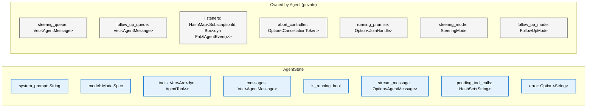
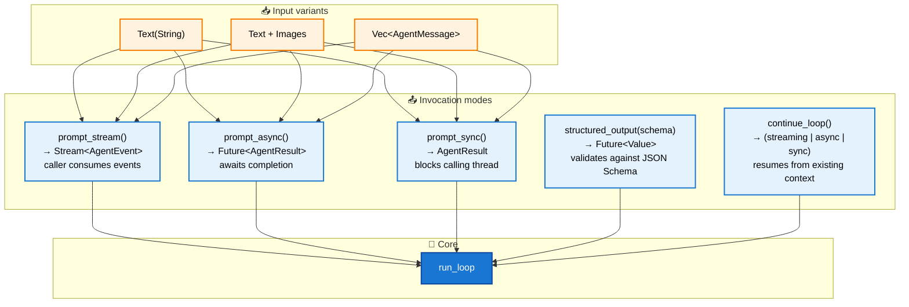

# Agent Struct

**Source file:** `src/agent.rs`
**Related:** [PRD §13](../../planning/PRD.md#13-agent-struct)

The `Agent` struct is the primary public interface of the harness. It is a stateful wrapper over the agent loop that owns conversation history, manages the steering and follow-up queues, exposes three invocation modes, and fans lifecycle events out to subscribers.

---

## L2 — Responsibilities



---

## L3 — AgentState Fields



---

## L3 — Invocation Modes

All three prompt variants and structured output share the same underlying `run_loop`. The differences are in how the result is surfaced to the caller.



> **Note — Structured output** is owned by the `Agent` struct. The `Agent` injects a synthetic tool, runs the loop, validates the result against the JSON Schema, and retries via `continue_loop()` if invalid — up to a configurable maximum. The loop itself has no structured output awareness.

---

## L4 — Concurrency State Machine

The `Agent` permits only one active invocation at a time. This state machine governs transitions.

```mermaid
stateDiagram-v2
    [*] --> Idle : constructed

    Idle --> Running : prompt() / continue_loop()
    Running --> Idle : loop completes (AgentEnd)
    Running --> Idle : abort() → StopReason::Aborted
    Running --> Idle : unrecoverable error

    Idle --> Idle : steer() [queued, no effect until next run]
    Idle --> Idle : follow_up() [queued]
    Running --> Running : steer() [enqueued, drained after next tool batch]
    Running --> Running : follow_up() [enqueued, drained when loop would stop]

    Idle --> Idle : reset() [clears state + queues]
    Running --> Running : ERROR — prompt() rejected, returns Err
```

---

## L4 — Steering and Follow-up Queue Draining

```mermaid
sequenceDiagram
    participant App as Application
    participant Agent as Agent Struct
    participant Loop as run_loop

    App->>Agent: prompt("do something")
    Agent->>Loop: launch with get_steering_messages callback

    Note over Loop: executing tool calls...

    App->>Agent: steer(message)
    Note over Agent: pushed to steering_queue

    Loop->>Agent: poll get_steering_messages()
    Agent-->>Loop: [steering message]
    Note over Loop: skip remaining tools,<br/>inject steering msg,<br/>start new turn

    Note over Loop: agent reaches natural stop...

    Loop->>Agent: poll get_follow_up_messages()
    Agent-->>Loop: [] (empty)
    Loop-->>Agent: AgentEnd
    Agent-->>App: AgentResult
```

> **Note:** On error or abort, follow-up queues are NOT polled — the loop exits immediately.
