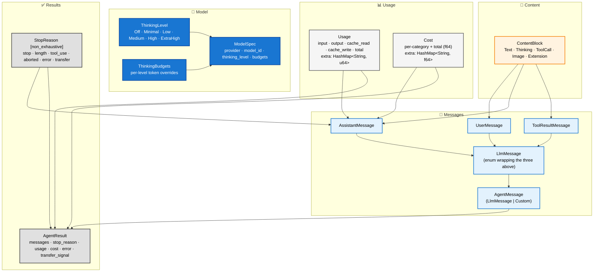
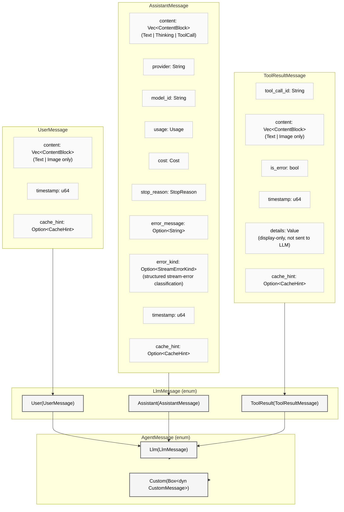
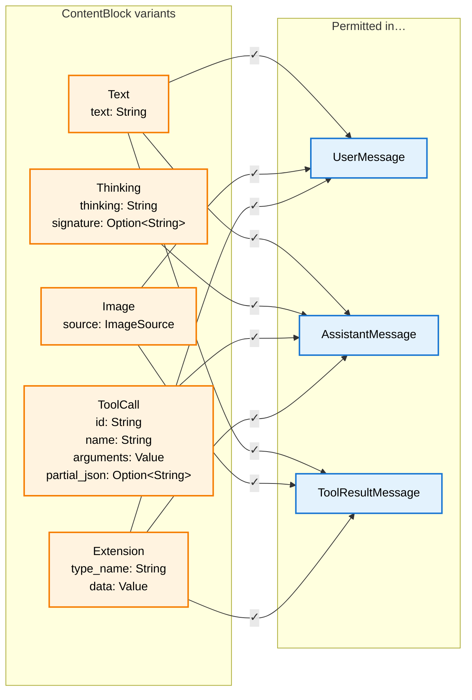
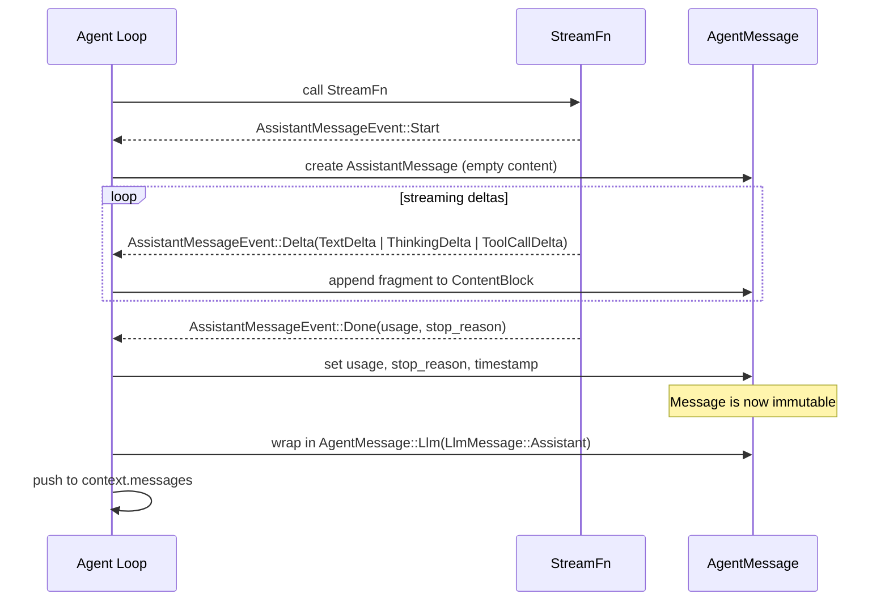

# Data Model

**Source files:** `src/types/` module (`mod.rs`, `model.rs`, `custom_message.rs`, `message_codec.rs`), `src/state.rs`
**Related:** [PRD §3](../../planning/PRD.md#3-core-data-model)

The data model defines every type that crosses a public boundary in the harness. All other modules depend on it; it depends on nothing else in the crate.

---

## L2 — Type Groups

The types are organised into five cohesive groups. Every other module in the harness imports from one or more of these groups.



---

## L3 — Message Type Composition

Each message type is a distinct struct. None of the structs carry an explicit `role` field — the role is encoded in the `LlmMessage` enum discriminant (`User`, `Assistant`, `ToolResult`). This avoids the possibility of a role field contradicting the variant it appears in. `AgentMessage` extends this further with an open custom variant.



---

## L3 — ContentBlock Variants

`ContentBlock` is the atomic unit of all message content. Different variants are permitted in different message roles.



---

## L4 — AgentMessage Lifetime

This sequence shows how an `AgentMessage` is created, mutated during streaming, and finalised within a single turn.



---

## Usage & Cost Arithmetic

`Usage` and `Cost` both implement `Add` and `AddAssign`, so they can be accumulated across turns with `+` and `+=`. `Usage` additionally provides a `pub fn merge(&mut self, other: &Usage)` convenience method whose body simply delegates to `AddAssign` (`*self += other.clone()`).

| Type | `Add` | `AddAssign` | `merge()` |
|-------|:-----:|:-----------:|:---------:|
| Usage | yes | yes | yes |
| Cost | yes | yes | — |

All five standard fields (`input`, `output`, `cache_read`, `cache_write`, `total`) are summed independently. Both `Usage` and `Cost` also carry an `extra` map (`HashMap<String, u64>` and `HashMap<String, f64>` respectively) for provider-specific metrics (e.g., reasoning tokens, search tokens). The `extra` entries are merged key-wise during addition and `merge()`.

---

## Serialisation

All message and content types derive `Serialize` and `Deserialize` (from `serde`). The two tagged enums use internally-tagged representation:

| Type | `#[serde(...)]` | Discriminant key |
|------|-----------------|-----------------|
| `ContentBlock` | `#[serde(tag = "type", rename_all = "snake_case")]` | `"type"` |
| `LlmMessage` | `#[serde(tag = "role", rename_all = "snake_case")]` | `"role"` |

This means a serialised `LlmMessage::User(...)` includes `"role": "user"` at the top level, while a `ContentBlock::ToolCall { .. }` includes `"type": "tool_call"`.

---

## Session State (`src/state.rs`)

`SessionState` is a key-value store (`HashMap<String, serde_json::Value>`) for per-session structured data that tools and policies can read/write during execution, shared as `Arc<RwLock<SessionState>>` (also a field on `AgentLoopConfig`). Every `set`/`remove`/`clear` is recorded in a `StateDelta` — a map of `key → Option<Value>` where `Some` means set/updated and `None` means removed — which the loop flushes at each turn boundary via `flush_delta()`.

| Method | Semantics |
|--------|-----------|
| `set<T: Serialize>(key, value)` | Serialize and store; records `Some(value)` in the delta. Errors leave state unchanged. |
| `remove(key)` / `clear()` | Records `None` per removed key; `remove` is a no-op for absent keys. |
| `get<T>` / `get_raw` | Typed (returns `None` on deserialization failure) or raw JSON access. |
| `with_data(map)` | Constructs pre-seeded state — baseline data does **not** appear in the delta. |
| `apply_baseline(&baseline)` | Layers baseline entries *underneath* existing data: only keys absent from this state are inserted; existing entries always win; inserted entries record **no** delta (mirrors `with_data` semantics). |
| `flush_delta()` | Takes the pending `StateDelta` and resets tracking. |
| `snapshot()` / `restore_from_snapshot(value)` | JSON round-trip of the materialized data (delta excluded — it is `#[serde(skip)]`). |

Delta entries collapse: set-then-set keeps the last value, set-then-remove yields `None`, remove-then-set yields `Some(new)`.

---

## Turn Snapshot

`TurnSnapshot` is a point-in-time capture of agent state at a turn boundary, emitted with `TurnEnd` events for external replay, auditing, and debugging:

| Field | Type | Notes |
|-------|------|-------|
| `turn_index` | `usize` | Zero-based within the current run |
| `messages` | `Arc<Vec<LlmMessage>>` | `Arc`-wrapped to avoid cloning per subscriber; custom (de)serialized |
| `usage` / `cost` | `Usage` / `Cost` | Accumulated up to and including this turn |
| `stop_reason` | `StopReason` | From the assistant message ending the turn |
| `state_delta` | `Option<StateDelta>` | Session-state changes during this turn, if any |

---

## Model Capabilities

`ModelCapabilities` (`src/types/model.rs`) describes what a model supports, attached to `ModelSpec` via `with_capabilities()` (defaults to all-false/`None` when unset): boolean flags `supports_thinking`, `supports_vision`, `supports_tool_use`, `supports_streaming`, `supports_structured_output`, plus `max_context_window: Option<u64>` and `max_output_tokens: Option<u64>`. Built with chainable `with_*` methods starting from `ModelCapabilities::none()`.

---

## Thread-Safety (Send + Sync)

The module contains compile-time assertions that verify every public type is `Send + Sync`:

```
ContentBlock, ImageSource, UserMessage, AssistantMessage, ToolResultMessage,
LlmMessage, AgentMessage, Usage, Cost, StopReason, ThinkingLevel,
ThinkingBudgets, ModelCapabilities, ModelSpec, AgentResult, AgentContext,
TurnSnapshot, CustomMessageRegistry, DowncastError
```

`src/state.rs` carries its own assertions for `SessionState`, `StateDelta`, and `Arc<RwLock<SessionState>>`. If any type were changed in a way that broke thread-safety, the build would fail immediately.

---

## Helper Methods

| Method | Description |
|--------|-------------|
| `ContentBlock::extract_text(blocks: &[ContentBlock]) -> String` | Concatenates all `Text` variants from a slice, ignoring other block types. |
| `ThinkingBudgets::new(budgets: HashMap<ThinkingLevel, u64>) -> Self` | Constructs a budget map. |
| `ThinkingBudgets::get(level: &ThinkingLevel) -> Option<u64>` | Looks up the token budget for a given thinking level. |
| `ModelSpec::new(provider, model_id) -> Self` | Creates a `ModelSpec` with thinking disabled and no budgets. Accepts `impl Into<String>`. |
