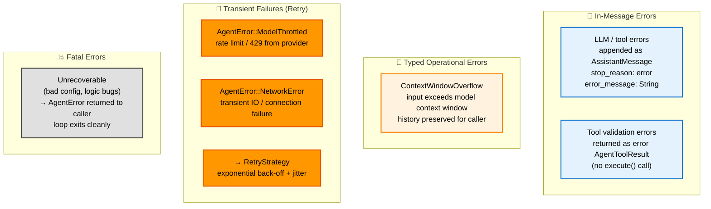
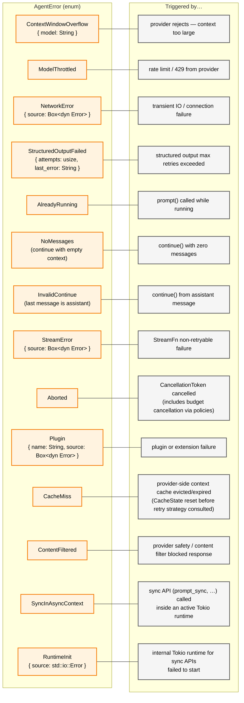
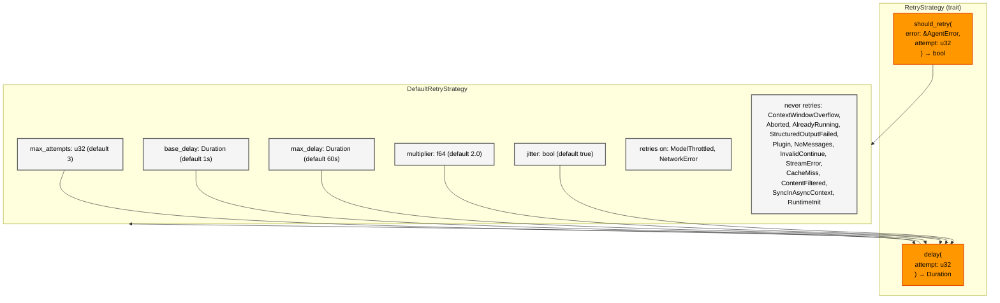
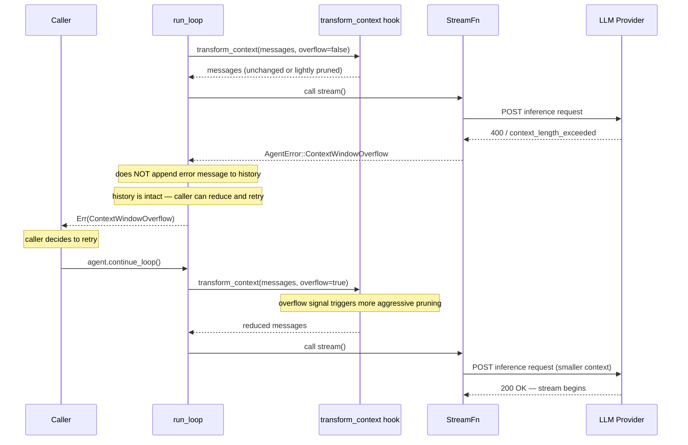
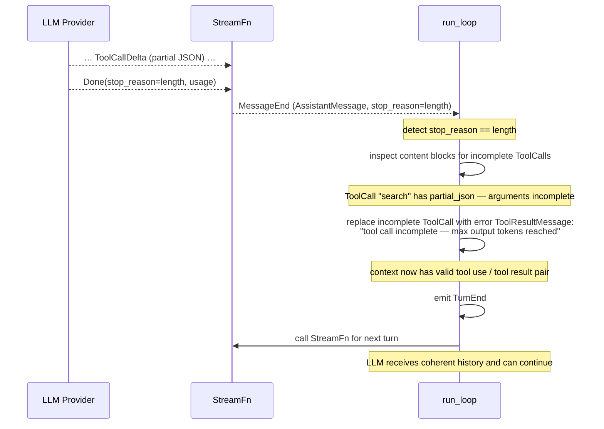

# Error Handling

**Source files:** `src/error.rs`, `src/retry.rs`, `src/loop_/mod.rs`
**Related:** [PRD §10](../../planning/PRD.md#10-error-handling), [PRD §11](../../planning/PRD.md#11-retry-strategy)

The harness distinguishes three categories of failure: recoverable model errors (surfaced in the message log), typed operational errors (context overflow), transient provider failures (handled by the retry strategy), and fatal errors. No category results in a panic.

---

## L2 — Error Categories

---

## L3 — Error Classification from Stream Events

When the stream produces an `AssistantMessageEvent::Error`, the loop classifies it into an `AgentError` variant via `classify_stream_error` (`src/loop_/mod.rs`). Classification is **structural first**: every built-in adapter attaches a `StreamErrorKind` to the error event, constructed at the adapter edge from provider-specific error codes/types (e.g. Anthropic `invalid_request_error` with the documented "prompt is too long" wording, OpenAI/Azure `code: "context_length_exceeded"`, Bedrock `validationException`, Google `INVALID_ARGUMENT`). If the adapter attached a `StreamErrorKind`, it is used directly and no string matching happens. A built-in adapter that leaves a classifiable error to the substring fallback is a bug in that adapter.

| `error_kind` (`StreamErrorKind`) | AgentError variant |
|---|---|
| `Throttled` | `ModelThrottled` |
| `ContextWindowExceeded` | `ContextWindowOverflow` |
| `Auth` | `StreamError` |
| `Network` | `NetworkError` |
| `ContentFiltered` | `ContentFiltered` |

Only when `error_kind` is absent — i.e. for third-party/custom `StreamFn` implementations, or provider errors with no more specific meaning — does the loop fall back to substring matching on the `error_message` string:

| `error_kind` (preferred) | Pattern in `error_message` (fallback, case-insensitive) | AgentError variant |
|---|---|---|
| `Throttled` | `"rate limit"`, `"429"`, or `"throttl"` | `ModelThrottled` |
| `ContextWindowExceeded` | `"context window"` or `"context_length_exceeded"` | `ContextWindowOverflow` |
| `Auth` | _(none)_ | `StreamError` |
| `Network` | _(none)_ | `NetworkError` |
| `ContentFiltered` | `"content filter"` or `"content_filter"` | `ContentFiltered` |
| _(none)_ | `"cache miss"`, `"cache not found"`, or `"cache_miss"` | `CacheMiss` |
| _(none)_ | _(stop_reason is Aborted)_ | `Aborted` |
| _(none)_ | _(anything else)_ | `StreamError` |

This classification determines whether the error is retryable (`ModelThrottled` triggers the retry strategy), triggers overflow recovery (`ContextWindowOverflow`), or is treated as a non-retryable failure (`StreamError`).

> **Adapters that rely on the string-matching fallback for a classifiable error are considered buggy, not merely incomplete.** The fallback exists for third-party/custom `StreamFn` compatibility (see [#106](https://github.com/SuperSwinkAI/Swink-Agent/issues/106)/#114, which hardened this mechanism), not as a permanent substitute for structured classification in built-in adapters. As of this writing, no built-in adapter (anthropic, openai, mistral, xai, azure, ollama, google, bedrock, proxy) ever constructs `StreamErrorKind::ContextWindowExceeded` — the context-overflow recovery flow documented below is, in practice, entirely dependent on the substring fallback matching a given provider's exact wording. Tracked in [#1063](https://github.com/SuperSwinkAI/Swink-Agent/issues/1063).

> **StreamError vs in-message errors.** `StreamError` is a non-retryable `AgentError` produced when the `StreamFn` itself fails or when `classify_stream_error` cannot match the error to a more specific variant. In-message errors are a distinct path: the provider returns an `AssistantMessageEvent::Error` event that the loop captures and classifies. If the classified result is non-retryable, the loop builds an `AssistantMessage` with `stop_reason: Error` and emits it as a `MessageEnd` agent event. The two paths share the `StreamError` variant name but originate from different failure points.

---

## L3 — AgentError Taxonomy

---

## L3 — RetryStrategy Trait

---

## L4 — Context Window Overflow Recovery Flow

---

## L4 — Max Tokens Recovery Flow

> **Note:** This recovery is handled internally by the loop. `MaxTokensReached` is not surfaced as a `AgentError` to the caller.

