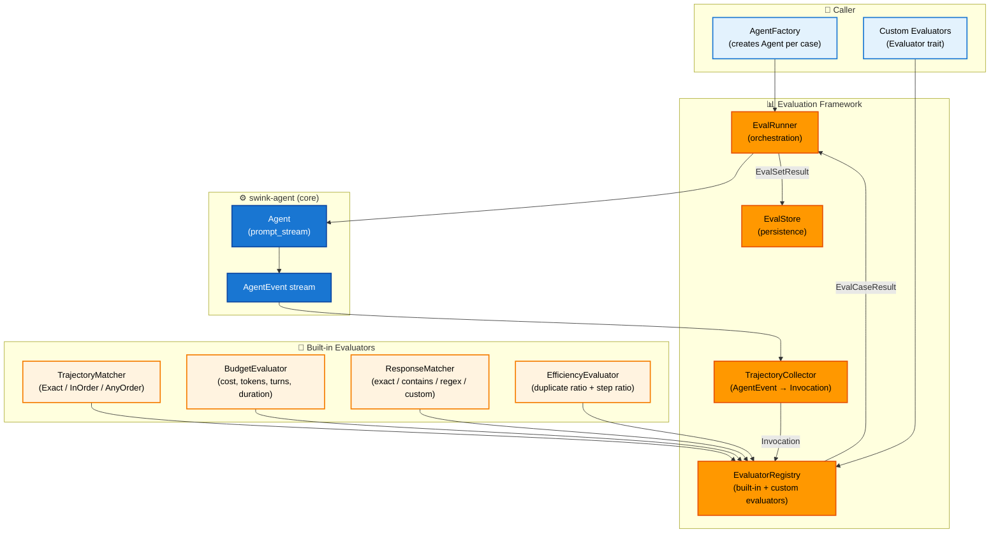
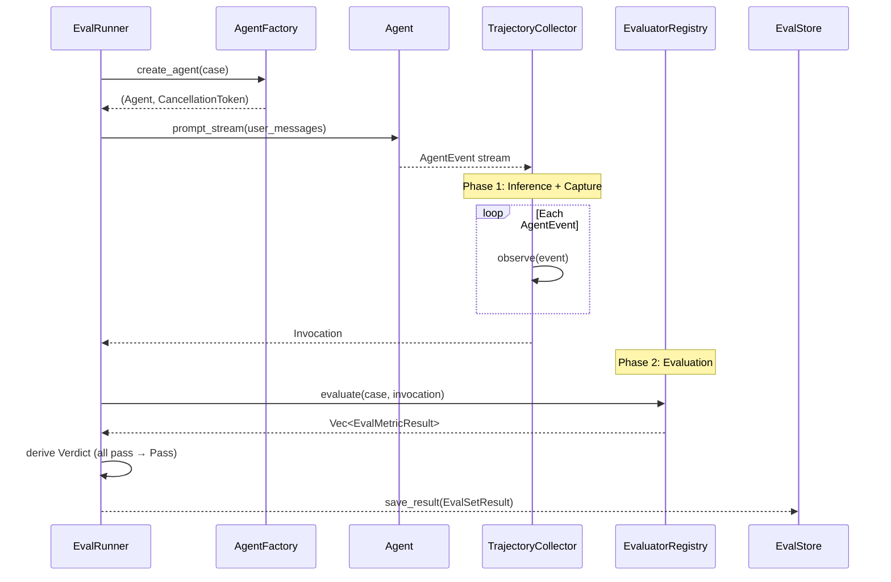
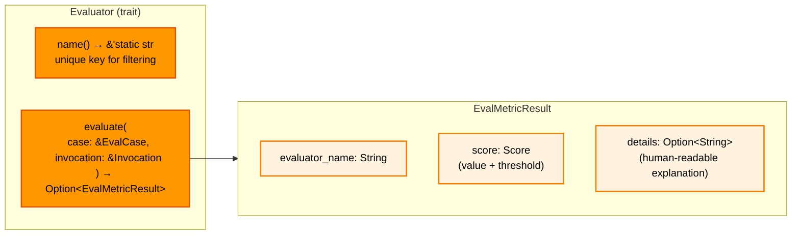
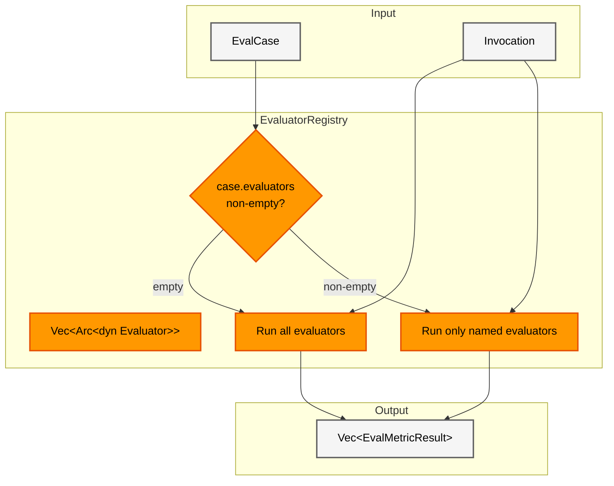
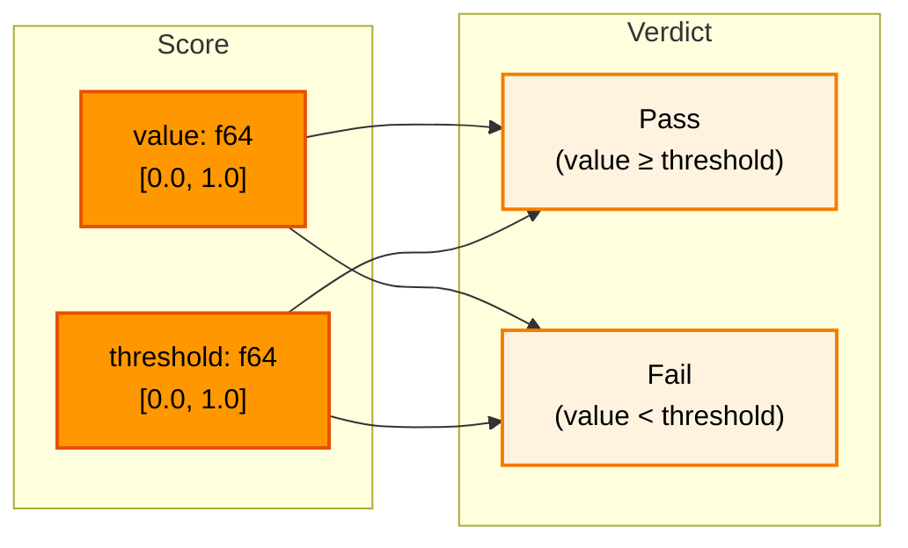

# Evaluation Framework

**Source files:** `eval/src/`
**Related:** [EVAL Planning](../../planning/EVAL.md), [Agent Loop](../agent-loop/README.md) (event protocol), [Tool System](../tool-system/README.md) (tool call format)

The evaluation framework provides trajectory tracing, golden path verification, response matching, and cost/latency governance for agent runs. It consumes the existing `AgentEvent` stream to capture execution traces, then scores them via a pluggable evaluator registry.

---

## L2 — Components



---

## L3 — Two-Phase Pipeline

The framework follows a two-phase design (inspired by Google ADK's evaluation architecture):

1. **Inference phase** — Run the agent and capture its execution trajectory as an `Invocation`
2. **Evaluation phase** — Score the invocation against the eval case definition using pluggable evaluators



---

## L3 — Evaluator Trait Contract



**Key design choice:** `evaluate` returns `Option<EvalMetricResult>`. `None` means "not applicable" — e.g., `TrajectoryMatcher` returns `None` when the case has no `expected_trajectory`. This avoids forcing every evaluator to produce a score for every case.

Blanket implementation for named closure pairs enables quick one-off evaluators:
```rust
let eval: Box<dyn Evaluator> = Box::new(("my_metric", |case, inv| { ... }));
```

---

## L3 — Trajectory Collector

The `TrajectoryCollector` subscribes to the `AgentEvent` stream and builds an `Invocation` trace. It is decoupled from `Agent` — it consumes events, not agents.

### Event → Record Mapping

| AgentEvent | Action |
|---|---|
| `AgentStart` | Record start timestamp |
| `BeforeLlmCall { model, .. }` | Capture `ModelSpec` (first occurrence) |
| `TurnStart` | Open new `TurnBuilder` |
| `ToolExecutionStart { id, name, arguments }` | Append `RecordedToolCall` to current turn |
| `TurnEnd { assistant_message, tool_results, .. }` | Close turn: record duration, accumulate usage/cost |
| All other events | Observed but not recorded |

### Two Entry Points

| Method | Use case |
|---|---|
| `observe(&mut self, event: &AgentEvent)` | Incremental — for subscription callbacks |
| `collect_from_stream(stream) -> Invocation` | Convenience — consumes entire event stream |

---

## L3 — Built-in Evaluators

### TrajectoryMatcher

Compares actual tool call sequences against an expected golden path.

| Mode | Behaviour | Score |
|---|---|---|
| `Exact` | Same tools, same order, same count. No extras allowed. | Fraction of matched pairs. Threshold: 1.0 |
| `InOrder` | Expected tools appear in sequence. Extra tools between are allowed. | Fraction of expected calls found in order. Threshold: 1.0 |
| `AnyOrder` | All expected tools appear somewhere. Order and extras don't matter. | Fraction of expected calls found. Threshold: 1.0 |

Argument matching: if `ExpectedToolCall.arguments` is `Some`, exact JSON equality is required. If `None`, only the tool name is checked.

### BudgetEvaluator

Checks that an agent run stays within defined cost, token, turn, and duration constraints.

| Constraint | Checked against |
|---|---|
| `max_cost` | `invocation.total_cost.total` |
| `max_tokens` | `invocation.total_usage.total` |
| `max_turns` | `invocation.turns.len()` |
| `max_duration` | `invocation.total_duration` |

Score: 1.0 (pass) if all constraints satisfied, 0.0 (fail) if any violated. Details string lists which constraints failed.

### ResponseMatcher

Scores the agent's final response text against expected criteria.

| Mode | Behaviour |
|---|---|
| `Exact` | `actual == expected` |
| `Contains` | `actual.contains(substring)` |
| `Regex` | `regex::Regex::new(pattern).is_match(actual)` |
| `Custom` | User-supplied `Arc<dyn Fn(&str) -> Score>` (not serializable) |

### EfficiencyEvaluator

Measures token and turn efficiency relative to a reference baseline. Loaded automatically by `EvaluatorRegistry::with_defaults()`. Source: `eval/src/efficiency.rs`.

Scores: composite of two weighted ratios. Returns `None` when the invocation has zero tool calls.

| Metric | Weight | Formula |
|---|---|---|
| Duplicate ratio | 0.6 | `unique_calls / total_calls` — penalises repeated identical tool calls |
| Step ratio | 0.4 | `min(ideal_turns, actual_turns) / actual_turns` — penalises excess turns relative to an ideal; ideal defaults to `budget.max_turns` if set, otherwise the unique tool call count |
| **Composite score** | — | `0.6 * duplicate_ratio + 0.4 * step_ratio` |

Default pass threshold: **0.5**. Customise with `EfficiencyEvaluator::with_threshold(f64)`.

---

## L3 — Evaluator Registry



`EvaluatorRegistry::with_defaults()` pre-loads: `TrajectoryMatcher::in_order()`, `BudgetEvaluator`, `ResponseMatcher`, `EfficiencyEvaluator`.

---

## L3 — Persistence

`FsEvalStore` stores data as JSON files in a simple directory layout:

```
{dir}/
├── sets/
│   └── {id}.json              # EvalSet definitions
└── results/
    └── {eval_set_id}/
        ├── {timestamp_1}.json  # EvalSetResult snapshots
        └── {timestamp_2}.json
```

The `EvalStore` trait enables alternative backends (in-memory, cloud storage). The `list_results` method returns sorted timestamps, enabling historical comparison and trending for future comparative metrics.

---

## L3 — Score and Verdict



Each evaluator embeds its own threshold in the `Score`, allowing different pass criteria per metric. The `EvalRunner` derives the overall `Verdict` by requiring all metrics to pass (AND semantics).

---

## L4 — Data Model

### EvalCase

Defines a single evaluation scenario:

| Field | Type | Purpose |
|---|---|---|
| `id` | `String` | Unique identifier |
| `name` | `String` | Human-readable name |
| `system_prompt` | `String` | System prompt for the agent |
| `user_messages` | `Vec<String>` | Initial user messages (the prompt) |
| `expected_trajectory` | `Option<Vec<ExpectedToolCall>>` | Golden path tool calls |
| `expected_response` | `Option<ResponseCriteria>` | Expected final response |
| `budget` | `Option<BudgetConstraints>` | Cost/latency governance |
| `evaluators` | `Vec<String>` | Evaluator name filter (empty = all) |
| `metadata` | `serde_json::Value` | Arbitrary user-defined extensions |

### Invocation

Complete trace of an agent run:

| Field | Type | Source |
|---|---|---|
| `turns` | `Vec<TurnRecord>` | Built from `TurnStart`/`TurnEnd` events |
| `total_usage` | `Usage` | Accumulated from `AssistantMessage.usage` |
| `total_cost` | `Cost` | Accumulated from `AssistantMessage.cost` |
| `total_duration` | `Duration` | Wall clock from `AgentStart` to finish |
| `final_response` | `Option<String>` | Extracted text from last assistant message |
| `stop_reason` | `StopReason` | From last turn |
| `model` | `ModelSpec` | From first `BeforeLlmCall` event |

### TurnRecord

A single recorded turn:

| Field | Type |
|---|---|
| `turn_index` | `usize` |
| `assistant_message` | `AssistantMessage` |
| `tool_calls` | `Vec<RecordedToolCall>` |
| `tool_results` | `Vec<ToolResultMessage>` |
| `duration` | `Duration` |

---

## L3 — CI/CD Gating

The gate system checks an `EvalSetResult` against configurable thresholds and produces a pass/fail verdict with a process exit code, suitable for CI/CD pipelines.

`GateConfig` supports three optional thresholds:

| Threshold | Field | Check |
|---|---|---|
| Minimum pass rate | `min_pass_rate` (f64, 0.0–1.0) | Fraction of cases that passed |
| Maximum cost | `max_cost` (f64, dollars) | Total cost across all cases |
| Maximum duration | `max_duration` (Duration) | Total wall-clock time |

`check_gate(result, config)` returns a `GateResult` with `passed: bool`, `exit_code: i32` (0 = pass, 1 = fail), and a human-readable `summary`. Multiple threshold violations are reported together. `GateResult::exit()` terminates the process with the appropriate exit code.

---

## L3 — Audit Trails

`AuditedInvocation` wraps an `Invocation` with a SHA-256 hash chain for tamper detection. Each turn is serialized to canonical JSON and hashed individually; the concatenated turn hashes are then hashed again to produce a single `chain_hash`.

- `AuditedInvocation::from_invocation(inv)` computes and stores the hash chain.
- `AuditedInvocation::verify()` recomputes all hashes and returns `true` if they match the stored values.

Serializable via serde for persistence alongside evaluation results. Note: `serde_json::Value` map key order is insertion-dependent, so audit trails verify same-instance integrity, not cross-process reproducibility.

---

## L3 — Budget Guarding

`BudgetGuard` enables real-time cancellation of agent runs that exceed cost, token, or turn thresholds during stream collection. It works with `TrajectoryCollector::collect_with_guard()`.

| Threshold | Builder method |
|---|---|
| Max cost (dollars) | `with_max_cost(f64)` |
| Max tokens | `with_max_tokens(u64)` |
| Max turns | `with_max_turns(usize)` |

`BudgetGuard::from_case(case, cancel)` constructs a guard from an `EvalCase`'s budget constraints. After each event, `collect_with_guard` checks accumulated metrics; if any threshold is exceeded, it cancels the `CancellationToken` and logs a warning. The stream is fully drained so the returned `Invocation` trace is complete even after cancellation.

`EvalRunner::run_case()` automatically wires a `BudgetGuard` when the case defines budget constraints.

---

## L3 — YAML Eval Specs

The `yaml` feature gate enables `load_eval_set_yaml(path)`, which deserializes an `EvalSet` from a YAML file via `serde_yaml`. All `ResponseCriteria` variants except `Custom` are supported; `Custom` requires programmatic construction.

---

## L4 — Future Comparative Metrics

The design accommodates A/B model comparison and Pareto frontier analysis without breaking changes:

1. **`EvalSetResult` stores full `Invocation` per case** — a comparison module can load two results (different models/configs) and diff them
2. **`EvalStore::list_results()` returns timestamped IDs** — load historical results for trending
3. **`EvalCase.metadata` carries arbitrary JSON** — model-specific config, tags, Pareto dimensions
4. **New evaluators register via `EvaluatorRegistry`** — a `ComparativeEvaluator` can be added as a new trait without modifying `Evaluator`

A future `comparative.rs` module would add:
- `ComparisonResult` — baseline vs candidate `EvalSetResult` with per-case deltas
- `CaseComparison` — score, cost, token, and latency deltas per case
- Pareto frontier computation across the cost-performance plane
