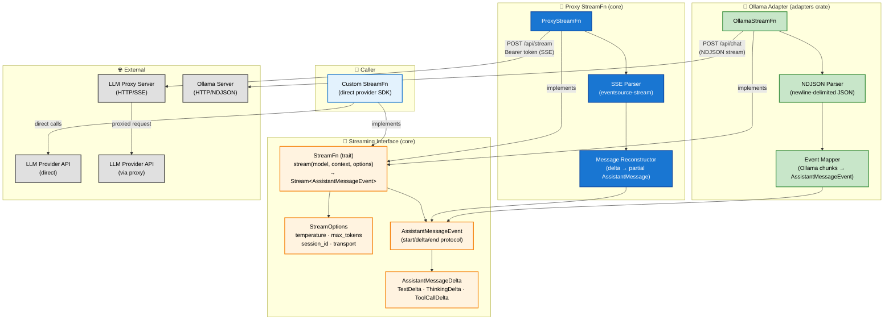
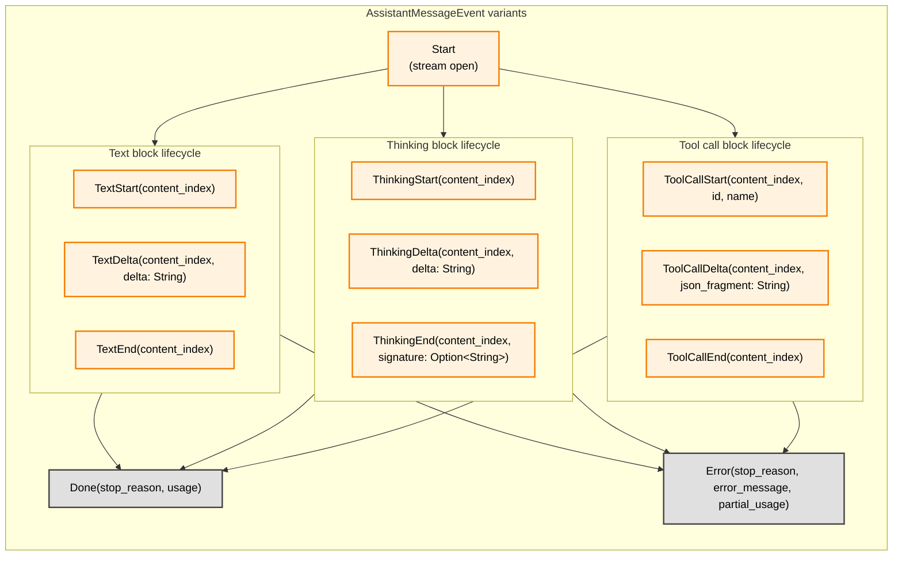
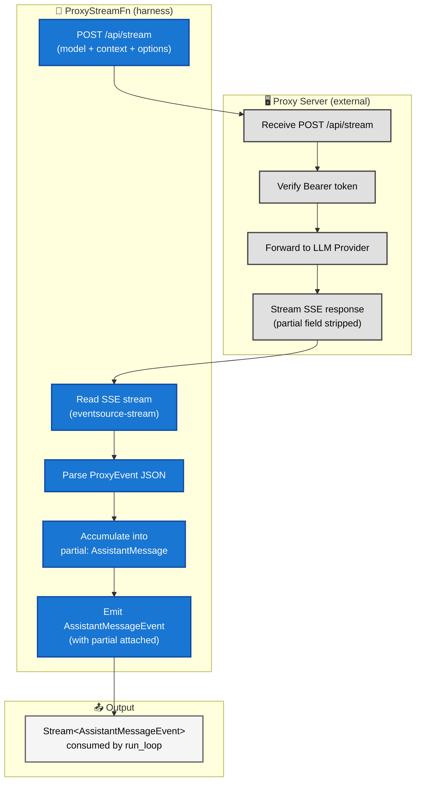
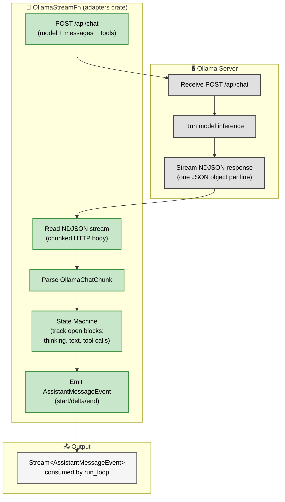

# Streaming Interface

**Source files:** `src/stream.rs`, `src/proxy.rs`, `adapters/src/ollama.rs`
**Related:** [PRD §7](../../planning/PRD.md#7-streaming-interface)

The streaming interface is the single boundary between the harness and LLM providers. The harness never holds provider credentials or SDK clients. All inference flows through a `StreamFn` implementation. Two implementations ship with the project:

| Implementation | Crate | Transport | Endpoint |
|---|---|---|---|
| `ProxyStreamFn` | `agent-harness` (core) | **SSE** (Server-Sent Events via `eventsource-stream`) | `POST /api/stream` on a caller-managed proxy |
| `OllamaStreamFn` | `agent-harness-adapters` | **NDJSON** (newline-delimited JSON over chunked HTTP) | `POST /api/chat` on an Ollama server |

Both implementations produce the same `Stream<AssistantMessageEvent>` output. The transport difference is internal: `ProxyStreamFn` parses SSE frames with named event types, while `OllamaStreamFn` splits raw newline-delimited JSON lines and maps Ollama's response schema into harness events. Callers can also supply a fully custom `StreamFn` for any other provider.

---

## L2 — Components



---

## L3 — AssistantMessageEvent Protocol

Events follow a strict start/delta/end protocol per content block. Each block has a `content_index` that identifies its position in the final message's content vec.



---

## L3 — ProxyStreamFn Architecture

The proxy strips the full partial message from delta events to reduce bandwidth. The client reconstructs it locally by accumulating deltas into a `partial: AssistantMessage`.



---

## L3 — OllamaStreamFn Architecture

The Ollama adapter connects to Ollama's `/api/chat` endpoint, which streams newline-delimited JSON (NDJSON) rather than SSE. Each line is a self-contained JSON object with a `message` field and a `done` boolean. The adapter maintains a state machine that tracks open content blocks (thinking, text, tool calls) and emits the same `AssistantMessageEvent` protocol that `ProxyStreamFn` produces.



**Key differences from `ProxyStreamFn`:**

| Aspect | `ProxyStreamFn` (SSE) | `OllamaStreamFn` (NDJSON) |
|---|---|---|
| Transport | SSE with named event types | Newline-delimited JSON |
| Parsing library | `eventsource-stream` | Custom `ndjson_lines` splitter |
| Message reconstruction | Accumulates deltas into a `partial: AssistantMessage` | State machine tracks open blocks, emits events directly |
| Tool call delivery | Streamed as incremental JSON fragments | Delivered as complete objects in a single chunk |
| Authentication | Bearer token header | None (local server) |
| Cost tracking | Provider-dependent | Always zero (local inference) |

---

## L4 — Delta Accumulation Sequence

This sequence shows how the harness reconstructs a complete `AssistantMessage` from individual delta events, including a text block and a tool call block arriving in the same stream.

```mermaid
sequenceDiagram
    participant Provider as LLM Provider / Proxy
    participant Stream as ProxyStreamFn / StreamFn
    participant Loop as run_loop

    Provider-->>Stream: Start
    Stream->>Loop: emit MessageStart (empty AssistantMessage)

    Provider-->>Stream: TextStart(index=0)
    Provider-->>Stream: TextDelta(index=0, "Hello")
    Provider-->>Stream: TextDelta(index=0, " world")
    Provider-->>Stream: TextEnd(index=0)
    Stream->>Loop: emit MessageUpdate(TextDelta×3)

    Provider-->>Stream: ToolCallStart(index=1, id="c1", name="search")
    Provider-->>Stream: ToolCallDelta(index=1, '{"q":')
    Provider-->>Stream: ToolCallDelta(index=1, '"rust"}')
    Provider-->>Stream: ToolCallEnd(index=1)
    Stream->>Loop: emit MessageUpdate(ToolCallDelta×2)

    Provider-->>Stream: Done(stop_reason=tool_use, usage={…})
    Stream->>Loop: emit MessageEnd (finalised AssistantMessage)
    Note over Loop: message.content = [Text("Hello world"), ToolCall("search", {q:"rust"})]
```

---

## L4 — Proxy Error Handling

Proxy failures are classified into `HarnessError` variants based on the nature of the failure. This determines whether the harness will retry the request (via `RetryStrategy`) or surface the error immediately to the caller.

| Failure mode | HarnessError variant | Retryable? | Notes |
|---|---|---|---|
| **Connection failure** (proxy unreachable, DNS failure, TCP timeout) | `HarnessError::NetworkError` | Yes | Retryable via `RetryStrategy`. |
| **Authentication failure** (invalid/expired bearer token, 401/403 response) | `HarnessError::StreamError` | No | Not retryable — caller must fix credentials. |
| **SSE stream drop** (connection lost mid-stream) | `HarnessError::NetworkError` | Yes | The harness does not attempt partial message recovery — the entire turn is retried. |
| **Proxy timeout** (proxy returns 504 or similar gateway timeout) | `HarnessError::NetworkError` | Yes | Retryable via `RetryStrategy`. |
| **Malformed SSE event** (unparseable JSON in event data) | `HarnessError::StreamError` | No | Not retryable — indicates a proxy bug. |
| **Rate limiting from proxy** (429 response from the proxy itself) | `HarnessError::ModelThrottled` | Yes | Retryable via `RetryStrategy`. |


