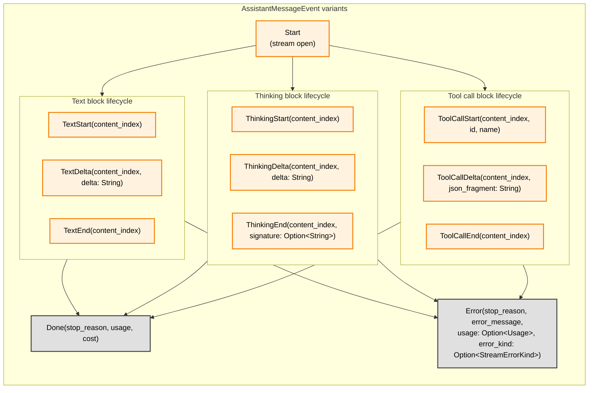
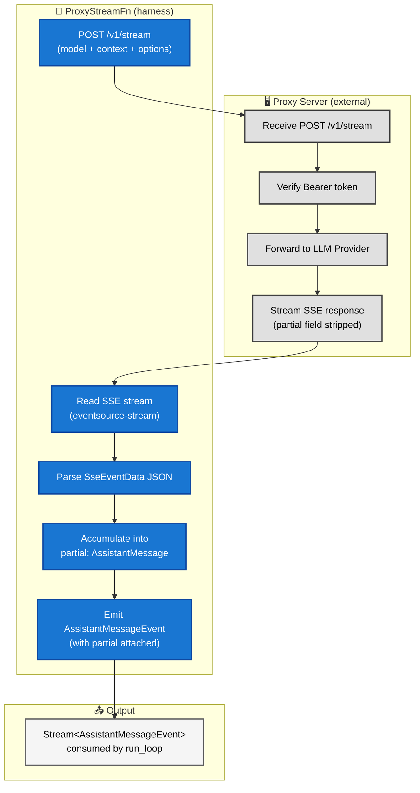
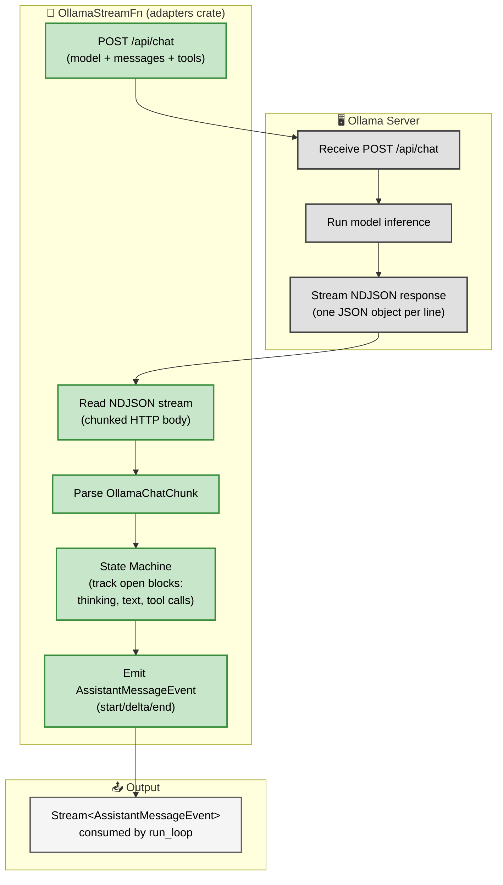
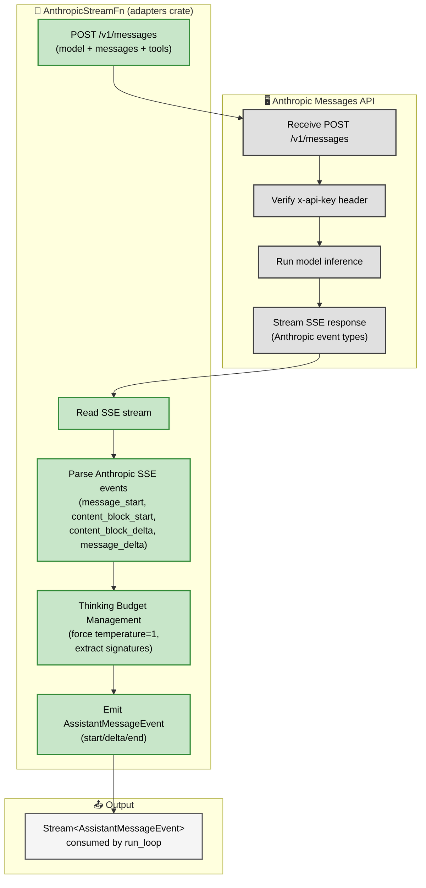
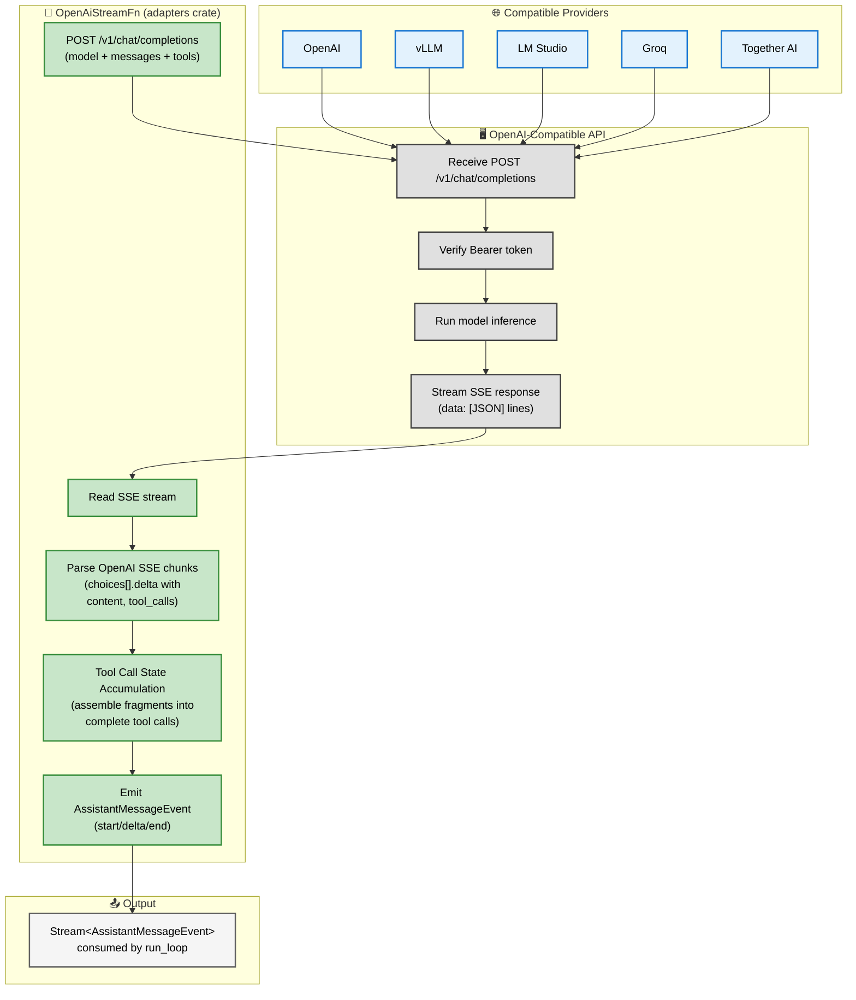
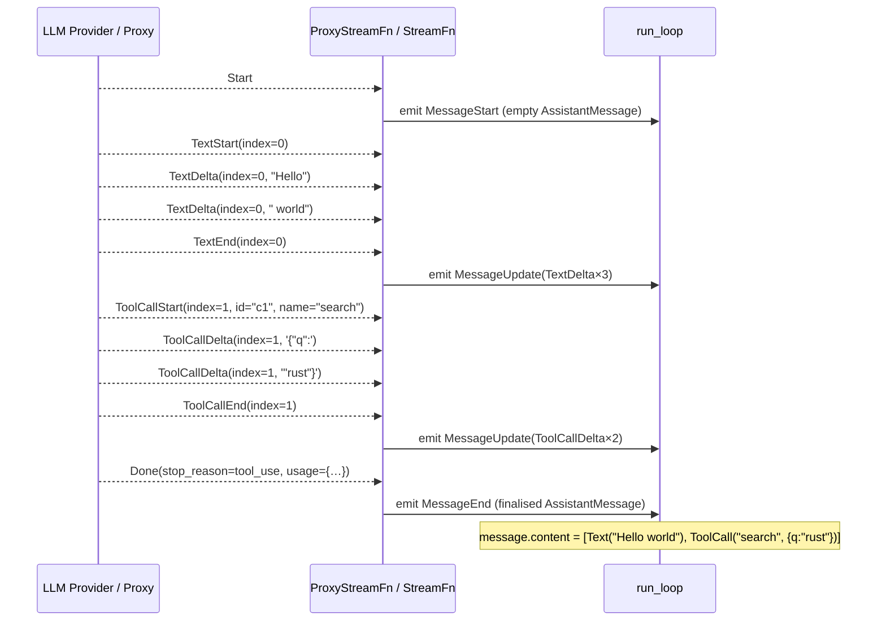
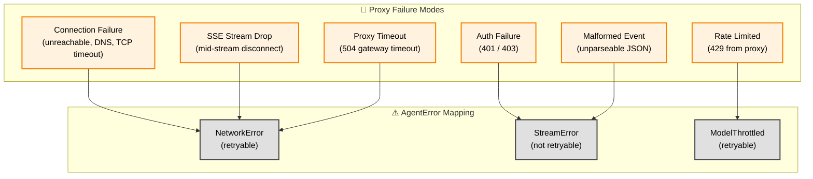

# Streaming Interface

**Source files:** `src/stream.rs`, `adapters/src/proxy.rs`, `adapters/src/ollama.rs`, `adapters/src/anthropic.rs`, `adapters/src/openai.rs`, `adapters/src/convert.rs`
**Related:** [PRD §7](../../planning/PRD.md#7-streaming-interface)

The streaming interface is the single boundary between the harness and LLM providers. The harness never holds provider credentials or SDK clients. All inference flows through a `StreamFn` implementation. Nine remote implementations ship in the adapters crate, plus `LocalStreamFn` in the local-llm crate:

| Implementation | Crate | Transport | Endpoint |
|---|---|---|---|
| `ProxyStreamFn` | `swink-agent-adapters` | **SSE** (Server-Sent Events via `eventsource-stream`) | `POST /v1/stream` on a caller-managed proxy |
| `OllamaStreamFn` | `swink-agent-adapters` | **NDJSON** (newline-delimited JSON over chunked HTTP) | `POST /api/chat` on an Ollama server |
| `AnthropicStreamFn` | `swink-agent-adapters` | **SSE** (Server-Sent Events) | `POST /v1/messages` on the Anthropic Messages API |
| `OpenAiStreamFn` | `swink-agent-adapters` | **SSE** (Server-Sent Events) | `POST /v1/chat/completions` on any OpenAI-compatible API |
| `AzureStreamFn` | `swink-agent-adapters` | **SSE** | Azure OpenAI endpoint |
| `BedrockStreamFn` | `swink-agent-adapters` | **SSE** (+ AWS SigV4) | AWS Bedrock endpoint |
| `GeminiStreamFn` | `swink-agent-adapters` | **SSE** | Google Gemini API |
| `MistralStreamFn` | `swink-agent-adapters` | **SSE** | Mistral API |
| `XAiStreamFn` | `swink-agent-adapters` | **SSE** | xAI API |
| `LocalStreamFn` | `swink-agent-local-llm` | Local inference | On-device (SmolLM3-3B) |

All implementations produce the same `Stream<AssistantMessageEvent>` output. The transport difference is internal: `ProxyStreamFn` parses SSE frames with named event types, `OllamaStreamFn` splits raw newline-delimited JSON lines and maps Ollama's response schema into harness events, `AnthropicStreamFn` connects directly to the Anthropic Messages API, and `OpenAiStreamFn` connects to any OpenAI-compatible endpoint. Callers can also supply a fully custom `StreamFn` for any other provider.

All adapters use the `tracing` crate for structured logging (`debug!`, `warn!`, `error!`), providing consistent observability across providers.

---

## L2 — Components

```mermaid
flowchart TB
    subgraph CallerLayer["👤 Caller"]
        CallerStreamFn["Custom StreamFn<br/>(direct provider SDK)"]
    end

    subgraph StreamLayer["📡 Streaming Interface (core)"]
        StreamFnTrait["StreamFn (trait)<br/>stream(model, context, options)<br/>→ Stream&lt;AssistantMessageEvent&gt;"]
        StreamOptions["StreamOptions<br/>temperature · max_tokens<br/>session_id · transport"]
        EventTypes["AssistantMessageEvent<br/>(start/delta/end protocol)"]
        Delta["AssistantMessageDelta<br/>TextDelta · ThinkingDelta · ToolCallDelta"]
    end

    subgraph ProxyLayer["🔀 Proxy StreamFn (adapters crate)"]
        ProxyStreamFn["ProxyStreamFn"]
        SSEParser["SSE Parser<br/>(eventsource-stream)"]
        Reconstructor["Message Reconstructor<br/>(delta → partial AssistantMessage)"]
    end

    subgraph OllamaLayer["🔌 Ollama Adapter (adapters crate)"]
        OllamaStreamFn["OllamaStreamFn"]
        NDJSONParser["NDJSON Parser<br/>(newline-delimited JSON)"]
        OllamaMapper["Event Mapper<br/>(Ollama chunks → AssistantMessageEvent)"]
    end

    subgraph AnthropicLayer["🔌 Anthropic Adapter (adapters crate)"]
        AnthropicStreamFn["AnthropicStreamFn"]
        AnthropicSSEParser["SSE Parser<br/>(Anthropic event types)"]
        AnthropicMapper["Event Mapper<br/>(Anthropic → AssistantMessageEvent)"]
    end

    subgraph OpenAiLayer["🔌 OpenAI Adapter (adapters crate)"]
        OpenAiStreamFn["OpenAiStreamFn"]
        OpenAiSSEParser["SSE Parser<br/>(OpenAI event types)"]
        OpenAiMapper["Event Mapper<br/>(OpenAI → AssistantMessageEvent)"]
    end

    subgraph SharedLayer["🔧 Shared Adapter Infrastructure"]
        MessageConverter["MessageConverter (trait)<br/>convert harness messages<br/>to provider-specific format"]
        TracingInfra["tracing crate<br/>(debug / warn / error logging)"]
    end

    subgraph ExternalLayer["🌐 External"]
        DirectProvider["LLM Provider API<br/>(direct)"]
        ProxyServer["LLM Proxy Server<br/>(HTTP/SSE)"]
        BackendProvider["LLM Provider API<br/>(via proxy)"]
        OllamaServer["Ollama Server<br/>(HTTP/NDJSON)"]
        AnthropicAPI["Anthropic Messages API<br/>(HTTP/SSE)"]
        OpenAiAPI["OpenAI-compatible API<br/>(HTTP/SSE)"]
    end

    CallerStreamFn -->|"implements"| StreamFnTrait
    ProxyStreamFn -->|"implements"| StreamFnTrait
    OllamaStreamFn -->|"implements"| StreamFnTrait
    AnthropicStreamFn -->|"implements"| StreamFnTrait
    OpenAiStreamFn -->|"implements"| StreamFnTrait
    StreamFnTrait --> StreamOptions
    StreamFnTrait --> EventTypes
    EventTypes --> Delta
    ProxyStreamFn --> SSEParser
    SSEParser --> Reconstructor
    Reconstructor --> EventTypes
    OllamaStreamFn --> NDJSONParser
    NDJSONParser --> OllamaMapper
    OllamaMapper --> EventTypes
    AnthropicStreamFn --> AnthropicSSEParser
    AnthropicSSEParser --> AnthropicMapper
    AnthropicMapper --> EventTypes
    OpenAiStreamFn --> OpenAiSSEParser
    OpenAiSSEParser --> OpenAiMapper
    OpenAiMapper --> EventTypes
    AnthropicStreamFn -->|"uses"| MessageConverter
    OpenAiStreamFn -->|"uses"| MessageConverter
    OllamaStreamFn -->|"uses"| MessageConverter
    CallerStreamFn -->|"direct calls"| DirectProvider
    ProxyStreamFn -->|"POST /v1/stream<br/>Bearer token (SSE)"| ProxyServer
    ProxyServer -->|"proxied request"| BackendProvider
    OllamaStreamFn -->|"POST /api/chat<br/>(NDJSON stream)"| OllamaServer
    AnthropicStreamFn -->|"POST /v1/messages<br/>x-api-key header (SSE)"| AnthropicAPI
    OpenAiStreamFn -->|"POST /v1/chat/completions<br/>Bearer token (SSE)"| OpenAiAPI

    classDef callerStyle fill:#e3f2fd,stroke:#1976d2,stroke-width:2px,color:#000
    classDef streamStyle fill:#fff3e0,stroke:#f57c00,stroke-width:2px,color:#000
    classDef proxyStyle fill:#1976d2,stroke:#0d47a1,stroke-width:2px,color:#fff
    classDef adapterStyle fill:#c8e6c9,stroke:#388e3c,stroke-width:2px,color:#000
    classDef externalStyle fill:#e0e0e0,stroke:#424242,stroke-width:2px,color:#000

    classDef sharedStyle fill:#f3e5f5,stroke:#7b1fa2,stroke-width:2px,color:#000

    class CallerStreamFn callerStyle
    class StreamFnTrait,StreamOptions,EventTypes,Delta streamStyle
    class ProxyStreamFn,SSEParser,Reconstructor proxyStyle
    class OllamaStreamFn,NDJSONParser,OllamaMapper adapterStyle
    class AnthropicStreamFn,AnthropicSSEParser,AnthropicMapper adapterStyle
    class OpenAiStreamFn,OpenAiSSEParser,OpenAiMapper adapterStyle
    class MessageConverter,TracingInfra sharedStyle
    class DirectProvider,ProxyServer,BackendProvider,OllamaServer,AnthropicAPI,OpenAiAPI externalStyle
```

---

## L3 — AssistantMessageEvent Protocol

Events follow a strict start/delta/end protocol per content block. Each block has a `content_index` that identifies its position in the final message's content vec.

### StreamErrorKind

Adapters can attach a `StreamErrorKind` to an `Error` event so the agent loop can classify errors structurally instead of relying on string matching on `error_message`.

| Variant | Meaning |
|---|---|
| `Throttled` | The provider throttled the request (HTTP 429 / rate limit). |
| `ContextWindowExceeded` | The request exceeded the model's context window. |
| `Auth` | Authentication or authorization failure (HTTP 401/403). |
| `Network` | Transient network or server error (connection drop, 5xx, etc.). |

### Error Constructor Helpers

`AssistantMessageEvent` provides five constructor helpers for adapters. All set `stop_reason: StopReason::Error` and `usage: None`.

| Constructor | `error_kind` | Use case |
|---|---|---|
| `error(message)` | `None` | Generic error; agent loop falls back to string-based classification. |
| `error_throttled(message)` | `Some(Throttled)` | Rate-limit / HTTP 429 errors. |
| `error_context_overflow(message)` | `Some(ContextWindowExceeded)` | Context window exceeded; triggers context compaction. |
| `error_auth(message)` | `Some(Auth)` | Authentication failure; non-retryable. |
| `error_network(message)` | `Some(Network)` | Transient network/server error; retryable. |

---

## L3 — ProxyStreamFn Architecture

The proxy strips the full partial message from delta events to reduce bandwidth. The client reconstructs it locally by accumulating deltas into a `partial: AssistantMessage`.

---

## L3 — OllamaStreamFn Architecture

The Ollama adapter connects to Ollama's `/api/chat` endpoint, which streams newline-delimited JSON (NDJSON) rather than SSE. Each line is a self-contained JSON object with a `message` field and a `done` boolean. The adapter maintains a state machine that tracks open content blocks (thinking, text, tool calls) and emits the same `AssistantMessageEvent` protocol that `ProxyStreamFn` produces.

**Key differences from `ProxyStreamFn`:**

| Aspect | `ProxyStreamFn` (SSE) | `OllamaStreamFn` (NDJSON) |
|---|---|---|
| Transport | SSE with named event types | Newline-delimited JSON |
| Parsing library | `eventsource-stream` | Custom `ndjson_lines` splitter |
| Message reconstruction | Accumulates deltas into a `partial: AssistantMessage` | State machine tracks open blocks, emits events directly |
| Tool call delivery | Streamed as incremental JSON fragments | Delivered as complete objects in a single chunk |
| Authentication | Bearer token header | None (local server) |
| Cost tracking | Provider-dependent | Always zero (local inference) |
| Thinking support | Depends on upstream proxy | Streaming thinking blocks supported |

---

## L3 — AnthropicStreamFn Architecture

**Source file:** `adapters/src/anthropic.rs` (~795 lines)

The Anthropic adapter connects directly to the Anthropic Messages API at `POST /v1/messages`. It handles the full Anthropic SSE event protocol, including thinking blocks with budget management and signature extraction.

**Key features:**

- **Authentication:** Uses `x-api-key` header (not Bearer token) per Anthropic API convention.
- **Thinking blocks:** Supports extended thinking with budget management. When thinking is enabled, temperature is forced to `1` as required by the Anthropic API.
- **Signature extraction:** Extracts thinking block signatures from `ThinkingEnd` events for downstream verification.
- **Message conversion:** Uses the `MessageConverter` trait (from `adapters/src/convert.rs`) to transform harness messages into Anthropic's expected format.
- **Tracing:** Uses `tracing` crate for structured debug, warn, and error logging throughout the streaming lifecycle.

---

## L3 — OpenAiStreamFn Architecture

**Source file:** `adapters/src/openai.rs` (~735 lines)

The OpenAI adapter connects to any OpenAI-compatible API at `POST /v1/chat/completions`. It supports multiple providers that implement the OpenAI chat completions protocol.

**Key features:**

- **Authentication:** Uses standard Bearer token authentication (`Authorization: Bearer <key>`).
- **Multi-provider support:** Works with any OpenAI-compatible endpoint including vLLM, LM Studio, Groq, and Together AI. The base URL is configurable.
- **Tool call streaming:** Accumulates tool call state across multiple SSE chunks. Tool calls arrive as incremental fragments (function name, argument JSON pieces) that are assembled into complete tool calls.
- **Message conversion:** Uses the `MessageConverter` trait (from `adapters/src/convert.rs`) to transform harness messages into OpenAI's chat completions format.
- **Tracing:** Uses `tracing` crate for structured debug, warn, and error logging throughout the streaming lifecycle.

---

## L3 — MessageConverter Trait and Shared Infrastructure

**Source file:** `adapters/src/convert.rs`

The `MessageConverter` trait provides the shared infrastructure for converting harness messages into provider-specific formats. Each adapter (`AnthropicStreamFn`, `OpenAiStreamFn`, `OllamaStreamFn`) implements this trait to handle the differences in how each provider expects messages, tool definitions, and tool results to be structured.

This keeps provider-specific serialization logic isolated from the streaming machinery, so adding a new provider only requires implementing `MessageConverter` and the `StreamFn` trait.

---

## L3 — Adapter Comparison

| Aspect | `ProxyStreamFn` | `OllamaStreamFn` | `AnthropicStreamFn` | `OpenAiStreamFn` |
|---|---|---|---|---|
| Transport | SSE | NDJSON | SSE | SSE |
| Endpoint | `POST /v1/stream` | `POST /api/chat` | `POST /v1/messages` | `POST /v1/chat/completions` |
| Authentication | Bearer token | None (local) | `x-api-key` header | Bearer token |
| Thinking support | Depends on proxy | Streaming thinking blocks | Thinking blocks with budget mgmt, forced temp=1, signature extraction | N/A |
| Tool calls | Streamed fragments | Complete objects | Streamed fragments | Streamed fragments with state accumulation |
| Message conversion | N/A (passthrough) | `MessageConverter` | `MessageConverter` | `MessageConverter` |
| Tracing | N/A | `tracing` crate | `tracing` crate | `tracing` crate |
| Multi-provider | No (single proxy) | No (Ollama only) | No (Anthropic only) | Yes (vLLM, LM Studio, Groq, Together) |

---

## L4 — Delta Accumulation Sequence

This sequence shows how the harness reconstructs a complete `AssistantMessage` from individual delta events, including a text block and a tool call block arriving in the same stream.

---

## L4 — Proxy Error Handling

Proxy failures are classified into `AgentError` variants based on the nature of the failure. This determines whether the harness will retry the request (via `RetryStrategy`) or surface the error immediately to the caller.

| Failure mode | AgentError variant | Retryable? | Notes |
|---|---|---|---|
| **Connection failure** (proxy unreachable, DNS failure, TCP timeout) | `AgentError::NetworkError` | Yes | Retryable via `RetryStrategy`. |
| **Authentication failure** (invalid/expired bearer token, 401/403 response) | `AgentError::StreamError` | No | Not retryable — caller must fix credentials. |
| **SSE stream drop** (connection lost mid-stream) | `AgentError::NetworkError` | Yes | The harness does not attempt partial message recovery — the entire turn is retried. |
| **Proxy timeout** (proxy returns 504 or similar gateway timeout) | `AgentError::NetworkError` | Yes | Retryable via `RetryStrategy`. |
| **Malformed SSE event** (unparseable JSON in event data) | `AgentError::StreamError` | No | Not retryable — indicates a proxy bug. |
| **Rate limiting from proxy** (429 response from the proxy itself) | `AgentError::ModelThrottled` | Yes | Retryable via `RetryStrategy`. |

