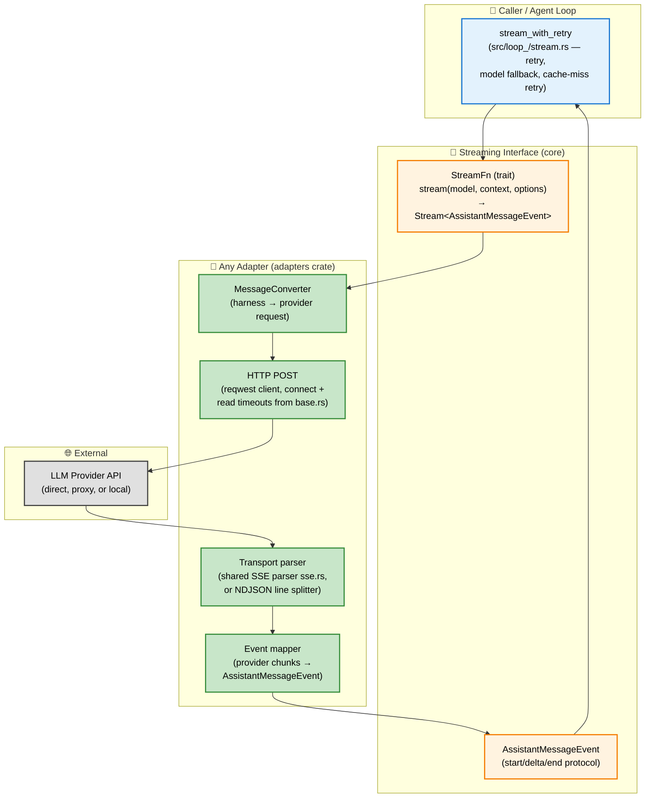
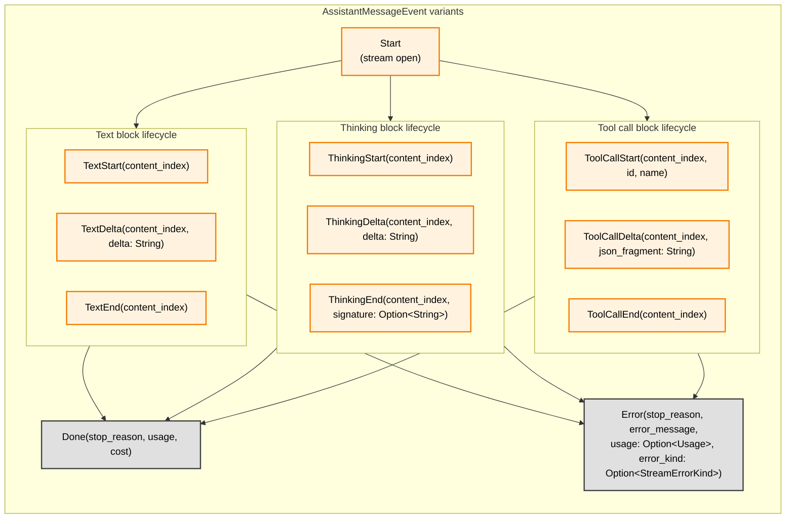
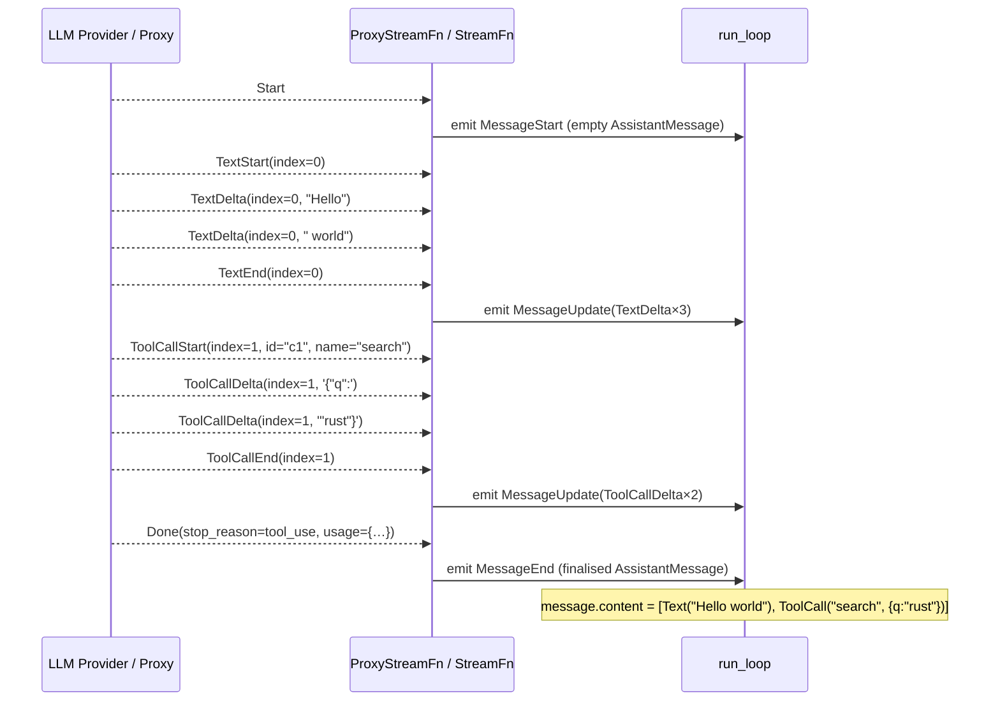

# Streaming Interface

**Source files:** `src/stream.rs` (trait + event protocol), `src/loop_/stream.rs` (retry/fallback wrapper), `adapters/src/` (`proxy.rs`, `ollama.rs`, `anthropic.rs`, `openai.rs` + `openai_compat.rs`, `convert.rs`, `sse.rs`, `base.rs`)
**Related:** [PRD §7](../../planning/PRD.md#7-streaming-interface)

The streaming interface is the single boundary between the harness and LLM providers. The harness never holds provider credentials or SDK clients. All inference flows through a `StreamFn` implementation. Nine remote implementations ship in the adapters crate, plus `LocalStreamFn` in the local-llm crate:

| Implementation | Crate | Transport | Endpoint |
|---|---|---|---|
| `ProxyStreamFn` | `swink-agent-adapters` | **SSE** (Server-Sent Events via `eventsource-stream`) | `POST /v1/stream` on a caller-managed proxy |
| `OllamaStreamFn` | `swink-agent-adapters` | **NDJSON** (newline-delimited JSON over chunked HTTP) | `POST /api/chat` on an Ollama server |
| `AnthropicStreamFn` | `swink-agent-adapters` | **SSE** (Server-Sent Events) | `POST /v1/messages` on the Anthropic Messages API |
| `OpenAiStreamFn` | `swink-agent-adapters` | **SSE** (Server-Sent Events) | `POST /v1/chat/completions` on any OpenAI-compatible API |
| `AzureStreamFn` | `swink-agent-adapters` | **SSE** | Azure OpenAI endpoint |
| `BedrockStreamFn` | `swink-agent-adapters` | **SSE** (+ AWS SigV4) | AWS Bedrock endpoint |
| `GeminiStreamFn` | `swink-agent-adapters` | **SSE** | Google Gemini API |
| `MistralStreamFn` | `swink-agent-adapters` | **SSE** | Mistral API |
| `XAiStreamFn` | `swink-agent-adapters` | **SSE** | xAI API |
| `LocalStreamFn` | `swink-agent-local-llm` | Local inference | On-device (SmolLM3-3B) |

All implementations produce the same `Stream<AssistantMessageEvent>` output; transport differences are internal. Callers can also supply a fully custom `StreamFn` for any other provider. All adapters use the `tracing` crate for structured logging (`debug!`, `warn!`, `error!`).

### Where retry sits

Raw adapters do **not** retry. The agent loop calls adapters through `src/loop_/stream.rs`:

- `stream_with_retry` — wraps the `StreamFn` call with `RetryStrategy` backoff and, when the primary model exhausts its retry budget on a retryable error, tries each `ModelFallback` model in order (each with a fresh retry budget).
- `handle_stream_error` — classifies stream errors into `AgentError` variants to decide retry vs. surface.
- `prepare_cache_miss_retry` — rebuilds the request context after a prompt-cache miss before retrying.

---

## L2 — Components

All remote adapters share the same shape: convert harness messages to the provider's request format, POST, parse the byte stream (SSE or NDJSON) into provider chunks, and map chunks onto the common `AssistantMessageEvent` protocol.

---

## L3 — AssistantMessageEvent Protocol

Events follow a strict start/delta/end protocol per content block. Each block has a `content_index` that identifies its position in the final message's content vec.

### StreamErrorKind

Adapters can attach a `StreamErrorKind` to an `Error` event so the agent loop can classify errors structurally instead of relying on string matching on `error_message`.

| Variant | Meaning |
|---|---|
| `Throttled` | The provider throttled the request (HTTP 429 / rate limit). |
| `ContextWindowExceeded` | The request exceeded the model's context window. |
| `Auth` | Authentication or authorization failure (HTTP 401/403). |
| `Network` | Transient network or server error (connection drop, 5xx, etc.). |

### Error Constructor Helpers

`AssistantMessageEvent` provides five constructor helpers for adapters. All set `stop_reason: StopReason::Error` and `usage: None`.

| Constructor | `error_kind` | Use case |
|---|---|---|
| `error(message)` | `None` | Generic error; agent loop falls back to string-based classification. |
| `error_throttled(message)` | `Some(Throttled)` | Rate-limit / HTTP 429 errors. |
| `error_context_overflow(message)` | `Some(ContextWindowExceeded)` | Context window exceeded; triggers context compaction. |
| `error_auth(message)` | `Some(Auth)` | Authentication failure; non-retryable. |
| `error_network(message)` | `Some(Network)` | Transient network/server error; retryable. |

---

## L3 — Shared Adapter Infrastructure

### MessageConverter (`adapters/src/convert.rs`)

The `MessageConverter` trait converts harness messages into provider-specific formats. Each direct-API adapter implements it to handle differences in how providers expect messages, tool definitions, and tool results to be structured. Adding a new provider only requires implementing `MessageConverter` and `StreamFn`; `ProxyStreamFn` passes harness messages through unconverted.

### Shared SSE parser (`adapters/src/sse.rs`)

The SSE adapters share `SseStreamParser`, which buffers bytes, carries incomplete multi-byte UTF-8 sequences across chunk boundaries, and concatenates successive `data:` fields per the SSE spec. It is **strictly UTF-8 with drain-before-poison**: on genuinely invalid bytes it first drains complete already-buffered lines (and any pending `data:` payload — e.g. a final `message_stop` or usage delta), then sets an internal `poisoned` flag and emits a non-retryable protocol error (`"SSE stream contained invalid UTF-8 bytes"`). A poisoned parser ignores all further `feed()`/`flush()` calls, so a desynchronized stream can never emit garbage data.

### HTTP client timeouts (`adapters/src/base.rs`)

Streaming responses can legitimately run for minutes, so adapter HTTP clients set no overall request deadline — only connect and per-read timeouts:

| Constant | Value | Applies to |
|---|---|---|
| `DEFAULT_CONNECT_TIMEOUT` | 30 s | All adapters (TCP connect). |
| `DEFAULT_READ_TIMEOUT` | 120 s | Remote adapters — a **read** timeout (`reqwest::ClientBuilder::read_timeout`), reset on each received chunk. |
| `LOCAL_READ_TIMEOUT` | 600 s | Local-inference adapters (Ollama) — cold model load or long prompt prefill can sit silent well past 120 s. |

---

## L3 — Adapter Specifics

Per-adapter behaviour beyond the generic pipeline above:

- **`ProxyStreamFn`** (`adapters/src/proxy.rs`) — the proxy strips the full partial message from delta events to reduce bandwidth; the client reconstructs it locally by accumulating deltas into a `partial: AssistantMessage` attached to emitted events. Bearer-token auth to the caller-managed proxy.
- **`OllamaStreamFn`** (`adapters/src/ollama.rs`) — NDJSON, not SSE: each line is a self-contained JSON object (`OllamaChatChunk`) with a `message` field and a `done` boolean, split by a custom `ndjson_lines` splitter. A state machine tracks open content blocks (thinking, text, tool calls) and emits the common start/delta/end protocol. Tool calls arrive as complete objects in a single chunk. No auth (local server); cost is always zero.
- **`AnthropicStreamFn`** (`adapters/src/anthropic.rs`) — direct Anthropic Messages API with `x-api-key` auth (not Bearer). Parses Anthropic's named SSE events (`message_start`, `content_block_start`, `content_block_delta`, `message_delta`). Supports extended thinking with budget management — when thinking is enabled, temperature is forced to `1` as the API requires — and extracts thinking-block signatures into `ThinkingEnd` events.
- **`OpenAiStreamFn`** (`adapters/src/openai.rs`, shared logic in `openai_compat.rs`) — works against any OpenAI-compatible chat completions endpoint (OpenAI, vLLM, LM Studio, Groq, Together AI); base URL configurable, Bearer-token auth. Tool calls arrive as incremental fragments (function name, argument JSON pieces) spread across SSE chunks; the adapter accumulates this state and assembles complete tool calls.

| Aspect | `ProxyStreamFn` | `OllamaStreamFn` | `AnthropicStreamFn` | `OpenAiStreamFn` |
|---|---|---|---|---|
| Transport | SSE | NDJSON | SSE | SSE |
| Endpoint | `POST /v1/stream` | `POST /api/chat` | `POST /v1/messages` | `POST /v1/chat/completions` |
| Parsing | `eventsource-stream` | Custom `ndjson_lines` splitter | SSE (Anthropic event types) | SSE (`data:` JSON chunks) |
| Authentication | Bearer token | None (local) | `x-api-key` header | Bearer token |
| Message conversion | N/A (passthrough) | `MessageConverter` | `MessageConverter` | `MessageConverter` |
| Message reconstruction | Accumulates deltas into `partial: AssistantMessage` | State machine over open blocks | Event mapping | Event mapping + tool-fragment accumulation |
| Thinking support | Depends on upstream proxy | Streaming thinking blocks | Budget mgmt, forced temp=1, signature extraction | N/A |
| Tool calls | Streamed fragments | Complete objects | Streamed fragments | Streamed fragments with state accumulation |
| Multi-provider | No (single proxy) | No (Ollama only) | No (Anthropic only) | Yes (vLLM, LM Studio, Groq, Together) |
| Cost tracking | Provider-dependent (proxy supplies) | Always zero (local) | `Cost::default()` — loop prices from catalog | `Cost::default()` — loop prices from catalog |

### Cost tracking

Adapters report token `Usage` but generally do not price it. Only `ProxyStreamFn`
passes real provider-billed cost through. For every other adapter, the agent loop
calls [`price_assistant_message_with`] on each assistant message, filling in `cost`
from the compiled model catalog via [`calculate_cost`]. This runs in the loop rather
than per-adapter so that third-party `StreamFn` implementations are covered too.

**Precedence** (highest first):

1. **The adapter's own non-zero `Cost`** — never overwritten.
2. **An operator-declared [`CostCalculator`]**, supplied via
   [`AgentOptions::with_cost_calculator`] / `with_pricing_table`. The catalog only
   knows about models shipped with the crate, so this is the only way to price
   local endpoints, private deployments, or negotiated per-tier rates.
3. **The compiled model catalog.**

A message stays at zero only when all three decline.

**Where pricing happens.** Two seams, both idempotent because a non-zero `Cost` is
never overwritten:

- `finalize_stream_message` (`loop_/stream.rs`) prices the message *before*
  emitting `AgentEvent::MessageEnd`. Event consumers — the TUI status bar and
  `/usage`, any `EventForwarder` — read cost off that event, so pricing later
  would leave them all displaying `$0.0000` even with the loop's own accounting
  correct.
- `run_single_turn` (`loop_/turn.rs`) prices before accumulation, covering the
  paths that bypass the streaming layer (overflow recovery, abort messages). This
  is what makes the priced cost reach `PolicyContext::accumulated_cost` — and
  therefore `BudgetPolicy::max_cost` — as well as turn metrics, the context
  history, and the `TurnEnd` event.

[`price_assistant_message_with`]: https://docs.rs/swink-agent/latest/swink_agent/fn.price_assistant_message_with.html
[`calculate_cost`]: https://docs.rs/swink-agent/latest/swink_agent/fn.calculate_cost.html
[`CostCalculator`]: https://docs.rs/swink-agent/latest/swink_agent/trait.CostCalculator.html
[`AgentOptions::with_cost_calculator`]: https://docs.rs/swink-agent/latest/swink_agent/struct.AgentOptions.html#method.with_cost_calculator

---

## L4 — Delta Accumulation Sequence

This sequence shows how the harness reconstructs a complete `AssistantMessage` from individual delta events, including a text block and a tool call block arriving in the same stream.

---

## L4 — Proxy Error Handling

Proxy failures are classified into `AgentError` variants based on the nature of the failure. This determines whether the harness will retry the request (via `RetryStrategy`) or surface the error immediately to the caller.

| Failure mode | AgentError variant | Retryable? | Notes |
|---|---|---|---|
| **Connection failure** (proxy unreachable, DNS failure, TCP timeout) | `AgentError::NetworkError` | Yes | Retryable via `RetryStrategy`. |
| **Authentication failure** (invalid/expired bearer token, 401/403 response) | `AgentError::StreamError` | No | Not retryable — caller must fix credentials. |
| **SSE stream drop** (connection lost mid-stream) | `AgentError::NetworkError` | Yes | The harness does not attempt partial message recovery — the entire turn is retried. |
| **Proxy timeout** (proxy returns 504 or similar gateway timeout) | `AgentError::NetworkError` | Yes | Retryable via `RetryStrategy`. |
| **Malformed SSE event** (unparseable JSON in event data) | `AgentError::StreamError` | No | Not retryable — indicates a proxy bug. |
| **Rate limiting from proxy** (429 response from the proxy itself) | `AgentError::ModelThrottled` | Yes | Retryable via `RetryStrategy`. |
