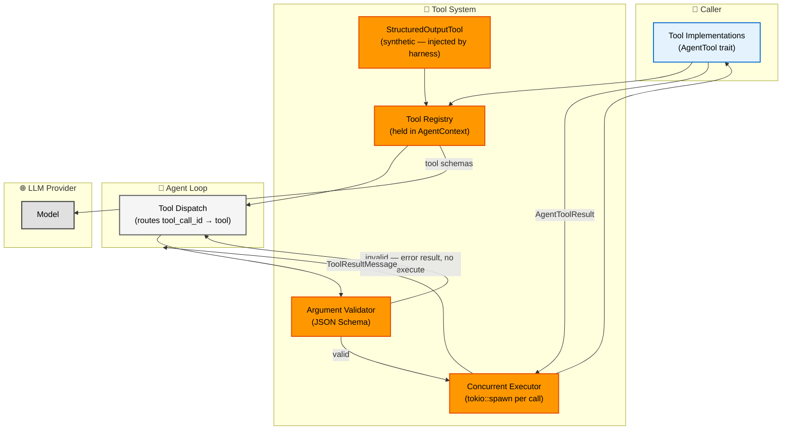
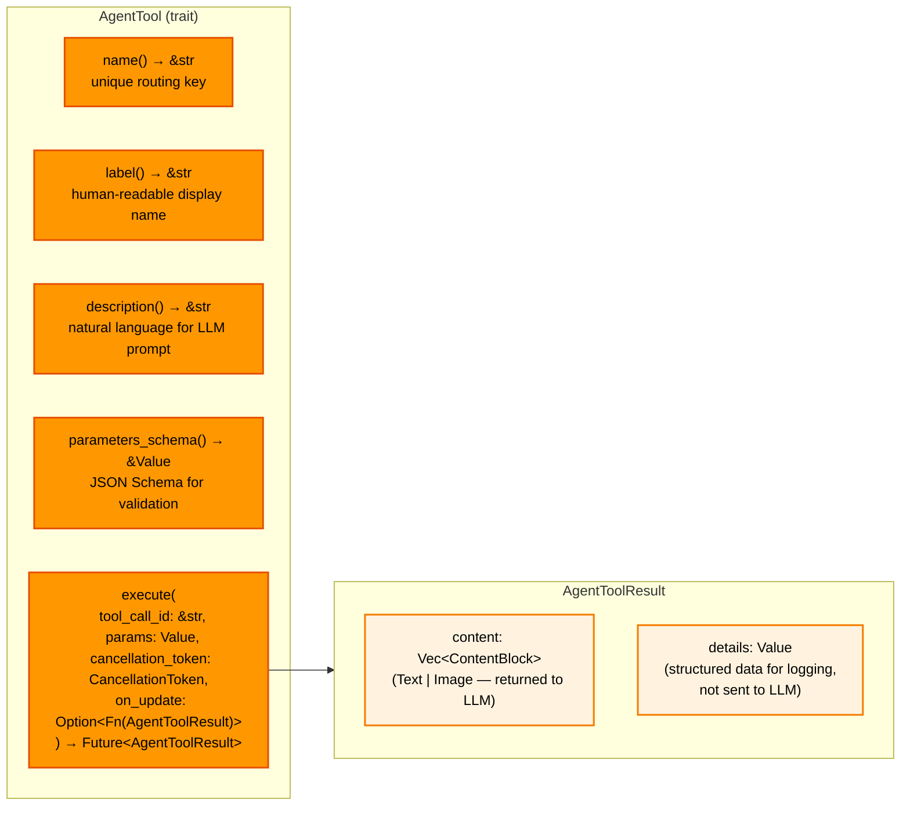
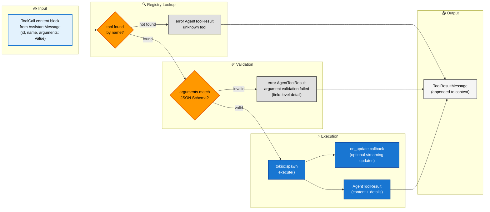
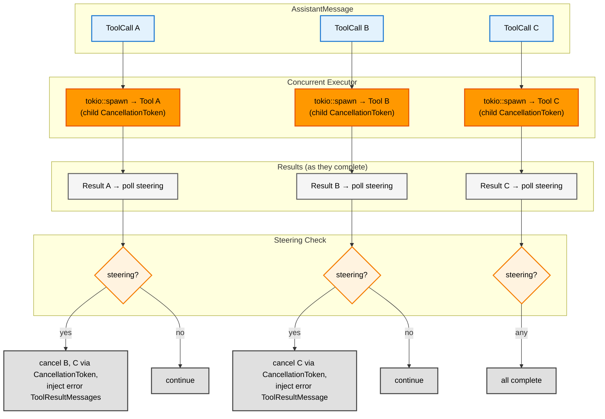
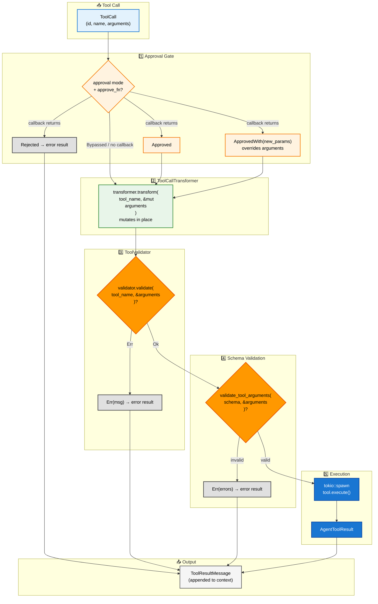
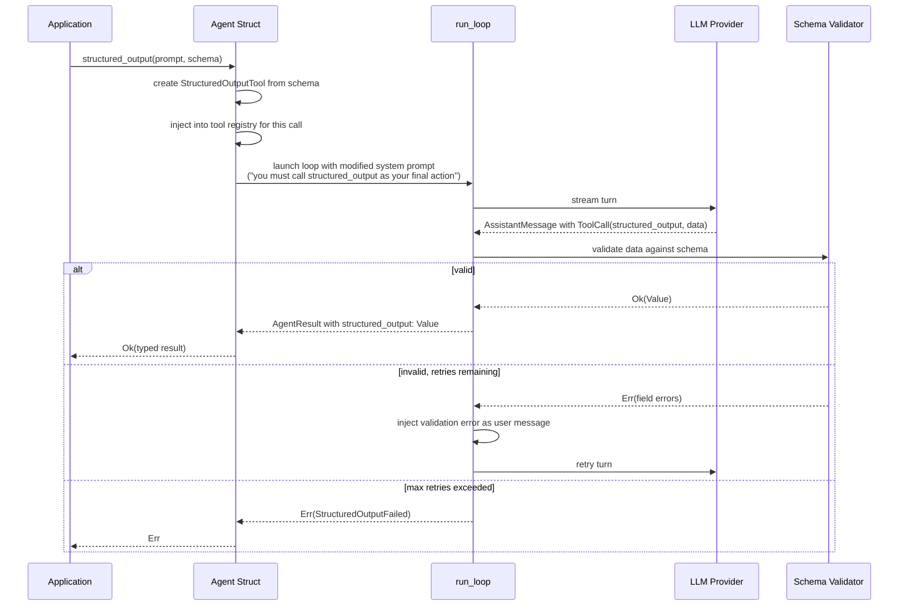

# Tool System

**Source files:** `src/tool.rs`, `src/tools/`, `src/fn_tool.rs`, `src/tool_middleware.rs`, `src/tool_validator.rs`, `src/tool_call_transformer.rs`, `src/loop_/tool_dispatch.rs`
**Related:** [PRD §4](../../planning/PRD.md#4-tool-system)

The tool system defines how tools are declared, validated, executed, and how their results are returned to the LLM. It also covers the structured output mechanism, which is implemented as a synthetic tool injected by the harness.

---

## L2 — Components



---

## L3 — Built-in Tools

The harness ships three built-in tools in `src/tools/`. They are ordinary `AgentTool` implementations and can be registered alongside caller-provided tools.

### Shared constant: `MAX_OUTPUT_BYTES`

Defined in `src/tools/mod.rs` as `100 * 1024` (100 KB). Used by `BashTool` and `ReadFileTool` to truncate output before returning it to the LLM, preventing oversized context windows.

### BashTool (`src/tools/bash.rs`)

Executes arbitrary shell commands via `sh -c`.

| Field | Value |
|---|---|
| **name** | `bash` |
| **Parameters** | `command` (string, required), `timeout_ms` (integer, optional — default 30 000 ms) |
| **Output** | Exit code + stdout + stderr. Combined stdout/stderr truncated at `MAX_OUTPUT_BYTES`, split proportionally with stdout favoured. |
| **Cancellation** | Checks `cancellation_token.is_cancelled()` before spawning. During execution, `tokio::select!` races the child process against both the cancellation token and the timeout. On cancellation or timeout the child process is killed. |
| **Security note** | Runs arbitrary commands via `sh -c`. Not suitable for agents exposed to untrusted users. |

### ReadFileTool (`src/tools/read_file.rs`)

Reads a file and returns its contents as text.

| Field | Value |
|---|---|
| **name** | `read_file` |
| **Parameters** | `path` (string, required — absolute path) |
| **Output** | File contents as text, truncated at `MAX_OUTPUT_BYTES` with a `[truncated]` marker appended. |
| **Cancellation** | Checks `cancellation_token.is_cancelled()` before the read. Returns error immediately if cancelled. |

### WriteFileTool (`src/tools/write_file.rs`)

Writes content to a file, creating parent directories as needed.

| Field | Value |
|---|---|
| **name** | `write_file` |
| **Parameters** | `path` (string, required — absolute path), `content` (string, required) |
| **Output** | Success message including byte count written. |
| **Cancellation** | Checks `cancellation_token.is_cancelled()` before the write. Returns error immediately if cancelled. |

### Tool cancellation pattern

All built-in tools follow the same cancellation contract:

1. **Pre-check** — Before starting any I/O, the tool calls `cancellation_token.is_cancelled()` and returns an error result immediately if true.
2. **During work** — `BashTool` uses `tokio::select!` to race the child process against `cancellation_token.cancelled()`, killing the process on cancellation. The file tools perform a single async operation, so the pre-check is sufficient.

### `ToolExecutionUpdate` event

The `on_update` callback parameter in `execute()` is designed for tools that produce streaming partial results (e.g., long-running commands emitting incremental output). `ToolExecutionUpdate` events are defined in the event model but **currently reserved for future use** — the agent loop always passes `None` for the callback. Built-in tools accept but ignore the parameter.

---

## L3 — AgentTool Trait Contract



---

## L3 — Argument Validation Pipeline

Before `execute` is called, arguments from the LLM are validated against the tool's JSON Schema. Failures produce an error result without touching the implementation.



---

## L3 — Concurrent Tool Execution

When an assistant message contains multiple tool calls, the harness spawns them concurrently. Each tool receives its own `CancellationToken` (a child of the loop's token). When steering arrives after a tool completes, all remaining in-flight tools are cancelled via their `CancellationToken`, and for each cancelled tool an error `ToolResultMessage` is injected with content: `"tool call cancelled: user requested steering interrupt"`.



---

## L3 — FnTool: Closure-Based Tool Builder

**Source file:** `src/fn_tool.rs`
**Re-exported as:** `swink_agent::FnTool`

`FnTool` implements [`AgentTool`] entirely from closures and configuration, eliminating the need for a custom struct and trait impl. It follows the `new()` + `with_*()` builder pattern.

### Builder API

| Method | Purpose |
|---|---|
| `FnTool::new(name, label, description)` | Create with metadata. Default schema accepts any object; default execute returns an error. |
| `.with_schema_for::<T>()` | Derive JSON Schema from a type implementing `schemars::JsonSchema`. Validated at construction (`debug_assert!`). |
| `.with_schema(Value)` | Set a raw JSON Schema value. |
| `.with_requires_approval(bool)` | Mark the tool as requiring user approval before execution. |
| `.with_execute(closure)` | Full signature: `(tool_call_id, params, cancel, on_update) -> Future<AgentToolResult>`. |
| `.with_execute_simple(closure)` | Simplified: `(params, cancel) -> Future<AgentToolResult>`. Ignores tool call ID and update callback. |

### Example

```rust
use schemars::JsonSchema;
use serde::Deserialize;
use swink_agent::{AgentToolResult, FnTool};

#[derive(Deserialize, JsonSchema)]
struct Params { city: String }

let tool = FnTool::new("get_weather", "Weather", "Get weather for a city.")
    .with_schema_for::<Params>()
    .with_execute_simple(|params, _cancel| async move {
        let city = params["city"].as_str().unwrap_or("unknown");
        AgentToolResult::text(format!("72F in {city}"))
    });
```

### Design notes

- The execute closure is stored as `Arc<dyn Fn(...) -> Pin<Box<dyn Future>>>`, making `FnTool` both `Send + Sync` and cloneable behind `Arc`.
- `Debug` implementation omits the closure, printing only metadata fields.

---

## L3 — ToolMiddleware: Execution Interceptor

**Source file:** `src/tool_middleware.rs`
**Re-exported as:** `swink_agent::ToolMiddleware`

`ToolMiddleware` wraps an existing `Arc<dyn AgentTool>` and intercepts `execute()` while delegating all metadata methods (`name`, `label`, `description`, `parameters_schema`, `requires_approval`) to the inner tool. This is the decorator pattern applied to tool execution.

### Constructor

```rust
ToolMiddleware::new(inner: Arc<dyn AgentTool>, f: F) -> Self
```

The closure `f` receives `(inner_tool, tool_call_id, params, cancel, on_update)` and can call through to the inner tool's `execute()` at any point, or skip it entirely.

### Built-in middleware constructors

| Constructor | Behaviour |
|---|---|
| `ToolMiddleware::with_timeout(inner, Duration)` | Races `execute()` against a timeout. On timeout, cancels the inner tool and returns an error result. |
| `ToolMiddleware::with_logging(inner, callback)` | Calls `callback(tool_name, tool_call_id, is_start)` before and after execution. |

### Example

```rust
use std::sync::Arc;
use swink_agent::{AgentTool, AgentToolResult, BashTool, ToolMiddleware};

let tool = Arc::new(BashTool::new());
let logged = ToolMiddleware::new(tool, |inner, id, params, cancel, on_update| {
    Box::pin(async move {
        println!("before");
        let result = inner.execute(&id, params, cancel, on_update).await;
        println!("after");
        result
    })
});

assert_eq!(logged.name(), "bash"); // metadata delegates to inner
```

### Design notes

- `ToolMiddleware` itself implements `AgentTool`, so middleware instances can be registered directly in the tool registry and can be stacked (middleware wrapping middleware).
- The inner tool is held as `Arc<dyn AgentTool>`, so multiple middleware instances can share the same underlying tool.

---

## L3 — ToolCallTransformer: Argument Rewriting

**Source file:** `src/tool_call_transformer.rs`
**Re-exported as:** `swink_agent::ToolCallTransformer`

`ToolCallTransformer` is a trait for pre-execution argument rewriting. It runs **unconditionally** (not gated by approval mode) and mutates arguments in place. Typical use cases: sandboxing file paths, injecting default values, normalizing argument formats.

### Trait

```rust
pub trait ToolCallTransformer: Send + Sync {
    fn transform(&self, tool_name: &str, arguments: &mut Value);
}
```

A blanket impl exists for closures matching `Fn(&str, &mut Value) + Send + Sync`, so a closure can be used directly:

```rust
let transformer = |name: &str, args: &mut Value| {
    if name == "bash" {
        if let Some(cmd) = args.get("command").and_then(Value::as_str) {
            args["command"] = Value::String(format!("sandbox {cmd}"));
        }
    }
};
```

### Configuration

Set on `AgentLoopConfig` as `tool_call_transformer: Option<Arc<dyn ToolCallTransformer>>`. When `None`, the transformer step is skipped.

### Execution order

The transformer runs **after** the approval gate and **before** the validator and schema validation. See the [Dispatch Pipeline](#l2--tool-dispatch-pipeline) diagram below for the complete ordering.

---

## L3 — ToolValidator: Pre-Execution Validation Hook

**Source file:** `src/tool_validator.rs`
**Re-exported as:** `swink_agent::ToolValidator`

`ToolValidator` is a trait for application-specific validation that runs **after** `ToolCallTransformer` and **before** JSON Schema validation. Use it for constraints that cannot be expressed in JSON Schema, such as file path allowlists, command blocklists, or cross-field business rules.

### Trait

```rust
pub trait ToolValidator: Send + Sync {
    fn validate(&self, tool_name: &str, arguments: &Value) -> Result<(), String>;
}
```

- Return `Ok(())` to proceed to schema validation and execution.
- Return `Err(message)` to reject the call. The error message is returned to the LLM as an error `ToolResultMessage` with `is_error: true`. The tool's `execute()` is never called.

A blanket impl exists for closures matching `Fn(&str, &Value) -> Result<(), String> + Send + Sync`:

```rust
let validator = |name: &str, args: &Value| -> Result<(), String> {
    if name == "bash" {
        if let Some(cmd) = args.get("command").and_then(Value::as_str) {
            if cmd.contains("rm -rf") {
                return Err("destructive commands are not allowed".into());
            }
        }
    }
    Ok(())
};
```

### Configuration

Set on `AgentLoopConfig` as `tool_validator: Option<Arc<dyn ToolValidator>>`. When `None`, the validator step is skipped.

### Distinction from ToolCallTransformer

| | ToolCallTransformer | ToolValidator |
|---|---|---|
| **Purpose** | Rewrite arguments | Accept or reject arguments |
| **Mutation** | Mutates `&mut Value` in place | Read-only `&Value` |
| **On failure** | N/A (cannot fail) | Error result returned to LLM |
| **Runs** | After approval, before validator | After transformer, before schema validation |

---

## L3 — ToolMetadata: Organizational Grouping

**Source file:** `src/tool.rs`
**Re-exported as:** `swink_agent::ToolMetadata`

`ToolMetadata` provides optional organizational metadata for tools — a namespace and version. Tools return it via the `metadata()` method on `AgentTool` (defaults to `None` for backward compatibility).

### Fields

| Field | Type | Description |
|---|---|---|
| `namespace` | `Option<String>` | Logical grouping such as `"filesystem"`, `"git"`, or `"code_analysis"`. |
| `version` | `Option<String>` | Semver-style version string (e.g. `"1.0.0"`). |

### Builder

```rust
let meta = ToolMetadata::with_namespace("filesystem").with_version("1.2.0");
```

---

## L3 — ToolExecutionPolicy: Dispatch Ordering

**Source file:** `src/tool_execution_policy.rs`
**Re-exported as:** `swink_agent::ToolExecutionPolicy`

`ToolExecutionPolicy` controls how tool calls within a single turn are dispatched. The default is `Concurrent`, which spawns all calls at once via `tokio::spawn`.

### Variants

| Variant | Behavior |
|---|---|
| `Concurrent` (default) | All tool calls execute concurrently via `tokio::spawn`. |
| `Sequential` | Tool calls execute one at a time, in the order the model returned them. |
| `Priority(Arc<PriorityFn>)` | Tool calls are sorted by priority (higher first). Calls with the same priority execute concurrently; groups run sequentially from highest to lowest. |
| `Custom(Arc<dyn ToolExecutionStrategy>)` | Fully custom execution strategy. The strategy partitions tool calls into sequential execution groups. |

### Configuration

Set on `AgentLoopConfig` as `tool_execution_policy: ToolExecutionPolicy`. Defaults to `Concurrent`.

---

## L3 — Schema Generation

**Source file:** `src/schema.rs`
**Re-exported as:** `swink_agent::schema_for`

The `schema_for` function generates a JSON Schema from any type implementing `schemars::JsonSchema`. This is used by `FnTool::with_schema_for::<T>()` and can be called directly when constructing tool schemas programmatically.

The `validate_schema` function (`src/tool.rs`) validates that a JSON value is a well-formed JSON Schema document, distinct from `validate_tool_arguments` which validates data *against* a schema.

---

## L2 — Tool Dispatch Pipeline

**Source file:** `src/loop_/tool_dispatch.rs`

The complete dispatch pipeline for each tool call, showing the exact order enforced by `execute_tools_concurrently`. Each stage can short-circuit the pipeline by producing an error result.



### Pipeline stages summary

| Stage | Component | Skip condition | Short-circuit |
|---|---|---|---|
| 1. Approval | `approve_tool` callback | `ApprovalMode::Bypassed` or no callback set | `Rejected` → error result, skip remaining |
| 2. Transform | `ToolCallTransformer` | `tool_call_transformer` is `None` | Cannot fail |
| 3. Validate | `ToolValidator` | `tool_validator` is `None` | `Err(msg)` → error result, skip remaining |
| 4. Schema | `validate_tool_arguments` | Never skipped | Invalid → error result, skip execute |
| 5. Execute | `tool.execute()` | Never skipped (if reached) | N/A — always produces result |

> **Note:** `ApprovedWith(new_params)` from the approval gate overrides the original arguments **before** the transformer runs. The transformer then operates on the already-overridden arguments.

---

## L4 — Structured Output Flow

> **Note:** Structured output is managed by the `Agent` struct, not the loop. The `Agent` injects the synthetic tool, runs the loop normally, validates the result, and retries via `continue_loop()` if invalid. The loop itself has no structured output awareness.

Structured output is implemented as a synthetic tool injected alongside the caller's tools. The model is instructed to call it as its final action.


