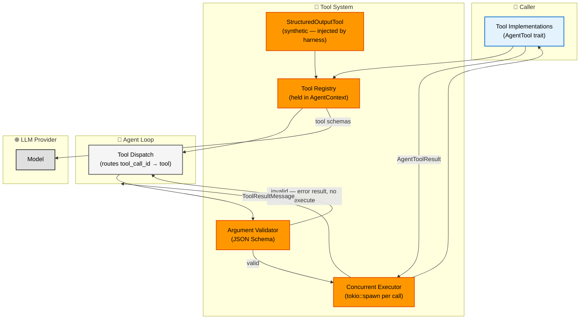
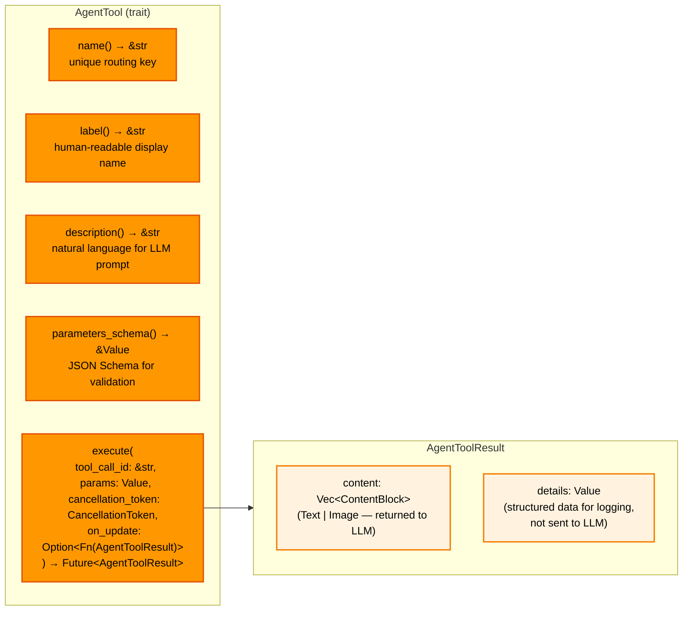
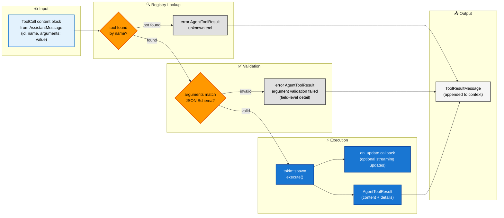
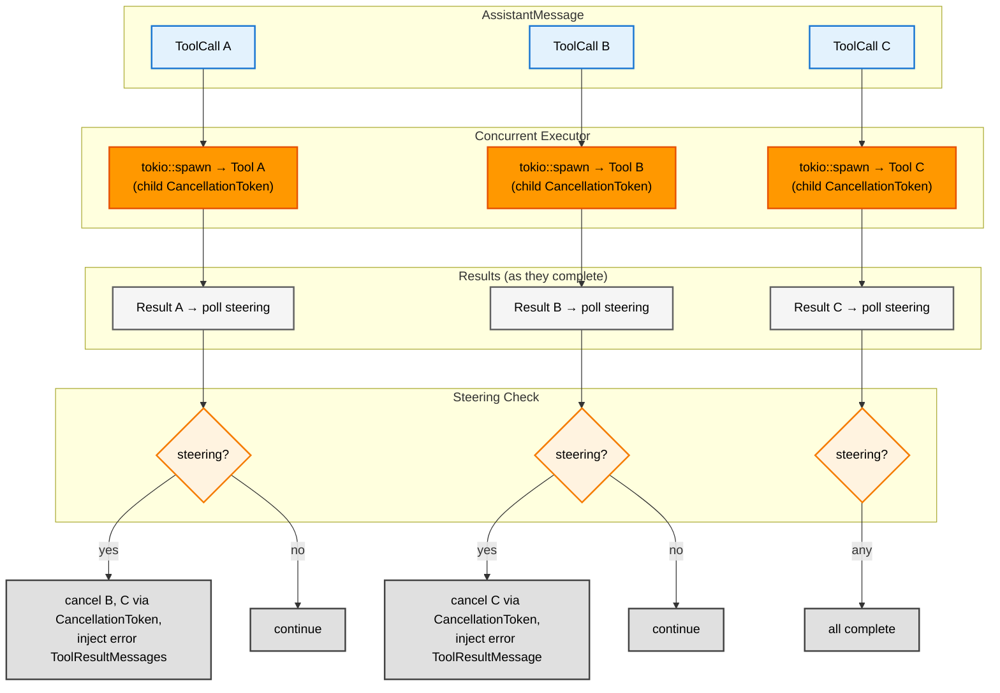
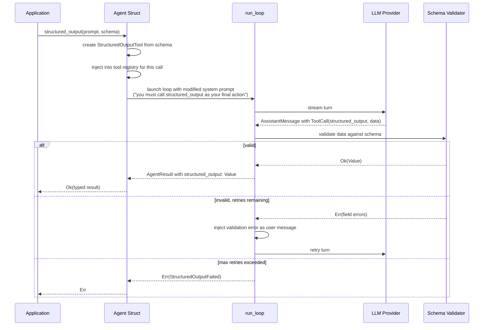

# Tool System

**Source files:** `src/tool.rs`, `src/tools/`
**Related:** [PRD §4](../../planning/PRD.md#4-tool-system)

The tool system defines how tools are declared, validated, executed, and how their results are returned to the LLM. It also covers the structured output mechanism, which is implemented as a synthetic tool injected by the harness.

---

## L2 — Components

---

## L3 — Built-in Tools

The harness ships three built-in tools in `src/tools/`. They are ordinary `AgentTool` implementations and can be registered alongside caller-provided tools.

### Shared constant: `MAX_OUTPUT_BYTES`

Defined in `src/tools/mod.rs` as `100 * 1024` (100 KB). Used by `BashTool` and `ReadFileTool` to truncate output before returning it to the LLM, preventing oversized context windows.

### BashTool (`src/tools/bash.rs`)

Executes arbitrary shell commands via `sh -c`.

| Field | Value |
|---|---|
| **name** | `bash` |
| **Parameters** | `command` (string, required), `timeout_ms` (integer, optional — default 30 000 ms) |
| **Output** | Exit code + stdout + stderr. Combined stdout/stderr truncated at `MAX_OUTPUT_BYTES`, split proportionally with stdout favoured. |
| **Cancellation** | Checks `cancellation_token.is_cancelled()` before spawning. During execution, `tokio::select!` races the child process against both the cancellation token and the timeout. On cancellation or timeout the child process is killed. |
| **Security note** | Runs arbitrary commands via `sh -c`. Not suitable for agents exposed to untrusted users. |

### ReadFileTool (`src/tools/read_file.rs`)

Reads a file and returns its contents as text.

| Field | Value |
|---|---|
| **name** | `read_file` |
| **Parameters** | `path` (string, required — absolute path) |
| **Output** | File contents as text, truncated at `MAX_OUTPUT_BYTES` with a `[truncated]` marker appended. |
| **Cancellation** | Checks `cancellation_token.is_cancelled()` before the read. Returns error immediately if cancelled. |

### WriteFileTool (`src/tools/write_file.rs`)

Writes content to a file, creating parent directories as needed.

| Field | Value |
|---|---|
| **name** | `write_file` |
| **Parameters** | `path` (string, required — absolute path), `content` (string, required) |
| **Output** | Success message including byte count written. |
| **Cancellation** | Checks `cancellation_token.is_cancelled()` before the write. Returns error immediately if cancelled. |

### Tool cancellation pattern

All built-in tools follow the same cancellation contract:

1. **Pre-check** — Before starting any I/O, the tool calls `cancellation_token.is_cancelled()` and returns an error result immediately if true.
2. **During work** — `BashTool` uses `tokio::select!` to race the child process against `cancellation_token.cancelled()`, killing the process on cancellation. The file tools perform a single async operation, so the pre-check is sufficient.

### `ToolExecutionUpdate` event

The `on_update` callback parameter in `execute()` is designed for tools that produce streaming partial results (e.g., long-running commands emitting incremental output). `ToolExecutionUpdate` events are defined in the event model but **currently reserved for future use** — the agent loop always passes `None` for the callback. Built-in tools accept but ignore the parameter.

---

## L3 — AgentTool Trait Contract

---

## L3 — Argument Validation Pipeline

Before `execute` is called, arguments from the LLM are validated against the tool's JSON Schema. Failures produce an error result without touching the implementation.

---

## L3 — Concurrent Tool Execution

When an assistant message contains multiple tool calls, the harness spawns them concurrently. Each tool receives its own `CancellationToken` (a child of the loop's token). When steering arrives after a tool completes, all remaining in-flight tools are cancelled via their `CancellationToken`, and for each cancelled tool an error `ToolResultMessage` is injected with content: `"tool call cancelled: user requested steering interrupt"`.

---

## L4 — Structured Output Flow

> **Note:** Structured output is managed by the `Agent` struct, not the loop. The `Agent` injects the synthetic tool, runs the loop normally, validates the result, and retries via `continue_loop()` if invalid. The loop itself has no structured output awareness.

Structured output is implemented as a synthetic tool injected alongside the caller's tools. The model is instructed to call it as its final action.

