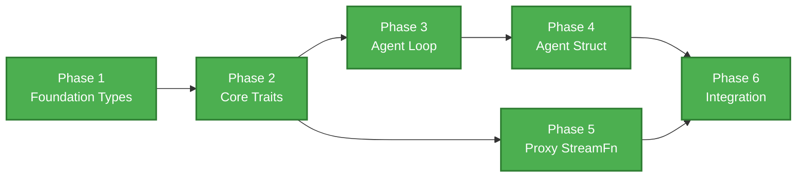

# Swink Agent — Implementation Phases

**Related Documents:**
- [PRD](./PRD.md)
- [HLD](../architecture/HLD.md)

**Status:** All 6 phases complete. 144 tests passing.

**Principle:** Each phase produces a compilable, fully tested artifact. Phases are ordered by dependency — each phase depends only on prior phases. A team can pick up any phase once its predecessors are complete.

---

## Dependency Graph



Note: Phases 3 and 5 are independent of each other and can run in parallel once Phase 2 is complete.

---

## Phase 1 — Foundation Types ✅

**Files:** `src/types.rs`, `src/error.rs`
**Depends on:** nothing
**Architecture docs:** [Data Model](../architecture/data-model/README.md), [Error Handling](../architecture/error-handling/README.md) (L3 AgentError taxonomy only), [Agent Context](../architecture/agent-context/README.md) (struct definition only)

### Scope

All core data types that every other module depends on. No async code, no business logic — pure type definitions, trait impls, and serialization.

### Deliverables

**`src/types.rs`**
- `ContentBlock` enum — `Text`, `Thinking`, `ToolCall`, `Image` variants
- `ImageSource` type
- `UserMessage`, `AssistantMessage`, `ToolResultMessage` structs
- `LlmMessage` enum wrapping the three message types
- `CustomMessage` trait (requires `Send + Sync + Any`)
- `AgentMessage` enum — `Llm(LlmMessage)` | `Custom(Box<dyn CustomMessage>)`
- `Usage` struct — input, output, cache_read, cache_write, total token counts
- `Cost` struct — per-category and total (f64)
- `StopReason` enum — `Stop`, `Length`, `ToolUse`, `Aborted`, `Error`
- `ModelSpec` struct — provider, model_id, thinking_level, thinking_budgets
- `ThinkingLevel` enum — `Off`, `Minimal`, `Low`, `Medium`, `High`, `ExtraHigh`
- `ThinkingBudgets` struct — optional per-level token overrides
- `AgentResult` struct — messages, stop_reason, usage, error
- `AgentContext` struct — system_prompt, messages, tools (type defined here, populated elsewhere)
- Derive `Serialize`, `Deserialize`, `Debug`, `Clone`, `PartialEq` where appropriate
- All public types must be `Send + Sync`

**`src/error.rs`**
- `AgentError` enum with all variants from PRD §10.3:
  - `ContextWindowOverflow { model: String }`
  - `ModelThrottled`
  - `NetworkError`
  - `StructuredOutputFailed { attempts: usize, last_error: String }`
  - `AlreadyRunning`
  - `NoMessages`
  - `InvalidContinue`
  - `StreamError { source: Box<dyn Error + Send + Sync> }`
  - `Aborted`
- Implement `std::error::Error` and `Display` via `thiserror`

### Test Criteria

| # | Test |
|---|---|
| 1.1 | All public types are `Send + Sync` (compile-time assertion) |
| 1.2 | `ContentBlock` variants construct and pattern-match correctly |
| 1.3 | `LlmMessage` wraps/unwraps each message type |
| 1.4 | `AgentMessage::Custom` holds a boxed trait object and downcasts correctly |
| 1.5 | `Usage` and `Cost` aggregate correctly (add/merge operations) |
| 1.6 | `StopReason` and `ThinkingLevel` round-trip through serde |
| 1.7 | `ModelSpec` constructs with defaults (thinking off, no budgets) |
| 1.8 | `AgentError` variants display meaningful messages |
| 1.9 | `AgentError` implements `std::error::Error` |
| 1.10 | `AgentContext` holds `Vec<AgentMessage>` and `Vec<Arc<dyn AgentTool>>` (type compiles with forward-declared trait) |

### Dependencies (Cargo.toml)

```toml
serde = { version = "1", features = ["derive"] }
serde_json = "1"
thiserror = "2"
```

---

## Phase 2 — Core Traits ✅

**Files:** `src/tool.rs`, `src/stream.rs`, `src/retry.rs`
**Depends on:** Phase 1
**Architecture docs:** [Tool System](../architecture/tool-system/README.md) (trait + validation), [Streaming](../architecture/streaming/README.md) (trait + events), [Error Handling](../architecture/error-handling/README.md) (retry strategy)

### Scope

The three trait definitions that form the pluggable boundaries of the harness: tool execution, LLM streaming, and retry logic. Includes the tool argument validation pipeline. No loop orchestration — just the contracts and their standalone logic.

### Deliverables

**`src/tool.rs`**
- `AgentTool` trait — `name`, `label`, `description`, `parameters_schema`, `execute`
  - `execute` signature: `async fn execute(&self, tool_call_id: &str, params: Value, cancellation_token: CancellationToken, on_update: Option<...>) -> AgentToolResult`
- `AgentToolResult` struct — `content: Vec<ContentBlock>`, `details: Value`
- `validate_tool_arguments(schema: &Value, arguments: &Value) -> Result<(), Vec<ValidationError>>` — validates arguments against JSON Schema using `jsonschema` crate
- Error result construction for: unknown tool, validation failure

**`src/stream.rs`**
- `StreamFn` trait — `async fn stream(&self, model: &ModelSpec, context: &AgentContext, options: &StreamOptions, cancellation_token: CancellationToken) -> impl Stream<Item = AssistantMessageEvent>`
- `StreamOptions` struct — temperature, max_tokens, session_id, transport
- `AssistantMessageEvent` enum — full start/delta/end protocol:
  - `Start`
  - `TextStart(content_index)`, `TextDelta(content_index, String)`, `TextEnd(content_index)`
  - `ThinkingStart(content_index)`, `ThinkingDelta(content_index, String)`, `ThinkingEnd(content_index, Option<String>)`
  - `ToolCallStart(content_index, id, name)`, `ToolCallDelta(content_index, String)`, `ToolCallEnd(content_index)`
  - `Done(StopReason, Usage)`
  - `Error(StopReason, String, Option<Usage>)`
- `AssistantMessageDelta` enum — `TextDelta`, `ThinkingDelta`, `ToolCallDelta`
- Delta accumulation logic: function that takes an `AssistantMessageEvent` stream and produces a finalized `AssistantMessage` (used by the loop and by proxy reconstruction)

**`src/retry.rs`**
- `RetryStrategy` trait — `should_retry(&self, error: &AgentError, attempt: u32) -> bool`, `delay(&self, attempt: u32) -> Duration`
- `DefaultRetryStrategy` struct — max_attempts (default 3), base_delay (default 1s), max_delay (default 60s), multiplier (default 2.0), jitter (default true)
- Retries on: `ModelThrottled`, `NetworkError`
- Never retries: `ContextWindowOverflow`, `Aborted`, `AlreadyRunning`, `StructuredOutputFailed`, `StreamError`

### Test Criteria

| # | Test |
|---|---|
| 2.1 | Valid arguments pass validation against a JSON Schema |
| 2.2 | Invalid arguments produce field-level validation errors |
| 2.3 | Missing required fields are caught by validation |
| 2.4 | Extra fields are handled according to schema (additionalProperties) |
| 2.5 | `AssistantMessageEvent` stream accumulates into a correct `AssistantMessage` (text + tool call) |
| 2.6 | Delta accumulation handles interleaved text and tool call blocks |
| 2.7 | `DefaultRetryStrategy` retries `ModelThrottled` up to max_attempts |
| 2.8 | `DefaultRetryStrategy` does not retry `ContextWindowOverflow` |
| 2.9 | `DefaultRetryStrategy` delay increases exponentially and caps at max_delay |
| 2.10 | `DefaultRetryStrategy` with jitter produces varying delays |
| 2.11 | A mock `AgentTool` can be constructed and its schema validated |
| 2.12 | `StreamOptions` defaults are sensible (no temperature, no max_tokens, SSE transport) |

### Additional Dependencies

```toml
tokio = { version = "1", features = ["full"] }
tokio-util = "0.7"
futures = "0.3"
jsonschema = "0.28"
uuid = { version = "1", features = ["v4"] }
```

---

## Phase 3 — Agent Loop ✅

**Files:** `src/loop_.rs`
**Depends on:** Phase 1, Phase 2
**Architecture docs:** [Agent Loop](../architecture/agent-loop/README.md), [Agent Context](../architecture/agent-context/README.md)

### Scope

The core execution engine. Implements the nested inner/outer loop, tool dispatch, steering/follow-up injection, event emission, retry integration, error/abort handling, and max tokens recovery. Stateless — all state is passed in via `AgentLoopConfig` and `AgentContext`.

### Deliverables

**`src/loop_.rs`**
- `AgentLoopConfig` struct — all fields from PRD §12.2:
  - `model: ModelSpec`
  - `stream_options: StreamOptions`
  - `retry_strategy: Box<dyn RetryStrategy>`
  - `convert_to_llm: Box<dyn Fn(&AgentMessage) -> Option<LlmMessage>>`
  - `transform_context: Option<Box<dyn AsyncFn(...)>>` with overflow signal
  - `get_api_key: Option<Box<dyn AsyncFn(...)>>`
  - `get_steering_messages: Option<Box<dyn AsyncFn(...)>>`
  - `get_follow_up_messages: Option<Box<dyn AsyncFn(...)>>`
- `agent_loop(messages, context, config, cancellation_token) -> impl Stream<Item = AgentEvent>` — entry point with new prompt messages
- `agent_loop_continue(context, config, cancellation_token) -> impl Stream<Item = AgentEvent>` — resume from existing context
- Internal `run_loop` implementing:
  - Emit `AgentStart` before outer loop entry
  - Inner loop: inject pending → `transform_context` → `convert_to_llm` → `get_api_key` → `StreamFn` (with retry) → emit message events → extract tool calls → "has tool calls?" branch → concurrent tool execution → steering poll → `TurnEnd`
  - Error/abort: emit `TurnEnd` → `AgentEnd` → immediate exit (no follow-up poll)
  - No tool calls: emit `TurnEnd` → exit inner loop
  - Outer loop: poll `get_follow_up_messages` → re-enter or emit `AgentEnd`
- Concurrent tool execution via `tokio::spawn` with per-tool child `CancellationToken`
- Steering interrupt: cancel in-flight tools, inject error `ToolResultMessage` ("tool call cancelled: user requested steering interrupt")
- Max tokens recovery: detect `stop_reason: length` with incomplete tool calls, replace with error `ToolResultMessage`, continue loop
- `AgentEvent` enum — all variants from PRD §8:
  - `AgentStart`, `AgentEnd { messages }`
  - `TurnStart`, `TurnEnd { assistant_message, tool_results }`
  - `MessageStart`, `MessageUpdate { delta }`, `MessageEnd`
  - `ToolExecutionStart { id, name, arguments }`, `ToolExecutionUpdate { partial }`, `ToolExecutionEnd { result, is_error }`

### Test Criteria

All tests use a mock `StreamFn` and mock tools — no real LLM calls.

| # | Test |
|---|---|
| 3.1 | Single-turn no-tool conversation emits: `AgentStart` → `TurnStart` → `MessageStart` → `MessageUpdate`* → `MessageEnd` → `TurnEnd` → `AgentEnd` |
| 3.2 | Single-turn with one tool call emits tool execution events between message events and turn end |
| 3.3 | Multi-turn conversation (tool_use → tool_result → assistant) produces correct event sequence |
| 3.4 | `transform_context` is called before `convert_to_llm` on every turn |
| 3.5 | `get_api_key` is called before `StreamFn` on every turn |
| 3.6 | Tool calls within a single turn execute concurrently (verify via timing or execution order) |
| 3.7 | Steering messages interrupt tool execution — remaining tools cancelled, error results injected |
| 3.8 | Follow-up messages cause the loop to continue after natural stop |
| 3.9 | Error stop reason exits immediately — no follow-up polling |
| 3.10 | Abort via `CancellationToken` produces `StopReason::Aborted` and clean exit |
| 3.11 | Retryable error (`ModelThrottled`) triggers retry strategy; succeeds on second attempt |
| 3.12 | Non-retryable error (`StreamError`) exits without retry |
| 3.13 | Max tokens recovery: incomplete tool calls replaced with error tool results, loop continues |
| 3.14 | `convert_to_llm` returning `None` filters messages from provider input |
| 3.15 | `transform_context` receives overflow signal after `ContextWindowOverflow` and retry |
| 3.16 | No tool calls present → emit `TurnEnd` → exit inner loop (no tool execution phase) |
| 3.17 | Tool argument validation failure produces error `ToolResultMessage` without calling `execute` |

### Additional Dependencies

None beyond Phase 1 + 2.

---

## Phase 4 — Agent Struct ✅

**Files:** `src/agent.rs`, `src/lib.rs`
**Depends on:** Phase 1, Phase 2, Phase 3
**Architecture docs:** [Agent](../architecture/agent/README.md)

### Scope

The stateful public API wrapper. Owns conversation history, manages steering/follow-up queues, enforces the single-invocation concurrency contract, provides three invocation modes (streaming, async, sync), implements structured output, and fans events to subscribers.

### Deliverables

**`src/agent.rs`**
- `AgentOptions` struct — initial state overrides, custom `convert_to_llm`, custom `transform_context`, steering mode, follow-up mode, custom `StreamFn`, API key callback, retry strategy
- `Agent` struct containing:
  - `AgentState` — system_prompt, model, tools, messages, is_running, stream_message, pending_tool_calls, error
  - Steering queue, follow-up queue
  - Listener registry: `HashMap<SubscriptionId, Box<dyn Fn(&AgentEvent) + Send + Sync>>`
  - Abort controller (`Option<CancellationToken>`), running handle
  - Steering mode, follow-up mode
- **State mutation API:** set_system_prompt, set_model, set_thinking_level, set_tools, set_messages, append_messages, clear_messages
- **Prompt — streaming:** `prompt_stream(input) -> Result<impl Stream<Item = AgentEvent>, AgentError>` — returns `AlreadyRunning` if active
- **Prompt — async:** `prompt_async(input) -> Result<AgentResult, AgentError>` — collects stream to completion
- **Prompt — sync:** `prompt_sync(input) -> Result<AgentResult, AgentError>` — blocks via `tokio::runtime::Runtime`
- **Structured output:** `structured_output(prompt, schema) -> Result<Value, AgentError>` — injects synthetic tool, validates response, retries via `continue_loop()` up to configurable max
- **Continue:** `continue_stream`, `continue_async`, `continue_sync` — resume from existing context
- **Queues:** `steer(message)`, `follow_up(message)`, `clear_steering`, `clear_follow_up`, `clear_queues`, `has_pending_messages`
- **Control:** `abort()`, `wait_for_idle()`, `reset()`
- **Observation:** `subscribe(callback) -> SubscriptionId`, `unsubscribe(id)`
- `AgentContext` snapshot creation at each turn from `AgentState`
- Panic-isolated event dispatch

**`src/lib.rs`**
- Public re-exports of all types, traits, structs, and the `Agent` struct
- No logic — just `pub use` declarations

### Test Criteria

| # | Test |
|---|---|
| 4.1 | `prompt_async` with a mock `StreamFn` returns correct `AgentResult` |
| 4.2 | `prompt_sync` blocks and returns the same result as async |
| 4.3 | `prompt_stream` yields events in correct order |
| 4.4 | Calling `prompt_*` while running returns `AgentError::AlreadyRunning` |
| 4.5 | `abort()` causes the active run to exit with `StopReason::Aborted` |
| 4.6 | `steer()` during a run causes steering interrupt on next tool completion |
| 4.7 | `follow_up()` causes the agent to continue after natural stop |
| 4.8 | `steer()` while idle queues the message for the next run |
| 4.9 | `subscribe` returns a `SubscriptionId`; callback receives events |
| 4.10 | `unsubscribe` removes the listener; no further events delivered |
| 4.11 | Subscriber panic does not crash the agent; panicking subscriber is auto-unsubscribed |
| 4.12 | `reset()` clears state, messages, queues, and error |
| 4.13 | `wait_for_idle()` resolves when the current run completes |
| 4.14 | `structured_output` validates response against schema and returns typed value |
| 4.15 | `structured_output` retries on invalid response up to configured maximum |
| 4.16 | `structured_output` returns `StructuredOutputFailed` after max retries |
| 4.17 | `continue_async` with empty messages returns `AgentError::NoMessages` |
| 4.18 | Steering mode `All` delivers all queued messages at once; `OneAtATime` delivers one per turn |
| 4.19 | `AgentContext` snapshot is immutable — messages added during a turn do not appear in the snapshot |

---

## Phase 5 — Proxy StreamFn ✅

**Files:** `adapters/src/proxy.rs` (moved from `src/proxy.rs`)
**Depends on:** Phase 1, Phase 2
**Architecture docs:** [Streaming](../architecture/streaming/README.md) (proxy sections + error handling)

**Note:** This phase is independent of Phases 3 and 4. It can run in parallel with Phase 3 once Phase 2 is complete. `ProxyStreamFn` was moved from the core crate to the adapters crate to remove `reqwest`/`eventsource-stream` from the core dependency tree.

### Scope

The `ProxyStreamFn` that forwards LLM calls to an HTTP proxy server over SSE. Implements delta reconstruction, authentication, and error classification. Lives in the adapters crate alongside other provider implementations.

### Deliverables

**`adapters/src/proxy.rs`**
- `ProxyStreamFn` struct — holds base URL and bearer token
- Implements `StreamFn` trait
- HTTP POST to proxy endpoint with model, context, and options as JSON body
- Bearer token authentication header
- SSE response parsing via `eventsource-stream`
- Delta accumulation: reconstructs `AssistantMessage` from stripped delta events
- Emits `AssistantMessageEvent` stream to the harness
- Error classification:
  - Connection failure, TCP timeout, DNS failure → `AgentError::NetworkError` (retryable)
  - 401/403 authentication failure → `AgentError::StreamError` (not retryable)
  - SSE stream drop mid-response → `AgentError::NetworkError` (retryable, full turn retry)
  - 504 gateway timeout → `AgentError::NetworkError` (retryable)
  - Malformed SSE event (unparseable JSON) → `AgentError::StreamError` (not retryable)
  - 429 rate limit from proxy → `AgentError::ModelThrottled` (retryable)
- Cancellation: respects `CancellationToken` — drops the HTTP connection and yields `Aborted`

### Test Criteria

All tests use a mock HTTP server (e.g., `wiremock` or `axum` test server).

| # | Test |
|---|---|
| 5.1 | Successful stream: proxy returns SSE deltas, `ProxyStreamFn` reconstructs correct `AssistantMessage` |
| 5.2 | Text + tool call in same stream reconstructs correctly |
| 5.3 | Bearer token is sent in Authorization header |
| 5.4 | Connection failure produces `NetworkError` |
| 5.5 | 401 response produces `StreamError` |
| 5.6 | 429 response produces `ModelThrottled` |
| 5.7 | 504 response produces `NetworkError` |
| 5.8 | Malformed SSE event produces `StreamError` |
| 5.9 | Mid-stream disconnect produces `NetworkError` |
| 5.10 | `CancellationToken` cancellation drops connection and yields `Aborted` |

### Additional Dependencies (in adapters crate)

```toml
eventsource-stream = "0.2"
# reqwest was already a dependency of the adapters crate
```

---

## Phase 6 — Integration ✅

**Files:** `tests/integration/`
**Depends on:** Phase 1, Phase 2, Phase 3, Phase 4, Phase 5

### Scope

End-to-end integration tests that exercise the full stack: `Agent` → loop → mock `StreamFn` → tool execution → events. Validates all PRD acceptance criteria as system-level tests. Also validates `lib.rs` public API surface.

### Deliverables

**Test infrastructure**
- `MockStreamFn` — configurable mock that returns scripted `AssistantMessageEvent` sequences
- `MockTool` — configurable mock tool with controllable latency, results, and failure modes
- `EventCollector` — subscribes to `Agent` events and collects them for assertion

**Integration tests** — one test per PRD acceptance criterion:

| # | PRD AC | Test |
|---|---|---|
| 6.1 | AC-1 | Agent loop emits all lifecycle events in correct order for single-turn, no-tool conversation |
| 6.2 | AC-2 | Tool arguments validated against JSON Schema; invalid args produce error results without execute |
| 6.3 | AC-3 | Tool calls within a single turn execute concurrently |
| 6.4 | AC-4 | Steering messages interrupt tool execution — remaining tools cancelled with error results |
| 6.5 | AC-5 | Follow-up messages cause the agent to continue after natural stop |
| 6.6 | AC-6 | Aborting via `CancellationToken` produces clean shutdown with `StopReason::Aborted` |
| 6.7 | AC-7 | Proxy stream correctly reconstructs assistant message from delta SSE events |
| 6.8 | AC-8 | Calling prompt while already running returns `AlreadyRunning` error |
| 6.9 | AC-9 | `transform_context` is called before `convert_to_llm` on every turn |
| 6.10 | AC-10 | All public types are `Send + Sync` |
| 6.11 | AC-11 | Structured output retries up to configured max on invalid response |
| 6.12 | AC-12 | Context window overflow surfaces as typed `ContextWindowOverflow` error |
| 6.13 | AC-13 | Incomplete tool calls from max tokens are replaced with error tool results |
| 6.14 | AC-14 | Default retry strategy applies exponential back-off with jitter, respects max delay cap |
| 6.15 | AC-15 | Sync prompt blocks until completion without caller managing Tokio runtime |

---

## Summary

| Phase | Files | Depends on | Can parallelize with | Status |
|---|---|---|---|---|
| 1 — Foundation Types | `types.rs`, `error.rs` | — | — | Complete |
| 2 — Core Traits | `tool.rs`, `stream.rs`, `retry.rs` | Phase 1 | — | Complete |
| 3 — Agent Loop | `loop_.rs` | Phase 1, 2 | Phase 5 | Complete |
| 4 — Agent Struct | `agent.rs`, `lib.rs` | Phase 1, 2, 3 | Phase 5 | Complete |
| 5 — Proxy StreamFn | `adapters/src/proxy.rs` | Phase 1, 2 | Phase 3, 4 | Complete |
| 6 — Integration | `tests/integration/` | All | — | Complete |

**Total: 144 tests passing across all phases.**

---

## Memory Crate

Session persistence and memory management are implemented in the `swink-agent-memory` crate (separate from the core phases above). See [`memory/docs/architecture/`](../../memory/docs/architecture/README.md) for architecture details.

## Evaluation Crate

Trajectory tracing, golden path verification, response matching, and cost/latency governance are implemented in the `swink-agent-eval` crate (separate from the core phases above). The eval crate depends only on `swink-agent` core and consumes the `AgentEvent` stream for trajectory capture. See [`docs/architecture/eval/`](../architecture/eval/README.md) for architecture details and [EVAL.md](./EVAL.md) for the evaluation feature roadmap.
