# Swink-Agent Specification Tracker

**Related Documents:**
- Product Requirements: [PRD.md](PRD.md) — §1–§17
- Architecture: [../architecture/HLD.md](../architecture/HLD.md) — Component diagram, data flow, dependency graph
- Constitution: [../../.specify/memory/constitution.md](../../.specify/memory/constitution.md)
- Provider Roadmap: [PROVIDER_EXPANSION_ROADMAP.md](PROVIDER_EXPANSION_ROADMAP.md)
- Eval Roadmap: [EVAL.md](EVAL.md)

**Current Focus:** 42 specs total — 42/42 have plans, 42/42 have tasks, 38/42 complete. Phase 0–8 done (including memory crate 021, Azure/xAI adapters). Phase 3: 9/10 complete (019-bedrock at 56%). Phase 9: 1/5 complete (038-mcp done), 036 at 18%, 037 at 44%, 039/040 ready. Phase 10: 041 (Gemma4 local adapter) at 60%, 042 (web browse plugin) complete. Next: finish bedrock adapter (019), continue artifact service (036) and plugin system (037), begin multi-agent patterns (039) and transfer/handoff (040), finish Gemma4 local adapter (041).

> **Numbering System:** Spec numbers (001–040) are sequential identifiers that
> never change. Phase numbers represent execution order and can be reassigned
> as priorities shift.

---

## Phase 0: Foundation

**Goal:** Establish the workspace scaffold and core type system that every
other crate and module depends on — the data model, error taxonomy, and
pluggable trait boundaries.

**Status:** 3/3 specs planned, 3/3 have tasks, 3/3 complete, 3/3 specs defined

### Implementation Checklist

- [x] **0.1** Workspace & Cargo Scaffold — 7-crate workspace, centralized deps, feature flags, MSRV/edition, toolchain config (§15)
  - Spec: `specs/001-workspace-scaffold/spec.md`
  - Branch: `001-workspace-scaffold`
  - Status: Complete (24/24 tasks, merged to main)
  - Depends on: —
- [x] **0.2** Foundation Types & Errors — ContentBlock, LlmMessage, AgentMessage, Usage, Cost, StopReason, ModelSpec, AgentError (§3, §10.3)
  - Spec: `specs/002-foundation-types-errors/spec.md`
  - Branch: `002-foundation-types-errors`
  - Status: Complete (63/63 tasks, merged to main)
  - Depends on: 0.1
- [x] **0.3** Core Traits — AgentTool, StreamFn, RetryStrategy, JSON Schema validation, delta accumulation (§4, §7, §11)
  - Spec: `specs/003-core-traits/spec.md`
  - Branch: `003-core-traits`
  - Status: Complete (47/47 tasks, merged to main)
  - Depends on: 0.2

---

## Phase 1: Core Engine

**Goal:** The agent loop execution engine and its public API wrapper —
the two central verticals that make the agent functional.

**Status:** 2/2 specs planned, 2/2 have tasks, 2/2 complete (core merged), 2/2 specs defined

### Implementation Checklist

- [x] **1.1** Agent Loop — Nested inner/outer loop, concurrent tool dispatch, steering/follow-up, retry, overflow recovery (§8, §9, §12)
  - Spec: `specs/004-agent-loop/spec.md`
  - Branch: `004-agent-loop`
  - Status: Complete (75/75 tasks, merged to main)
  - Depends on: 0.2, 0.3
- [x] **1.2** Agent Struct & Public API — Stateful wrapper, streaming/async/sync API, structured output, queues, subscriptions (§13)
  - Spec: `specs/005-agent-struct/spec.md`
  - Branch: `005-agent-struct`
  - Status: Complete (93/93 tasks, merged to main)
  - Depends on: 1.1

---

## Phase 2: Core Extensions

**Goal:** Context management, tool system extensions, model catalog, multi-agent
primitives, and loop governance — capabilities that enhance the core engine.

**Status:** 5/5 specs planned, 5/5 have tasks, 5/5 complete (core merged), 5/5 specs defined

### Implementation Checklist

- [x] **2.1** Context Management — Sliding window pruning, transform hooks (sync/async), versioned history, convert_to_llm pipeline (§5, §10.1)
  - Spec: `specs/006-context-management/spec.md`
  - Branch: `006-context-management`
  - Status: Complete (76/76 tasks, merged to main)
  - Depends on: 0.2
- [x] **2.2** Tool System Extensions — Transformer, validator, middleware, execution policies, FnTool, builtin tools (§4)
  - Spec: `specs/007-tool-system-extensions/spec.md`
  - Branch: `007-tool-system-extensions`
  - Status: Complete (98/98 tasks, merged to main)
  - Depends on: 0.3
- [x] **2.3** Model Catalog, Presets & Fallback — TOML-driven catalog, preset-to-connection resolution, automatic fallback chain
  - Spec: `specs/008-model-catalog-presets/spec.md`
  - Branch: `008-model-catalog-presets`
  - Status: Complete (44/44 tasks, merged to main)
  - Depends on: 0.3
- [x] **2.4** Multi-Agent System — AgentRegistry, AgentMailbox, AgentOrchestrator, SubAgent tool wrapper
  - Spec: `specs/009-multi-agent-system/spec.md`
  - Branch: `009-multi-agent-system`
  - Status: Complete (59/59 tasks, merged to main)
  - Depends on: 1.2
- [x] **2.5** Loop Policies & Observability — LoopPolicy, StreamMiddleware, MetricsCollector, PostTurnHook, BudgetGuard, Checkpoint
  - Spec: `specs/010-loop-policies-observability/spec.md`
  - Branch: `010-loop-policies-observability`
  - Status: Complete (95/95 tasks, merged to main)
  - Depends on: 1.1

---

## Phase 3: Adapters

**Goal:** LLM provider adapters — shared infrastructure and one adapter per
provider. Each adapter implements StreamFn for its provider's streaming protocol.

**Status:** 10/10 specs planned, 10/10 have tasks, 9/10 complete, 10/10 specs defined

### Implementation Checklist

- [x] **3.1** Adapter Shared Infrastructure — MessageConverter trait, HttpErrorClassifier, SSE parsing, remote preset construction (§15.1)
  - Spec: `specs/011-adapter-shared-infra/spec.md`
  - Branch: `011-adapter-shared-infra`
  - Status: Complete (63/63 tasks, merged to main)
  - Depends on: 0.3
- [x] **3.2** Adapter: Anthropic — AnthropicStreamFn, /v1/messages SSE, thinking blocks with budget control (§15.1)
  - Spec: `specs/012-adapter-anthropic/spec.md`
  - Branch: `012-adapter-anthropic`
  - Status: Complete (73/73 tasks, merged to main)
  - Depends on: 3.1
- [x] **3.3** Adapter: OpenAI — OpenAiStreamFn, /v1/chat/completions SSE, multi-provider compatible (§15.1)
  - Spec: `specs/013-adapter-openai/spec.md`
  - Branch: `013-adapter-openai`
  - Status: Complete (73/73 tasks, merged to main)
  - Depends on: 3.1
- [x] **3.4** Adapter: Ollama — OllamaStreamFn, /api/chat NDJSON, native tool-calling (§15.1)
  - Spec: `specs/014-adapter-ollama/spec.md`
  - Branch: `014-adapter-ollama`
  - Status: Complete (74/74 tasks, merged to main)
  - Depends on: 3.1
- [x] **3.5** Adapter: Google Gemini — GeminiStreamFn, Gemini API SSE (§15.1)
  - Spec: `specs/015-adapter-gemini/spec.md`
  - Branch: `015-adapter-gemini`
  - Status: Complete (44/44 tasks, merged to main)
  - Depends on: 3.1
- [x] **3.6** Adapter: Azure OpenAI — AzureStreamFn, deployment routing, API versioning (§15.1)
  - Spec: `specs/016-adapter-azure/spec.md`
  - Branch: `016-adapter-azure`
  - Status: Complete (54/54 tasks, merged to main)
  - Depends on: 3.1
- [x] **3.7** Adapter: xAI — XAiStreamFn, xAI (Grok) SSE (§15.1)
  - Spec: `specs/017-adapter-xai/spec.md`
  - Branch: `017-adapter-xai`
  - Status: Complete (17/17 tasks, merged to main)
  - Depends on: 3.1
- [x] **3.8** Adapter: Mistral — MistralStreamFn, Mistral API SSE (§15.1)
  - Spec: `specs/018-adapter-mistral/spec.md`
  - Branch: `018-adapter-mistral`
  - Status: Complete (42/42 tasks, merged to main)
  - Depends on: 3.1
- [ ] **3.9** Adapter: AWS Bedrock — BedrockStreamFn, SSE, AWS SigV4 signing (§15.1)
  - Spec: `specs/019-adapter-bedrock/spec.md`
  - Branch: `019-adapter-bedrock`
  - Status: In Progress (23/41 tasks, 56%)
  - Depends on: 3.1
- [x] **3.10** Adapter: Proxy — ProxyStreamFn, SSE, bearer auth, typed delta events (§7.4, §15.1)
  - Spec: `specs/020-adapter-proxy/spec.md`
  - Branch: `020-adapter-proxy`
  - Status: Complete (40/40 tasks, merged to main)
  - Depends on: 3.1

### Parallel Opportunities

After **3.1 Shared Infrastructure** completes, all 9 provider adapters (3.2–3.10) can proceed in parallel — they are independent implementations of the same trait.

---

## Phase 4: Companion Crates

**Goal:** Standalone crates for session persistence, on-device inference, and
evaluation — each depends only on the core library.

**Status:** 4/4 specs planned, 4/4 have tasks, 4/4 complete, 4/4 specs defined

### Implementation Checklist

- [x] **4.1** Memory Crate — SessionStore (sync/async), JsonlSessionStore, SummarizingCompactor, session metadata
  - Spec: `specs/021-memory-crate/spec.md`
  - Branch: `021-memory-crate`
  - Status: Complete (98/98 tasks, merged to main)
  - Depends on: 0.2
- [x] **4.2** Local LLM Crate — LocalModel (SmolLM3-3B), LocalStreamFn, EmbeddingModel, presets, progress reporting
  - Spec: `specs/022-local-llm-crate/spec.md`
  - Branch: `022-local-llm-crate`
  - Status: Complete (58/58 tasks, merged to main)
  - Depends on: 0.3
- [x] **4.3** Eval: Trajectory & Matching — TrajectoryCollector, TrajectoryMatcher, EfficiencyEvaluator, ResponseCriteria
  - Spec: `specs/023-eval-trajectory-matching/spec.md`
  - Branch: `023-eval-trajectory-matching`
  - Status: Complete (40/40 tasks, merged to main)
  - Depends on: 1.1
- [x] **4.4** Eval: Runner, Scoring & Governance — EvalRunner, EvaluatorRegistry, FsEvalStore, CI/CD gating, audit trails
  - Spec: `specs/024-eval-runner-governance/spec.md`
  - Branch: `024-eval-runner-governance`
  - Status: Complete (69/69 tasks, merged to main)
  - Depends on: 4.3

---

## Phase 5: Terminal UI

**Goal:** Interactive terminal interface — the binary crate that demonstrates
the full agent library in a usable application.

**Status:** 5/5 specs planned, 5/5 have tasks, 5/5 complete, 5/5 specs defined

### Implementation Checklist

- [x] **5.1** TUI: Scaffold, Event Loop & Config — Binary entry, terminal setup, async event loop, config, credentials, wizard (§16.1–16.2)
  - Spec: `specs/025-tui-scaffold-config/spec.md`
  - Branch: `025-tui-scaffold-config`
  - Status: Complete (56/56 tasks, merged to main)
  - Depends on: 1.2, 3.1
- [x] **5.2** TUI: Input & Conversation — Multi-line editor, scrollable conversation, markdown, syntax highlighting (§16.2–16.3)
  - Spec: `specs/026-tui-input-conversation/spec.md`
  - Branch: `026-tui-input-conversation`
  - Status: Complete (69/69 tasks, merged to main)
  - Depends on: 5.1
- [x] **5.3** TUI: Tool Panel, Diffs & Status Bar — Tool panel, collapsible blocks, inline diffs, status bar, context gauge (§16.6–16.7, §16.10)
  - Spec: `specs/027-tui-tools-diffs-status/spec.md`
  - Branch: `027-tui-tools-diffs-status`
  - Status: Complete (67/67 tasks, merged to main)
  - Depends on: 5.2
- [x] **5.4** TUI: Commands, Editor & Session — Hash/slash commands, external editor, session persistence (§16.4, §16.8)
  - Spec: `specs/028-tui-commands-editor-session/spec.md`
  - Branch: `028-tui-commands-editor-session`
  - Status: Complete (78/78 tasks, merged to main)
  - Depends on: 5.2
- [x] **5.5** TUI: Plan Mode & Approval — Plan mode (read-only restriction), tiered approval (Enabled/Smart/Bypassed), session trust (§16.9, §16.11)
  - Spec: `specs/029-tui-plan-mode-approval/spec.md`
  - Branch: `029-tui-plan-mode-approval`
  - Status: Complete (70/70 tasks, merged to main)
  - Depends on: 5.2

### Parallel Opportunities

After **5.2 Input & Conversation** completes, specs 5.3, 5.4, and 5.5 can proceed in parallel — they are independent feature layers on top of the conversation UI.

---

## Phase 6: Integration Testing

**Goal:** End-to-end tests exercising the full stack against all PRD acceptance
criteria.

**Status:** 1/1 specs planned, 1/1 have tasks, 1/1 complete, 1/1 specs defined

### Implementation Checklist

- [x] **6.1** Integration Tests — MockStreamFn, MockTool, EventCollector, tests for all 30 PRD acceptance criteria (§17)
  - Spec: `specs/030-integration-tests/spec.md`
  - Branch: `030-integration-tests`
  - Status: Complete (48/48 tasks, merged to main)
  - Depends on: 1.2, 2.1, 2.2

---

## Phase 7: Policy Slots

**Goal:** Replace scattered loop hooks (BudgetGuard, LoopPolicy, PostTurnHook,
ToolValidator, ToolCallTransformer) with a unified, configurable policy slot system.

**Status:** 2/2 specs planned, 2/2 have tasks, 2/2 complete, 2/2 specs defined

### Implementation Checklist

- [x] **7.1** Policy Slots — Four configurable policy slots (PreTurn, PreDispatch, PostTurn, PostLoop), verdict enums, built-in policies (Budget, Checkpoint, DenyList, LoopDetection, MaxTurns, Sandbox)
  - Spec: `specs/031-policy-slots/spec.md`
  - Branch: `031-policy-slots`
  - Status: Complete (93/93 tasks, merged to main)
  - Depends on: 2.5
- [x] **7.2** Policy Recipes Crate — swink-agent-policies crate with 10 feature-gated policy implementations (PromptInjectionGuard, PiiRedactor, ContentFilter, AuditLogger, Budget, MaxTurns, DenyList, Sandbox, LoopDetection, Checkpoint)
  - Spec: `specs/032-policy-recipes-crate/spec.md`
  - Branch: `032-policy-recipes-crate`
  - Status: Complete (43/43 tasks, merged to main)
  - Depends on: 7.1

---

## Phase 8: Infrastructure & Credentials

**Goal:** Workspace-level feature gates, session state persistence, and
credential management — cross-cutting infrastructure for production readiness.

**Status:** 3/3 specs planned, 3/3 have tasks, 3/3 complete, 3/3 specs defined

### Implementation Checklist

- [x] **8.1** Workspace Feature Gates — Per-adapter and local-llm feature flags, cyclic dependency detection, conditional compilation
  - Spec: `specs/033-workspace-feature-gates/spec.md`
  - Branch: `033-workspace-feature-gates`
  - Status: Complete (25/25 tasks, merged to main)
  - Depends on: 3.1, 4.2
- [x] **8.2** Session State Store — Key-value state store per session, integrated with SessionStore and JSONL persistence
  - Spec: `specs/034-session-state-store/spec.md`
  - Branch: `034-session-state-store`
  - Status: Complete (93/93 tasks, merged to main)
  - Depends on: 4.1
- [x] **8.3** Credential Management — OAuth2 refresh, credential provider trait, in-memory credential store, deduplication
  - Spec: `specs/035-credential-management/spec.md`
  - Branch: `035-credential-management`
  - Status: Complete (73/73 tasks, merged to main)
  - Depends on: 3.1

---

## Phase 9: Extensibility & Composition

**Goal:** Artifact persistence, plugin composition, MCP tool interop, multi-agent
orchestration patterns, and agent-to-agent handoff — capabilities that make the
agent framework composable and extensible for production use cases.

**Status:** 5/5 specs planned, 5/5 have tasks, 1/5 complete, 5/5 specs defined

### Implementation Checklist

- [ ] **9.1** Artifact Service — Versioned artifact storage, filesystem + in-memory backends, session-independent persistence
  - Spec: `specs/036-artifact-service/spec.md`
  - Branch: `036-artifact-service`
  - Status: In Progress (15/81 tasks, 18%)
  - Depends on: 0.2, 2.2
- [ ] **9.2** Plugin System — Plugin trait, bundled policy/tool/event registration, priority-ordered composition
  - Spec: `specs/037-plugin-system/spec.md`
  - Branch: `037-plugin-system`
  - Status: In Progress (21/47 tasks, 44%)
  - Depends on: 7.1, 2.2
- [x] **9.3** MCP Integration — MCP server connections (stdio/SSE), tool discovery, namespaced registration, policy integration
  - Spec: `specs/038-mcp-integration/spec.md`
  - Branch: `038-mcp-integration`
  - Status: Complete (48/49 tasks, merged to main — T042 deferred by design)
  - Depends on: 2.2
- [ ] **9.4** Multi-Agent Patterns — Pipeline primitives (sequential, parallel, loop), merge strategies, pipeline registry
  - Spec: `specs/039-multi-agent-patterns/spec.md`
  - Branch: `039-multi-agent-patterns`
  - Status: Ready for implementation (0/66 tasks)
  - Depends on: 2.4
- [ ] **9.5** TransferToAgent Tool & Handoff Safety — Transfer tool, allowed-target validation, circular transfer detection, transfer events
  - Spec: `specs/040-agent-transfer-handoff/spec.md`
  - Branch: `040-agent-transfer-handoff`
  - Status: Ready for implementation (0/49 tasks)
  - Depends on: 2.4

### Parallel Opportunities

After their respective dependencies are met, 9.1 (Artifact Service), 9.2 (Plugin System), 9.3 (MCP Integration), 9.4 (Multi-Agent Patterns), and 9.5 (Transfer/Handoff) can all proceed in parallel — they are independent feature verticals.

---

## Phase 10: Local Models & Plugins

**Goal:** On-device model expansion and plugin-based tool ecosystems.

**Status:** 2/2 specs planned, 2/2 have tasks, 2/2 complete, 2/2 specs defined

### Implementation Checklist

- [x] **10.1** ~~Adapter: Gemma 4 Local~~ — Folded into spec 022 (local-llm crate) after llama-cpp-2 migration unified GGUF loading path. Gemma 4 thinking/tool-call parsing now in spec 022.
  - Status: Complete (merged into 022, spec removed)
- [x] **10.2** Web Browse Plugin — Web search, page fetch, content extraction, screenshot via Playwright
  - Spec: `specs/042-web-browse-plugin/spec.md`
  - Branch: `042-web-browse-plugin`
  - Status: Complete (merged to main)
  - Depends on: 9.2

---

## Dependencies

```mermaid
graph TD
    subgraph Phase 0: Foundation
        A["0.1 Workspace Scaffold"]
        B["0.2 Foundation Types"]
        C["0.3 Core Traits"]
    end

    subgraph Phase 1: Core Engine
        D["1.1 Agent Loop"]
        E["1.2 Agent Struct"]
    end

    subgraph Phase 2: Core Extensions
        F["2.1 Context Management"]
        G["2.2 Tool Extensions"]
        H["2.3 Model Catalog"]
        I["2.4 Multi-Agent"]
        J["2.5 Policies & Observability"]
    end

    subgraph Phase 3: Adapters
        K["3.1 Shared Infra"]
        L["3.2–3.10 Provider Adapters"]
    end

    subgraph Phase 4: Companion Crates
        M["4.1 Memory"]
        N["4.2 Local LLM"]
        O["4.3 Eval: Trajectory"]
        P["4.4 Eval: Runner"]
    end

    subgraph Phase 5: Terminal UI
        Q["5.1 TUI Scaffold"]
        R["5.2 Input & Conversation"]
        S["5.3 Tools & Diffs"]
        T["5.4 Commands & Editor"]
        U["5.5 Plan Mode & Approval"]
    end

    subgraph Phase 6: Integration
        V["6.1 Integration Tests"]
    end

    subgraph Phase 7: Policy Slots
        W["7.1 Policy Slots"]
        X["7.2 Policy Recipes"]
    end

    subgraph Phase 8: Infrastructure
        Y["8.1 Feature Gates"]
        Z["8.2 Session State"]
        AA["8.3 Credentials"]
    end

    subgraph Phase 9: Extensibility
        AB["9.1 Artifact Service"]
        AC["9.2 Plugin System"]
        AD["9.3 MCP Integration"]
        AE["9.4 Multi-Agent Patterns"]
        AF["9.5 Transfer/Handoff"]
    end

    A --> B
    B --> C
    B --> F
    B --> M
    C --> D
    C --> G
    C --> H
    C --> K
    C --> N
    D --> E
    D --> J
    D --> O
    E --> I
    E --> Q
    K --> L
    K --> Q
    O --> P
    Q --> R
    R --> S
    R --> T
    R --> U
    J --> W
    W --> X
    K --> Y
    N --> Y
    M --> Z
    K --> AA
    E --> V
    F --> V
    G --> V
    B --> AB
    G --> AB
    W --> AC
    G --> AC
    G --> AD
    I --> AE
    I --> AF

    style A fill:#22c55e,color:#000,stroke:#16a34a,stroke-width:2px
    style B fill:#22c55e,color:#000,stroke:#16a34a,stroke-width:2px
    style C fill:#22c55e,color:#000,stroke:#16a34a,stroke-width:2px
    style D fill:#22c55e,color:#000,stroke:#16a34a,stroke-width:2px
    style E fill:#22c55e,color:#000,stroke:#16a34a,stroke-width:2px
    style F fill:#22c55e,color:#000,stroke:#16a34a,stroke-width:2px
    style G fill:#22c55e,color:#000,stroke:#16a34a,stroke-width:2px
    style H fill:#22c55e,color:#000,stroke:#16a34a,stroke-width:2px
    style I fill:#22c55e,color:#000,stroke:#16a34a,stroke-width:2px
    style J fill:#22c55e,color:#000,stroke:#16a34a,stroke-width:2px
    style K fill:#22c55e,color:#000,stroke:#16a34a,stroke-width:2px
    style L fill:#eab308,color:#000,stroke:#ca8a04,stroke-width:2px
    style M fill:#22c55e,color:#000,stroke:#16a34a,stroke-width:2px
    style N fill:#22c55e,color:#000,stroke:#16a34a,stroke-width:2px
    style O fill:#22c55e,color:#000,stroke:#16a34a,stroke-width:2px
    style P fill:#22c55e,color:#000,stroke:#16a34a,stroke-width:2px
    style Q fill:#22c55e,color:#000,stroke:#16a34a,stroke-width:2px
    style R fill:#22c55e,color:#000,stroke:#16a34a,stroke-width:2px
    style S fill:#22c55e,color:#000,stroke:#16a34a,stroke-width:2px
    style T fill:#22c55e,color:#000,stroke:#16a34a,stroke-width:2px
    style U fill:#22c55e,color:#000,stroke:#16a34a,stroke-width:2px
    style V fill:#22c55e,color:#000,stroke:#16a34a,stroke-width:2px
    style W fill:#22c55e,color:#000,stroke:#16a34a,stroke-width:2px
    style X fill:#22c55e,color:#000,stroke:#16a34a,stroke-width:2px
    style Y fill:#22c55e,color:#000,stroke:#16a34a,stroke-width:2px
    style Z fill:#22c55e,color:#000,stroke:#16a34a,stroke-width:2px
    style AA fill:#22c55e,color:#000,stroke:#16a34a,stroke-width:2px
    style AB fill:#eab308,color:#000,stroke:#ca8a04,stroke-width:2px
    style AC fill:#eab308,color:#000,stroke:#ca8a04,stroke-width:2px
    style AD fill:#22c55e,color:#000,stroke:#16a34a,stroke-width:2px
    style AE fill:#fff,color:#000,stroke:#6b7280,stroke-width:2px
    style AF fill:#fff,color:#000,stroke:#6b7280,stroke-width:2px
```



> ⬜ Not started · 🟢 Complete · 🟡 In progress · 🔴 Blocked

### Critical Path

```
0.1 Scaffold → 0.2 Types → 0.3 Traits → 1.1 Loop → 1.2 Agent Struct → 5.1 TUI Scaffold → 5.2 Input (full app)
                                       ↘ 3.1 Shared Infra → 3.2–3.10 Adapters (provider coverage)
                           ↘ 2.1 Context, 2.2 Tools, 2.3 Catalog (extensions)
                                       ↘ 4.3 Eval Trajectory → 4.4 Eval Runner (evaluation)
                                       ↘ 2.5 Policies → 7.1 Policy Slots (unified policy system)
```

### Parallel Opportunities

After **0.3 Core Traits** completes, the following can proceed in parallel:
- **Track A (Engine):** 1.1 Agent Loop → 1.2 Agent Struct
- **Track B (Adapters):** 3.1 Shared Infra → 3.2–3.10 (all 9 in parallel)
- **Track C (Extensions):** 2.1 Context, 2.2 Tool Extensions, 2.3 Model Catalog

After **1.2 Agent Struct** completes:
- **Track D (Multi-Agent):** 2.4 Multi-Agent System
- **Track E (TUI):** 5.1 Scaffold → 5.2 Input → 5.3/5.4/5.5 (three in parallel)

After **0.2 Foundation Types** completes:
- **Track F (Companion):** 4.1 Memory (depends only on core types)

After **4.1 Memory** completes:
- **Track G (Session State):** 8.2 Session State Store

After **3.1 Shared Infra** completes:
- **Track H (Credentials):** 8.3 Credential Management (can proceed in parallel with adapters)

After **Phase 2** completes (all dependencies met):
- **Track I (Extensibility):** 9.1 Artifact Service, 9.2 Plugin System, 9.3 MCP Integration (all in parallel)
- **Track J (Composition):** 9.4 Multi-Agent Patterns, 9.5 Transfer/Handoff (both in parallel, depend on 2.4)
