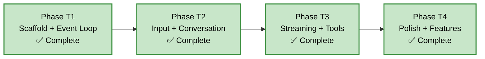

> **Archived** — All phases complete as of 2026-03-14. Kept for historical reference.

---

# TUI — Implementation Phases

**Related Documents:**
- [PRD](./PRD.md) §16
- [HLD](../architecture/HLD.md)
- [TUI Architecture](../architecture/tui/README.md)

**Principle:** Each phase produces a compilable, runnable artifact. Phases build on each other incrementally.

**Status:** Phases T1–T4 complete. Phase T5 tracks planned features not yet implemented. The TUI is wired to real LLM providers (priority: Proxy > OpenAI > Anthropic > Ollama).

---

## Dependency Graph

---

## Phase T1 — Scaffold + Event Loop ✅

**Files:** `tui/Cargo.toml`, `tui/src/main.rs`, `tui/src/app.rs`, `tui/src/event.rs`, `tui/src/theme.rs`, `tui/src/ui/mod.rs`, `tui/src/ui/status_bar.rs`
**Depends on:** Swink agent library (all phases complete)

### Scope

Set up the TUI binary crate, terminal initialization/teardown with panic safety, the async event loop multiplexing terminal and agent events, and a minimal status bar to prove rendering works.

### What was built

- `tui/Cargo.toml` — binary crate with dependencies on `swink-agent`, `swink-agent-adapters`, `ratatui` 0.30, `crossterm` 0.29 (event-stream), `tokio`, `syntect` 5, `futures`, `arboard` 3, `toml` 0.8, `dirs` 6, `serde`
- Workspace `Cargo.toml` updated with TUI as a workspace member
- `main.rs` — terminal setup/teardown with panic hook, agent creation from environment variables
- `app.rs` — `App` struct with async event loop using `crossterm::EventStream` + `tokio::select!`, dirty flag for render gating
- `event.rs` — `AppEvent` enum (reserved for future use)
- `theme.rs` — color constants and style helpers
- `ui/mod.rs` — root layout function dividing the screen into regions
- `ui/status_bar.rs` — renders formatted token counts, elapsed time, cost, and retry indicator

### Test Criteria

| # | Test | Status |
|---|---|---|
| T1.1 | Binary compiles and starts without panicking | ✅ |
| T1.2 | Terminal is properly restored on normal exit | ✅ |
| T1.3 | Terminal is properly restored on panic | ✅ |
| T1.4 | Status bar renders model name and agent state | ✅ |
| T1.5 | Ctrl+Q exits cleanly | ✅ |

---

## Phase T2 — Input + Conversation View ✅

**Files:** `tui/src/ui/input.rs`, `tui/src/ui/conversation.rs`, `tui/src/ui/markdown.rs`
**Depends on:** Phase T1

### Scope

The two core UI components: a multi-line input editor for composing messages, and a scrollable conversation view for displaying message history.

### What was built

- `ui/input.rs` — `InputEditor` widget:
  - Character insertion, deletion, cursor navigation
  - Dynamic height from 3 to 10 lines based on content
  - Line number gutter
  - Enter to submit, Shift+Enter for newline
  - Input history with Up/Down arrow recall
- `ui/conversation.rs` — `ConversationView` widget:
  - Role-colored left borders: green (user), cyan (assistant), yellow (tool), red (error), magenta (system)
  - Auto-scroll to bottom on new content
  - Manual scroll with Up/Down/PageUp/PageDown
  - "↓ scroll to bottom" indicator when scrolled up
  - Streaming cursor during assistant response
- `ui/markdown.rs` — `markdown_to_lines()` renderer:
  - Headers with styling
  - Bold, italic, inline code
  - Fenced code blocks with syntax highlighting integration
  - Bullet and numbered lists
  - Word wrapping

### Test Criteria

| # | Test | Status |
|---|---|---|
| T2.1 | Input editor accepts typed characters and renders them | ✅ |
| T2.2 | Enter submits the input text and clears the editor | ✅ |
| T2.3 | Shift+Enter inserts a newline without submitting | ✅ |
| T2.4 | Conversation view renders user and assistant messages | ✅ |
| T2.5 | Conversation auto-scrolls to bottom on new messages | ✅ |
| T2.6 | Manual scroll up disables auto-scroll; scroll to bottom re-enables | ✅ |
| T2.7 | Markdown bold, italic, and code render with correct styles | ✅ |

---

## Phase T3 — Streaming + Tool Execution ✅

**Files:** `tui/src/ui/tool_panel.rs`, `tui/src/ui/syntax.rs`
**Depends on:** Phase T2

### Scope

Wire up the swink agent to the TUI: send messages from the input editor, stream responses into the conversation view, display tool execution in a dedicated panel, and handle cancellation.

### What was built

- Agent integration in `app.rs`:
  - Uses `prompt_stream()` with an mpsc forwarder task that sends `AgentEvent` variants into the event loop
  - Handles all `AgentEvent` variants: text deltas, thinking deltas, tool calls, tool results, usage, errors, completion
  - Wired to Ollama by default, proxy mode via environment variables
  - Escape / Ctrl+C aborts the running agent
- Streaming conversation updates:
  - `TextDelta` appends to in-progress assistant message
  - `ThinkingDelta` appends to thinking section
  - Auto-scroll during streaming
  - Streaming cursor indicator while assistant is responding
- `ui/tool_panel.rs` — `ToolPanel` widget:
  - Braille spinner animation for active tools
  - ✓/✗ badges for completed tools (success/error)
  - Auto-fade: completed tools disappear after 3 seconds
  - Panel appears when tools are running, hides when idle
- `ui/syntax.rs` — syntect-based syntax highlighting:
  - `OnceLock` caching of syntax set and theme
  - Language detection from markdown fence labels
  - Fallback to plain monospace for unknown languages
  - Integrated into markdown fenced code blocks

### Test Criteria

| # | Test | Status |
|---|---|---|
| T3.1 | Typing a message and pressing Enter invokes agent.prompt_stream() | ✅ |
| T3.2 | Streaming text deltas appear incrementally in conversation view | ✅ |
| T3.3 | Tool execution start/end events update the tool panel | ✅ |
| T3.4 | Escape during streaming aborts the agent and shows aborted state | ✅ |
| T3.5 | Thinking deltas render in a dimmed section | ✅ |
| T3.6 | Code blocks in responses render with syntax highlighting | ✅ |

---

## Phase T4 — Polish + Features ✅

**Files:** `tui/src/config.rs`, `tui/src/commands.rs`, `tui/src/format.rs`, `tui/src/editor.rs`, `tui/src/credentials.rs`, `tui/src/session.rs`, `tui/src/wizard.rs`, various refinements
**Depends on:** Phase T3

### Scope

UX polish, configuration, command system, inline diffs, external editor, plan mode, approval modes, collapsible tool blocks, context window gauge, and quality-of-life features.

### What was built

- `config.rs` — `TuiConfig` loaded from `~/.config/swink-agent/tui.toml`:
  - Fields: `show_thinking`, `auto_scroll`, `tick_rate_ms`, `default_model`, `theme`, `editor`
  - Deserialized via `serde` + `toml`
  - Platform directory resolution via `dirs`
- `commands.rs` — dual command system:
  - Hash commands: `#help`, `#clear`, `#info`, `#copy`, `#copy all`, `#copy code`, `#approve on/off/smart`
  - Slash commands: `/quit`, `/model`, `/thinking`, `/system`, `/reset`, `/plan`, `/editor`
- `editor.rs` — external editor integration:
  - Resolves editor from config override > `$EDITOR` > `$VISUAL` > `vi`
  - TUI suspends while editor is open, submits content on close
  - Empty file on close treated as cancellation
- `ui/diff.rs` — inline diff view:
  - Unified diff rendering with LCS-based computation
  - Syntax-highlighted additions (green) and removals (red), context lines dimmed
  - New files shown as all-additions; large diffs truncated at 50 lines
- Collapsible tool result blocks:
  - Tool results start expanded, auto-collapse after 10 seconds
  - F2 key toggles collapse; user-expanded blocks resist auto-collapse
  - Collapsed view shows one-line summary
- Plan mode:
  - Toggled via Shift+Tab or `/plan` command
  - Restricts agent to read-only tools; plan output styled distinctly
  - Switching to execute mode re-registers write tools
- Tiered approval modes:
  - Three modes: Enabled (prompt for all), Smart (auto-approve reads, prompt for writes), Bypassed (auto-approve all)
  - Per-tool session trust: "always approve this tool" persists for session duration
  - Configurable via `#approve smart/on/off` commands
- Context window progress bar:
  - 10-character gauge in status bar showing estimated fill percentage
  - Color transitions: green (<60%) to yellow (60–85%) to red (>85%)
- `format.rs` — `format_tokens()` (human-readable K/M format), `format_elapsed()`, `format_context_gauge()`
- `credentials.rs` — credential resolution (env vars, keychain)
- `session.rs` — session persistence
- `wizard.rs` — first-run setup wizard
- Terminal resize handling — re-layout all components on resize event
- Focus management — Tab cycles Input/Conversation, typing auto-focuses input, focused component gets brighter border
- Input history — Up/Down arrow recalls previous messages
- Cost display — running cost total in status bar
- Clipboard integration — `arboard` crate for `#copy` commands
- Key bindings: Home/End/Ctrl+A/Ctrl+E for line navigation

### Test Criteria

| # | Test | Status |
|---|---|---|
| T4.1 | Terminal resize re-layouts all components correctly | ✅ |
| T4.2 | Tab cycles focus between input and conversation | ✅ |
| T4.3 | Up/down arrow in input recalls previous messages | ✅ |
| T4.4 | `/quit` exits the application | ✅ |
| T4.5 | `#clear` clears the conversation history | ✅ |
| T4.6 | Status bar shows running cost total | ✅ |
| T4.7 | Inline diff renders file modifications as syntax-highlighted unified diffs | ✅ |
| T4.8 | External editor opens `$EDITOR`, submits content, empty file = cancellation | ✅ |
| T4.9 | Plan mode restricts agent to read-only tools and labels output distinctly | ✅ |
| T4.10 | Tool result blocks default to expanded, auto-collapse after timeout, toggle with F2 | ✅ |
| T4.11 | Smart approval mode auto-approves reads and prompts for writes | ✅ |
| T4.12 | Per-tool session trust persists for session duration | ✅ |
| T4.13 | Context window gauge displays fill percentage with color transitions | ✅ |

---

## Phase T5 — Planned Features

**Status:** Partially implemented. Plan mode, tiered approval, and per-tool session trust were implemented in Phase T4 (spec 029) and are no longer part of this phase.

### Scope

Remaining diff interaction features described in PRD §16 that are not yet implemented.

### Planned Deliverables

- **Side-by-side diff layout** — when terminal width exceeds a threshold (160 columns), switch from unified to side-by-side diff rendering
- **Per-hunk approve/reject** — each changed hunk in the inline diff view becomes an independent decision point. Approved hunks are applied; rejected hunks are reverted and communicated back to the agent as a tool result

### Acceptance Criteria

| # | Criterion | Status |
|---|---|---|
| T5.1 | Side-by-side diff layout when terminal width exceeds threshold | ✅ |
| T5.2 | Per-hunk approve/reject in inline diff view | Planned |

---

## Summary

| Phase | Key Deliverables | Status |
|---|---|---|
| T1 — Scaffold | Binary crate, event loop, terminal setup, status bar | ✅ Complete |
| T2 — Input + Conversation | Text editor, message display, markdown, scrolling | ✅ Complete |
| T3 — Streaming + Tools | Agent integration, streaming display, tool panel, syntax highlighting | ✅ Complete |
| T4 — Polish | Config, commands, diffs, editor, plan mode, approval, collapse, context gauge | ✅ Complete |
| T5 — Planned | Side-by-side diffs, per-hunk approve/reject | Partially implemented |
