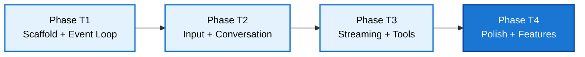

# TUI — Implementation Phases

**Related Documents:**
- [PRD](./PRD.md) §16
- [HLD](../architecture/HLD.md)
- [TUI Architecture](../architecture/tui/README.md)

**Principle:** Each phase produces a compilable, runnable artifact. Phases build on each other incrementally.

---

## Dependency Graph

---

## Phase T1 — Scaffold + Event Loop

**Files:** `tui/Cargo.toml`, `tui/src/main.rs`, `tui/src/app.rs`, `tui/src/event.rs`, `tui/src/theme.rs`, `tui/src/ui/mod.rs`, `tui/src/ui/status_bar.rs`
**Depends on:** Agent harness library (all phases complete)

### Scope

Set up the TUI binary crate, terminal initialization/teardown with panic safety, the async event loop multiplexing terminal and agent events, and a minimal status bar to prove rendering works.

### Deliverables

- `tui/Cargo.toml` — binary crate with dependencies on `agent-harness` (path), `ratatui`, `crossterm`, `tokio`, `syntect`
- Workspace `Cargo.toml` updated with `members = [".", "tui"]`
- `main.rs` — CLI arg parsing, terminal setup/teardown, panic hook, launch event loop
- `app.rs` — `App` struct with state (messages, running flag, usage, etc.), `tick()`, `needs_render()`
- `event.rs` — `AppEvent` enum unifying `crossterm::Event` and `AgentEvent`
- `theme.rs` — color constants and style helpers
- `ui/mod.rs` — root layout function dividing the screen into regions
- `ui/status_bar.rs` — renders agent state, model info, usage stats

### Test Criteria

| # | Test |
|---|---|
| T1.1 | Binary compiles and starts without panicking |
| T1.2 | Terminal is properly restored on normal exit |
| T1.3 | Terminal is properly restored on panic |
| T1.4 | Status bar renders model name and agent state |
| T1.5 | Ctrl+Q exits cleanly |

---

## Phase T2 — Input + Conversation View

**Files:** `tui/src/ui/input.rs`, `tui/src/ui/conversation.rs`, `tui/src/ui/markdown.rs`
**Depends on:** Phase T1

### Scope

The two core UI components: a multi-line input editor for composing messages, and a scrollable conversation view for displaying message history.

### Deliverables

- `ui/input.rs` — Multi-line text editor widget:
  - Character insertion, deletion, word navigation
  - Line wrapping within widget width
  - Cursor rendering
  - Enter to submit, Shift+Enter for newline
  - Input history (up/down arrow when at first/last line)
- `ui/conversation.rs` — Scrollable message list:
  - User messages: bordered block with text content
  - Assistant messages: bordered block with text content
  - Tool result messages: bordered block with content and error highlighting
  - Scroll position tracking, auto-scroll to bottom
  - Manual scroll with arrow keys / Page Up/Down / mouse wheel
- `ui/markdown.rs` — Basic markdown to ratatui `Spans` converter:
  - Bold, italic, code (inline), code blocks
  - Headers with styling
  - Lists (bulleted, numbered)
  - No full CommonMark — just the common patterns

### Test Criteria

| # | Test |
|---|---|
| T2.1 | Input editor accepts typed characters and renders them |
| T2.2 | Enter submits the input text and clears the editor |
| T2.3 | Shift+Enter inserts a newline without submitting |
| T2.4 | Conversation view renders user and assistant messages |
| T2.5 | Conversation auto-scrolls to bottom on new messages |
| T2.6 | Manual scroll up disables auto-scroll; scroll to bottom re-enables |
| T2.7 | Markdown bold, italic, and code render with correct styles |

---

## Phase T3 — Streaming + Tool Execution

**Files:** `tui/src/ui/tool_panel.rs`, `tui/src/ui/syntax.rs`
**Depends on:** Phase T2

### Scope

Wire up the agent harness to the TUI: send messages from the input editor, stream responses into the conversation view, display tool execution in a dedicated panel, and handle cancellation.

### Deliverables

- Agent integration in `app.rs`:
  - Create `Agent` with a configured `StreamFn`
  - On input submit: call `agent.prompt_stream()`
  - Subscribe to `AgentEvent` and forward to event loop
  - `Escape` / `Ctrl+C` calls `agent.abort()`
- Streaming conversation updates:
  - `MessageUpdate(TextDelta)` appends to in-progress assistant message
  - `MessageUpdate(ThinkingDelta)` appends to thinking section
  - Auto-scroll during streaming
  - Cursor/typing indicator while streaming
- `ui/tool_panel.rs` — Tool execution display:
  - Shows active tools with spinner animation and elapsed time
  - Shows completed tools with duration and success/error status
  - Appears when tools are running, hides when idle
- `ui/syntax.rs` — Code block syntax highlighting via `syntect`:
  - Language detection from markdown fence labels
  - Fallback to plain monospace for unknown languages
  - Theme-aware colors

### Test Criteria

| # | Test |
|---|---|
| T3.1 | Typing a message and pressing Enter invokes agent.prompt_stream() |
| T3.2 | Streaming text deltas appear incrementally in conversation view |
| T3.3 | Tool execution start/end events update the tool panel |
| T3.4 | Escape during streaming aborts the agent and shows aborted state |
| T3.5 | Thinking deltas render in a collapsible/dimmed section |
| T3.6 | Code blocks in responses render with syntax highlighting |

---

## Phase T4 — Polish + Features

**Files:** `tui/src/config.rs`, various refinements
**Depends on:** Phase T3

### Scope

UX polish, configuration, and quality-of-life features.

### Deliverables

- `config.rs` — TUI configuration:
  - Configurable keybindings
  - Color theme selection (dark/light)
  - Custom model/provider settings
- Terminal resize handling — re-layout all components on resize event
- Focus management — Tab cycles between input and conversation
- Input history — up/down arrow recalls previous messages
- Cost display — running total of session cost in status bar
- Loading indicators — animated dots/spinner during LLM streaming
- Error display — inline error messages when agent encounters errors
- Slash commands — `/quit`, `/clear`, `/model <id>`, `/help`

### Test Criteria

| # | Test |
|---|---|
| T4.1 | Terminal resize re-layouts all components correctly |
| T4.2 | Tab cycles focus between input and conversation |
| T4.3 | Up/down arrow in input recalls previous messages |
| T4.4 | `/quit` exits the application |
| T4.5 | `/clear` clears the conversation history |
| T4.6 | Status bar shows running cost total |

---

## Summary

| Phase | Key Deliverables | Depends on |
|---|---|---|
| T1 — Scaffold | Binary crate, event loop, terminal setup, status bar | Harness library |
| T2 — Input + Conversation | Text editor, message display, markdown, scrolling | T1 |
| T3 — Streaming + Tools | Agent integration, streaming display, tool panel, syntax highlighting | T2 |
| T4 — Polish | Config, resize, focus, history, slash commands | T3 |
