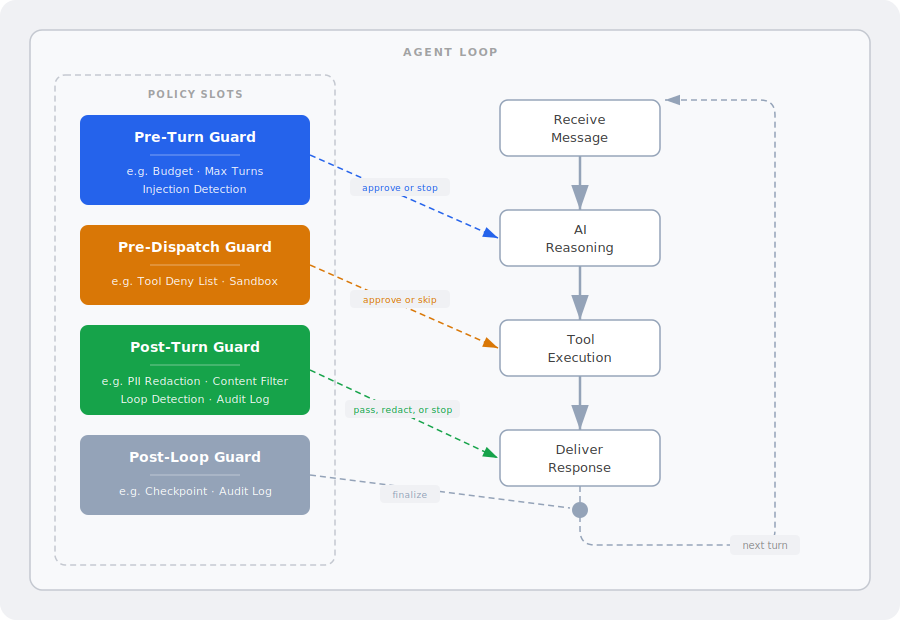

# Swink Agent: Policy Guardrails

AI agents make decisions on their own. They reason, call tools, and produce responses without waiting for a human to approve every step. That speed is what makes them useful, but it also means you need built-in controls to keep things safe.

Swink Agent handles this with **policy guardrails**, a series of configurable checkpoints embedded directly in the agent loop. Every LLM call, every tool execution, and every response passes through these gates. They enforce safety, cost, and compliance rules *before* anything reaches the outside world.

Because these controls are part of the framework itself, every agent built as a Swink Agent inherits them automatically. Developers don't bolt on safety after the fact. Policies evaluate at the instance level, run entirely on-device, and work with both cloud and local models. No external service required. They add negligible latency since they run as native compiled code, not additional LLM calls.

---

## How It Works

The agent loop is the engine. Policy checkpoints wrap each stage so nothing passes through unchecked.

Each guard can **approve**, **modify**, or **halt** the agent before the next stage runs.

| Color | Checkpoint | When It Runs |
|:-----:|-----------|-------------|
| &#9632; Blue | Pre-Turn | Before the AI begins reasoning |
| &#9632; Amber | Pre-Dispatch | Before a tool is allowed to execute |
| &#9632; Green | Post-Turn | After the AI responds, before delivery |
| &#9632; Grey | Post-Loop | After the full loop completes |

---

## Example Policies

| Policy | Checkpoint | What It Does |
|--------|-----------|-------------|
| **Budget** | Pre-Turn | Stops the agent when cost or token usage exceeds a set limit |
| **Max Turns** | Pre-Turn | Caps the number of reasoning cycles the agent can take |
| **Tool Deny List** | Pre-Dispatch | Blocks specific tools from being used (e.g., file write, shell access) |
| **Sandbox** | Pre-Dispatch | Restricts file access to an approved directory and rejects path traversal |
| **Loop Detection** | Post-Turn | Detects when the agent is stuck repeating the same action |
| **Checkpoint** | Post-Turn | Saves agent state after each turn for recovery and audit |
| **Prompt Injection Guard** | Pre-Turn + Post-Turn | Detects attempts to override the agent's instructions |
| **PII Redactor** | Post-Turn | Removes personally identifiable information from responses |
| **Content Filter** | Post-Turn | Blocks responses containing prohibited keywords or patterns |
| **Audit Logger** | Post-Turn | Records every turn to a persistent log for compliance review |

---

## Key Properties

- **Default-off.** No policies run unless explicitly enabled. Zero overhead when unused.
- **Composable.** Multiple policies can run at the same checkpoint. They evaluate in order, and if any policy says stop, the agent stops.
- **Isolated.** A failing policy cannot crash the agent. Panics are caught and the policy is automatically removed.
- **Extensible.** Custom policies can be built against the public trait API without modifying the core.
